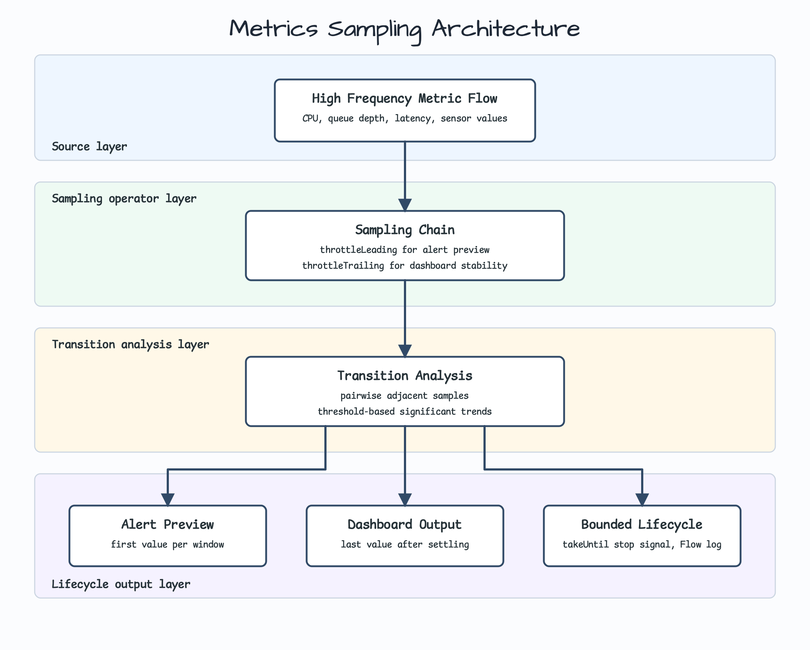
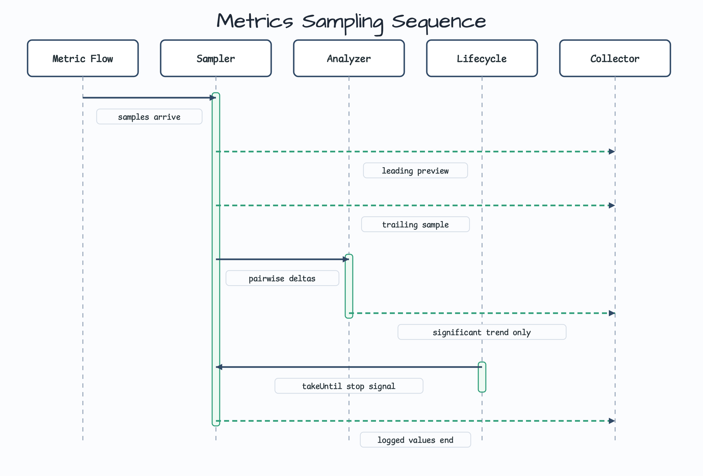

# Flow Extensions Metrics Sampling

[English](README.md) | 한국어

이 예제는 bluetape4k Flow extension으로 noisy high-frequency metric 또는 sensor reading을 학습자가 이해하기 쉬운 Flow pipeline으로 줄이는 방법을 보여줍니다.

서비스가 초당 많은 값을 받지만 소비자마다 필요한 view가 다를 때 사용할 수 있습니다. Alert preview는 빠른 첫 값을 원하고, dashboard는 안정된 마지막 값을 원하며, 분석 로직은 adjacent delta, significant transition, lifecycle stop signal을 다뤄야 합니다.

## 시나리오

Monitoring component가 CPU utilization, queue depth, p95 latency, sensor temperature 같은 값을 받습니다. Workshop pipeline은 이 sample을 in-memory로 소비하고, 직접 scheduler state를 들고 가지 않고 stream을 줄이는 방법을 가르칩니다.

이 예제는 metrics backend, HTTP endpoint, database, queue를 일부러 넣지 않았습니다. Infrastructure를 붙이기 전에 Flow operator의 의미를 먼저 눈으로 확인하는 것이 목적입니다.

## Architecture



Architecture는 위에서 아래로 읽습니다. Raw metric sample이 sampling layer로 들어가고, adjacent transition analysis를 거친 뒤, alert preview, dashboard, bounded lifecycle output으로 나뉩니다.

이 모듈은 코드 예제만 포함합니다. Redis, broker, database, server가 없으므로 diagram은 infrastructure icon 대신 text card만 사용합니다.

## Operator sequence



Sequence diagram은 중요한 contract를 보여줍니다.

- `throttleLeading`은 빠른 alert preview를 위해 window 안의 첫 값을 emit합니다.
- `throttleTrailing`은 dashboard를 위해 window가 안정된 뒤 마지막 값을 emit합니다.
- `pairwise`는 mutable previous-value state 없이 adjacent sample을 비교합니다.
- `filter`는 configured absolute threshold를 넘는 trend만 남깁니다.
- `takeUntil`은 lifecycle signal이 오면 collection을 멈춥니다.
- `Flow<T>.log()`는 stream을 바꾸지 않고 teaching output을 관찰합니다.
- `mapResultCatching`은 `CancellationException`을 domain failure로 바꾸지 않고 그대로 전파합니다.

## Before: 직접 작성한 scheduler와 timestamp state

```kotlin
var lastPreviewAt = Instant.EPOCH
var previous: MetricSample? = null
val trends = mutableListOf<MetricTrend>()

for (sample in samples) {
    if (Duration.between(lastPreviewAt, sample.timestamp) >= previewWindow) {
        preview(sample)
        lastPreviewAt = sample.timestamp
    }

    previous?.let { before ->
        val delta = MetricDelta.from(before, sample)
        if (abs(delta.delta) >= threshold) {
            trends += MetricTrend.from(delta, threshold)
        }
    }
    previous = sample
}
```

직접 loop를 작성하면 짧은 demo에서는 동작하지만, timer policy, previous-value tracking, threshold filtering, lifecycle stop behavior, logging이 한곳에 섞입니다.

## After: Flow extension chain

```kotlin
val pipeline = MetricsSamplingPipeline()

val preview = pipeline.leadingPreview(samples, 500.milliseconds)
val dashboard = pipeline.dashboardSamples(samples, 500.milliseconds)
val trends = pipeline.significantChanges(samples, absoluteThreshold = 10.0)
val resultTrends = pipeline.significantChangeResults(deltaResults, absoluteThreshold = 10.0)
val bounded = pipeline.lifecycleBoundSamples(samples, stopSignal)
```

각 public function은 하나의 boundary만 가르칩니다. 학습자는 테스트를 실행하고 operator별 emitted value를 차례로 확인할 수 있습니다.

## Leading vs trailing samples

| Consumer | Extension | Emits | Good for | Trade-off |
|---|---|---|---|---|
| Alert preview | `throttleLeading` | Window 안의 첫 값 | 빠른 feedback | Burst의 마지막 값을 놓칠 수 있음 |
| Dashboard tile | `throttleTrailing` | Window 안의 마지막 값 | 안정된 display value | Window가 닫힐 때까지 기다림 |

## Domain model

`MetricSample`은 private constructor를 가진 regular serializable class입니다. generated `copy(...)`가 name, unit, finite-value validation을 우회하지 못하게 일부러 data class를 쓰지 않았습니다.

`MetricDelta`와 `MetricTrend`는 derived value이고 construction 이후 validation bypass 경로가 없으므로 data class로 둡니다.

## Failure and cancellation contracts

- Blank name, control character, non-finite value, invalid threshold는 의미 있는 output을 만들기 전에 실패합니다.
- `takeUntil`은 정상적인 lifecycle termination을 표현합니다. Bounded stream은 stop signal 전에 본 값까지만 emit하고 완료됩니다.
- `significantChangeResults`는 `mapResultCatching`으로 cancellation-safe result mapping의 library contract를 보여줍니다. `CancellationException`은 `Result.failure`로 감싸지 않고 다시 던집니다.

## 사용한 Bluetape4k 기능

| 기능 | 코드 위치 | 학습 포인트 |
|---|---|---|
| `throttleLeading` | `leadingPreview` | 빠른 first-sample preview emit |
| `throttleTrailing` | `dashboardSamples` | 안정된 dashboard sample emit |
| `pairwise` | `deltas` | Mutable state 없이 adjacent sample 비교 |
| `takeUntil` | `lifecycleBoundSamples` | Lifecycle stop signal로 collection 종료 |
| `Flow<T>.log()` | `leadingPreview`, `dashboardSamples`, `significantChanges`, `lifecycleBoundSamples` | Stream value를 바꾸지 않고 관찰 |
| `mapResultCatching` | `significantChangeResults` | Cooperative coroutine cancellation 보존 |

## 빌드와 테스트

```bash
./gradlew :kotlin-flow-extensions-metrics-sampling:test --rerun-tasks --console=plain
./gradlew :kotlin-flow-extensions-metrics-sampling:compileKotlin :kotlin-flow-extensions-metrics-sampling:compileTestKotlin --console=plain
./gradlew projects --console=plain
```

## 참고

- [throttleLeading and throttleTrailing](../../../../bluetape4k-projects/bluetape4k/coroutines/src/main/kotlin/io/bluetape4k/coroutines/flow/extensions/throttle.kt)
- [pairwise](../../../../bluetape4k-projects/bluetape4k/coroutines/src/main/kotlin/io/bluetape4k/coroutines/flow/extensions/pairwise.kt)
- [takeUntil](../../../../bluetape4k-projects/bluetape4k/coroutines/src/main/kotlin/io/bluetape4k/coroutines/flow/extensions/takeUntil.kt)
- [Result mapping](../../../../bluetape4k-projects/bluetape4k/coroutines/src/main/kotlin/io/bluetape4k/coroutines/flow/extensions/results.kt)
- [Flow logging](../../../../bluetape4k-projects/bluetape4k/coroutines/src/main/kotlin/io/bluetape4k/coroutines/flow/extensions/logger.kt)
