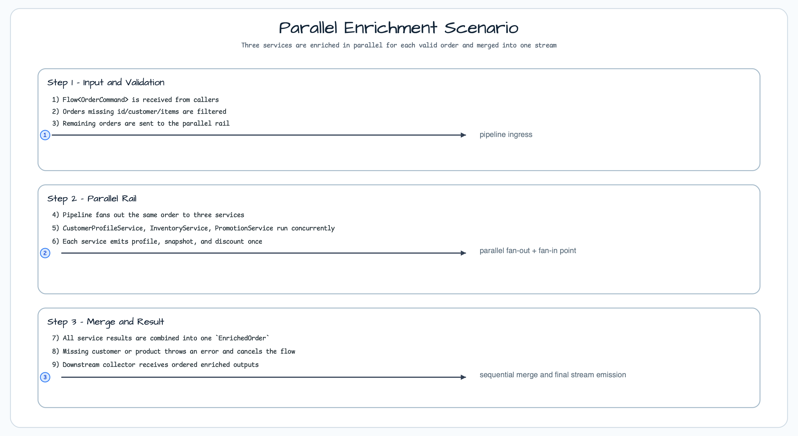
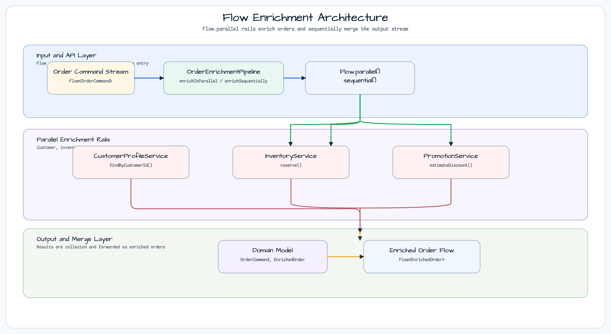
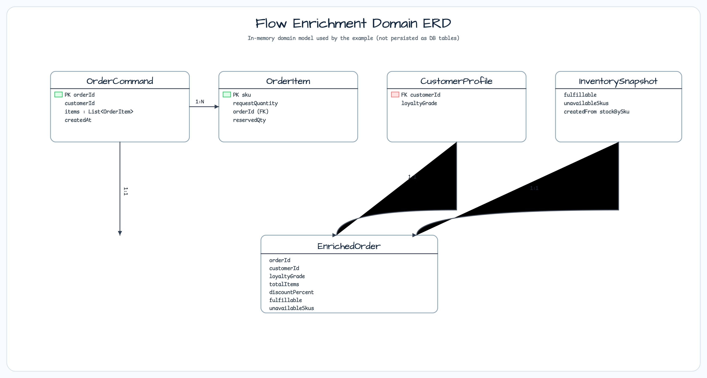
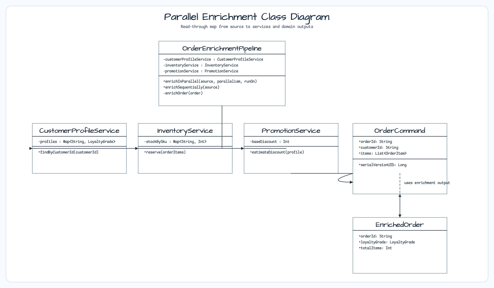
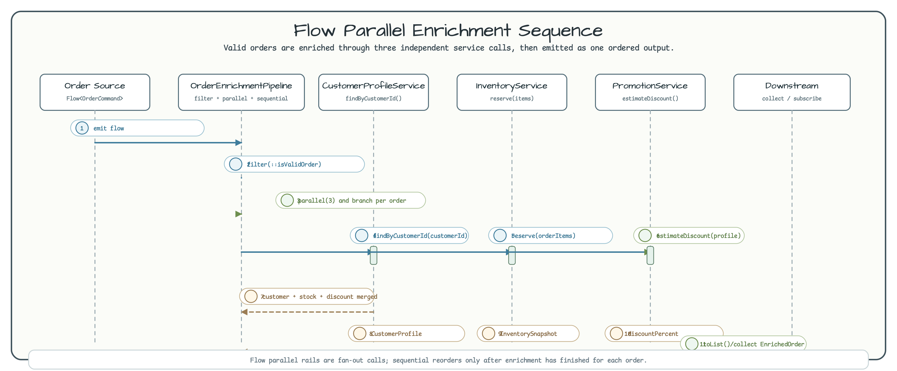

# Flow Extensions Parallel Enrichment

[English](README.md) | 한국어

이 예제는 `Flow.parallel(...)`을 사용해 주문 유입 스트림을 병렬 Enrichment 파이프라인으로 처리하는 방법을 보여줍니다.

- 주문마다 고객 정보 조회, 재고 점검, 할인 계산을 병렬 rail에서 수행
- `Flow` 파이프라인에서 유효 주문만 선별 후 처리
- 고객/상품 미존재 실패 전파 확인
- 동일 로직의 순차 처리 경로도 함께 제공해 비교 가능

## 시나리오



각 주문이 스트림으로 들어오면 유효성 검사 후 병렬 rail에서 아래 작업이 동시에 진행됩니다.

1. 고객 프로필 조회
2. 주문 라인별 재고 스냅샷 조회
3. 멤버십 등급 기반 할인 계산
4. `EnrichedOrder` 조합 후 downstream 노출

`orderId`, `customerId`, `items`가 비어있으면 enrichment 단계로 넘어가지 않습니다.

## 아키텍처



`OrderEnrichmentPipeline`이 orchestration 역할을 담당합니다.

- `Flow<T>.parallel(...)` 로 병렬 rail을 나눕니다.
- 각 rail에서 `map`으로 enrichment을 수행합니다.
- `sequential()`로 단일 결과 스트림으로 재정렬합니다.

## 도메인 모델



도메인 객체는 예제 내 인메모리 타입으로 구성되어 있습니다.

- `OrderCommand` — 유입 주문(`orderId`, `customerId`, `items`)
- `CustomerProfile` — 고객 등급 정보
- `InventorySnapshot` — 상품별 재고 점검 결과
- `EnrichedOrder` — downstream에서 소비할 최종 DTO

`UnknownCustomerException`, `UnknownProductException`은 필수 경로의 빠른 실패를 표현합니다.

## 클래스 다이어그램



핵심 타입은 아래와 같습니다.

- `OrderEnrichmentPipeline`
- `CustomerProfileService`
- `InventoryService`
- `PromotionService`
- 도메인 타입 및 예외 클래스들

## 시퀀스 다이어그램



`parallel`은 주문 단위로 세 개의 서비스 호출을 분기하고, 각 결과를 다시 결합해
`EnrichedOrder`를 생성합니다.

## 코드 예시

```kotlin
val services = OrderEnrichmentPipeline(
    customerProfileService = CustomerProfileService(customerGrades),
    inventoryService = InventoryService(stockBySku),
    promotionService = PromotionService()
)

val out = services.enrichInParallel(
    source = orders,
    parallelism = 4,
    runOn = { i -> dispatchers[i] }
).toList()
```

## 빌드 및 테스트

```bash
./gradlew :kotlin-flow-extensions-parallel-enrichment:test
```

## 참고

- [bluetape4k-coroutines flow extensions (parallel)](../../../../bluetape4k-projects/bluetape4k/coroutines/src/main/kotlin/io/bluetape4k/coroutines/flow/extensions/parallel/ParallelFlowSupport.kt)
