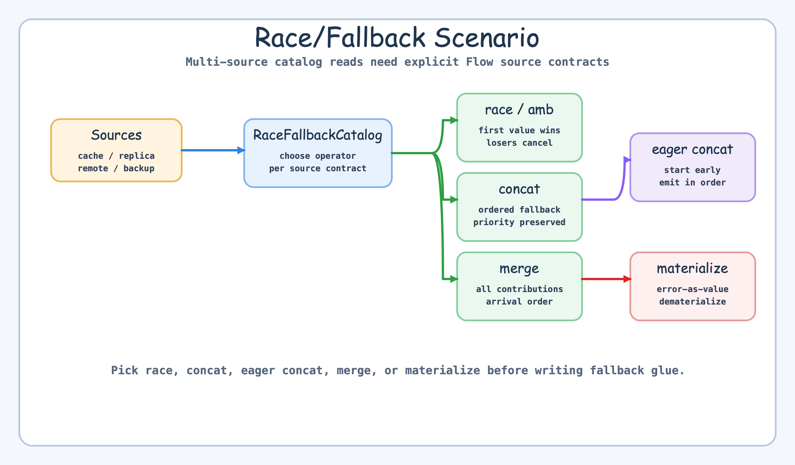
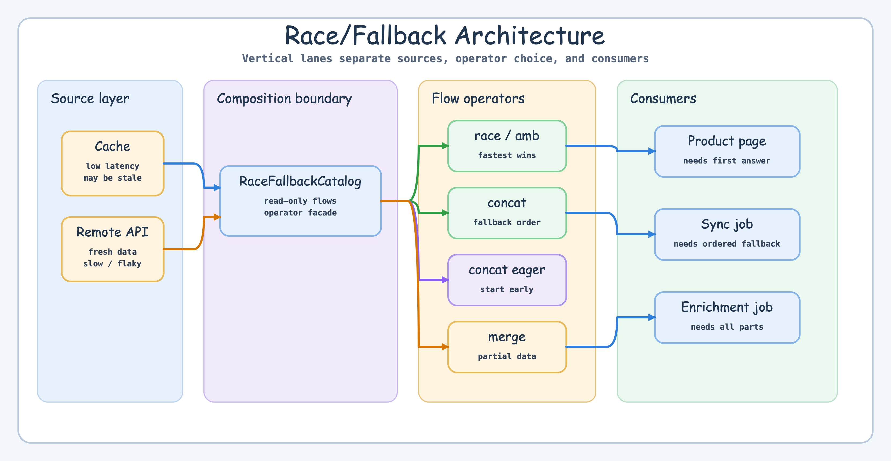
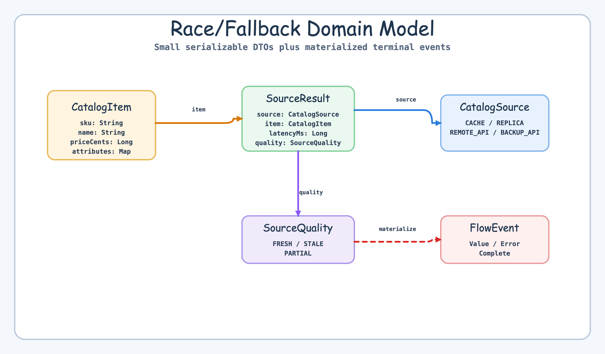
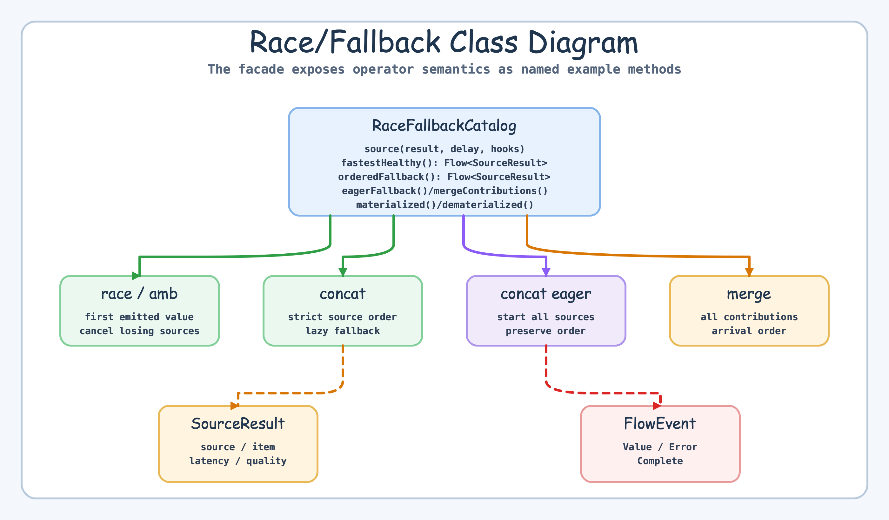
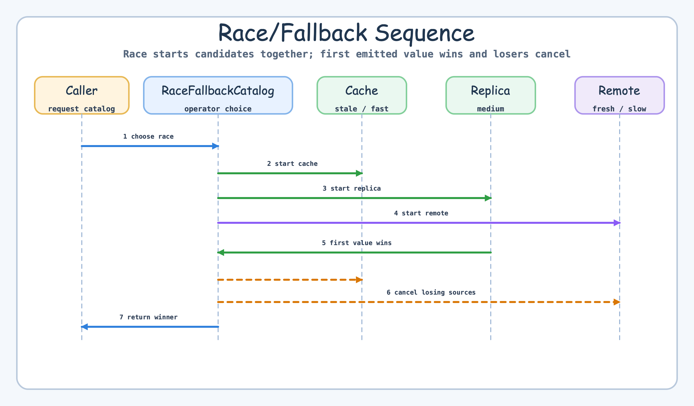

# Flow Extensions Race and Fallback

[English](README.md) | 한국어

이 예제는 여러 catalog source를 bluetape4k Flow source-composition operator로 조합하는 방법을 보여줍니다.

`async`와 `select`를 직접 엮는 코드보다 source lifetime과 delivery semantics를 명확히 드러내야 할 때 이 operator들을 사용하세요.

## 시나리오



Catalog service는 같은 reference data를 네 곳에서 읽을 수 있습니다.

- in-memory cache
- local replica
- remote API
- backup endpoint

비즈니스 질문에 따라 올바른 조합이 달라집니다. 가장 빠른 정상 응답이 필요한지, fallback 순서가 중요한지, 모든 source의 partial data를 합쳐야 하는지, 오류를 값으로 설명해야 하는지를 먼저 정해야 합니다.

## Before: 직접 작성한 async/select 배선

```kotlin
suspend fun rawRace(cache: Deferred<SourceResult>, remote: Deferred<SourceResult>): SourceResult = select {
    cache.onAwait { it }
    remote.onAwait { it }
}
```

이 방식도 가능하지만 실제 코드는 loser job 취소, fallback 순서 보존, 원본 실패 보존, race/fallback/merge 별도 구현을 모두 직접 처리해야 합니다.

## After: Flow source composition

```kotlin
val catalog = RaceFallbackCatalog()
val winner = catalog.fastestHealthy(listOf(cacheFlow, replicaFlow, remoteFlow)).toList()
val fallback = catalog.orderedFallback(listOf(cacheFlow, replicaFlow, backupFlow)).toList()
val enriched = catalog.mergeContributions(cacheFlow, replicaFlow, remoteFlow).toList()
```

## Architecture



`RaceFallbackCatalog`는 의사결정 지점을 명시합니다. nested `try/catch` 안에 fallback 동작을 숨기지 않고, source contract마다 하나의 operator를 선택합니다.

## 선택 기준표

| 필요 | Operator | 계약 |
|---|---|---|
| 가장 낮은 latency의 정상 응답 | `race` / `amb` | 먼저 값을 emit한 source가 이기고 loser는 취소됩니다 |
| 순서가 중요한 fallback | `concat` | 우선순위 순서대로 source를 하나씩 실행합니다 |
| eager fallback + 순서 보존 | `concatArrayEager` | source는 즉시 시작하지만 출력은 source 순서를 지킵니다 |
| 동적 eager fallback | `concatMapEager` | mapping된 source는 eager하게 시작하고 outer 순서가 출력을 결정합니다 |
| 모든 source의 partial enrichment | `merge` | 모든 source가 도착 순서대로 기여합니다 |
| 오류를 값으로 설명 | `materialize` / `dematerialize` | terminal signal을 값으로 바꾸고 다시 복원합니다 |

## Domain model



모델은 작게 유지했습니다. `CatalogItem`, `CatalogSource`, `SourceResult`, `SourceQuality`만 사용합니다.

## Class model



## Sequence model



## 오류 의미론

source 실패가 현재 composition을 멈춰야 한다면 terminal error를 그대로 사용하세요. 원본 예외를 잃지 않으면서 실패를 데이터로 설명하거나 라우팅해야 한다면 `materialize()`를 사용합니다.

## 사용한 Bluetape4k 기능

| 기능 | 사용 방식 |
|---|---|
| `race` / `amb` | 가장 빠른 정상 source 선택 |
| `concat` | 엄격한 fallback 순서 |
| `concatArrayEager` | source를 eager하게 시작하되 출력 순서 보존 |
| `concatMapEager` | 동적 eager fallback mapping |
| `merge` | 모든 source의 partial contribution 수집 |
| `materialize` / `dematerialize` | error-as-value와 terminal-error 변환 |

## 빌드와 테스트

```bash
./gradlew :kotlin-flow-extensions-race-fallback:test
```

## 참고

- [amb](../../../../bluetape4k-projects/bluetape4k/coroutines/src/main/kotlin/io/bluetape4k/coroutines/flow/extensions/amb.kt)
- [race](../../../../bluetape4k-projects/bluetape4k/coroutines/src/main/kotlin/io/bluetape4k/coroutines/flow/extensions/race.kt)
- [concat](../../../../bluetape4k-projects/bluetape4k/coroutines/src/main/kotlin/io/bluetape4k/coroutines/flow/extensions/concat.kt)
- [concatArrayEager](../../../../bluetape4k-projects/bluetape4k/coroutines/src/main/kotlin/io/bluetape4k/coroutines/flow/extensions/concatArrayEager.kt)
- [concatMapEager](../../../../bluetape4k-projects/bluetape4k/coroutines/src/main/kotlin/io/bluetape4k/coroutines/flow/extensions/concatMapEager.kt)
- [merge](../../../../bluetape4k-projects/bluetape4k/coroutines/src/main/kotlin/io/bluetape4k/coroutines/flow/extensions/mergeFlows.kt)
- [materialize](../../../../bluetape4k-projects/bluetape4k/coroutines/src/main/kotlin/io/bluetape4k/coroutines/flow/extensions/materialize.kt)
