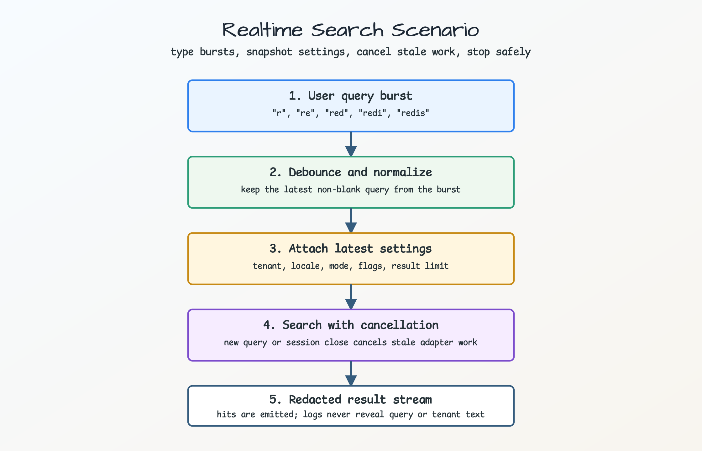
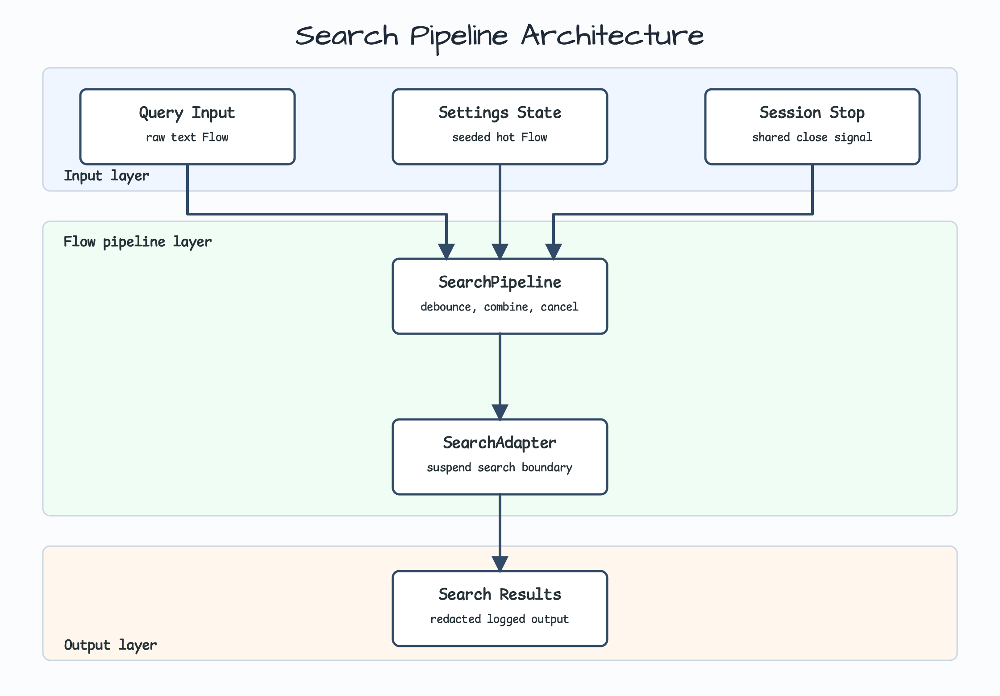
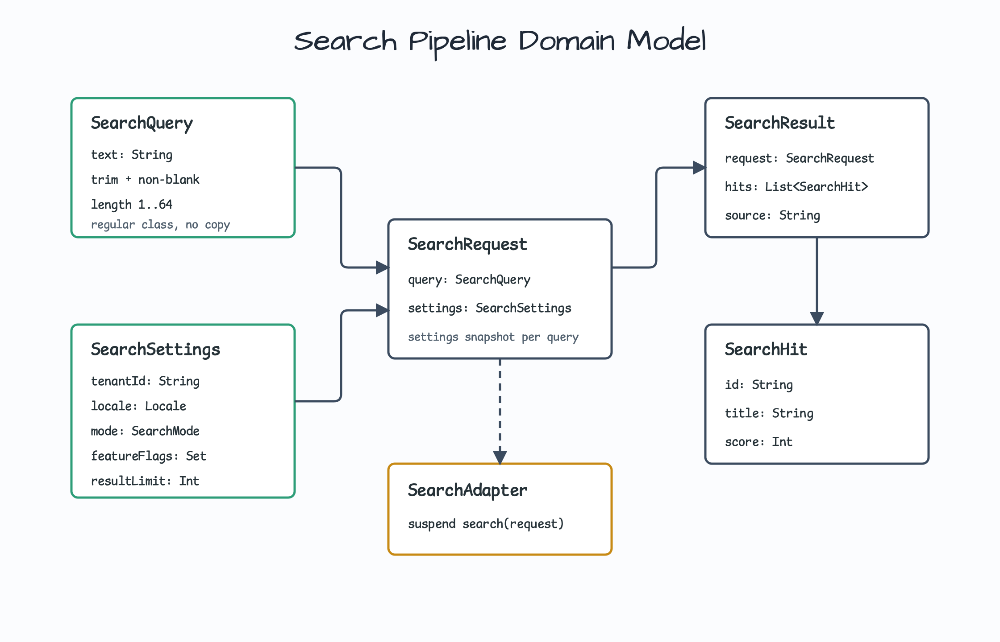
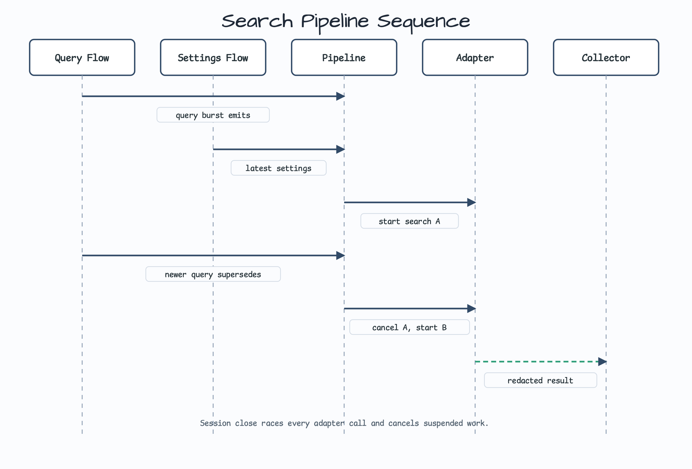

# Flow Extensions Search Pipeline

[English](README.md) | 한국어

이 예제는 bluetape4k Flow extension으로 실시간 검색과 자동완성 파이프라인을 구성하는 방법을 보여줍니다.

검색어 입력이 backend 검색 속도보다 빠르게 들어오고, 세션 중 사용자 설정이 바뀔 수 있으며, 오래된 검색 작업은 취소해야 하고, 진단 로그에는 검색어와 tenant 정보가 노출되면 안 되는 상황을 다룹니다.

## 시나리오



사용자가 짧은 burst로 검색어를 입력합니다. 파이프라인은 각 burst의 마지막 검색어만 남기고, 최신 설정과 결합한 뒤, 한 번에 하나의 adapter 요청을 실행합니다. 더 새로운 검색어가 오면 이전 작업을 취소하고, 세션이 닫히면 즉시 멈춥니다.

이 예제는 의도적으로 in-memory로 유지합니다. 검색 인덱스, ranking engine, HTTP endpoint, UI widget을 구현하지 않습니다. 현실적인 자동완성 경계에서 Flow operator의 의미를 배우는 것이 목적입니다.

## Before: 직접 작성한 MutableSharedFlow와 Job 배선

```kotlin
private var searchJob: Job? = null

fun onQuery(text: String) {
    searchJob?.cancel()
    searchJob = scope.launch {
        delay(150)
        val settings = currentSettings()
        val result = adapter.search(SearchRequest(SearchQuery(text), settings))
        render(result)
    }
}
```

데모에서는 가능하지만, 실제 코드에서는 입력 정규화, burst debounce, 설정 snapshot, 실행 중인 adapter 호출 취소, 세션 종료 처리, redacted logging을 모두 직접 챙겨야 합니다.

## After: Flow extension chain

```kotlin
val results = SearchPipeline(adapter).search(
    queries = queryText,
    settings = settingsState,
    sessionClosed = sessionClosed,
    debounce = 150.milliseconds,
)
```

`SearchPipeline`은 lifecycle 규칙을 하나의 stream에 모읍니다.

- `bufferingDebounce`는 빠른 입력을 burst로 묶고 마지막 검색어를 남깁니다.
- `withLatestFrom`은 debounced query가 준비된 시점의 최신 settings를 snapshot으로 붙입니다.
- Kotlin `flatMapLatest`는 더 새로운 검색어가 오면 오래된 adapter 작업을 취소합니다.
- `takeUntil`은 세션이 닫히면 downstream 출력을 멈춥니다.
- `Flow<T>.log()`는 stream event를 기록하고, domain `toString()`은 민감한 텍스트를 redaction합니다.

## Architecture



Architecture는 input, pipeline, adapter/output 순서로 layer를 나눴습니다. 세션 종료 신호는 한 번만 공유하므로 cold `sessionClosed` flow가 두 번 collect되지 않습니다.

## Domain model



`SearchQuery`와 `SearchSettings`는 private constructor를 가진 일반 serializable class입니다. generated `copy`가 validation을 우회하지 못하게 의도적으로 data class를 쓰지 않았습니다. 결과 값 class들은 data class이며 `Serializable`을 구현합니다.

## Sequence model



Adapter 호출은 공유된 세션 종료 신호와 race합니다. 세션이 먼저 닫히면 늦게 도착한 결과만 버리는 것이 아니라, suspend 중인 adapter job 자체를 취소합니다.

## 왜 `flatMapLatest`이고 `flatMapDrop`이 아닌가

자동완성은 가장 최신 검색어를 살리고 오래된 작업을 취소해야 합니다. `flatMapDrop`과 `flatMapFirst`는 inner flow가 바쁜 동안 새 값을 의도적으로 버립니다. 그래서 검색 supersession이 아니라 "재진입 무시" workflow에 맞습니다.

이 예제에서 두 operator를 함께 설명하는 이유는 중요합니다. Flow operator 선택은 단순 문법이 아니라 business contract 선택입니다.

## Settings stream 전제

`settings`는 `MutableStateFlow(initialSettings)`처럼 초기값이 있는 hot/state-like flow여야 합니다. 첫 settings 값이 오기 전에 들어온 query는 `withLatestFrom`에 의해 의도적으로 버립니다. 완전한 요청을 만들 수 없기 때문입니다.

## 진단과 운영 메모

- Blank input은 debounce 전에 제외합니다.
- Query text와 tenant id는 trim 후 검증합니다.
- Feature flag는 lowercase kebab-case set으로 정규화하고 변경 불가능하게 보관합니다.
- Result limit을 제한해 fake adapter가 무제한 결과를 materialize하지 않게 합니다.
- Adapter는 `CancellationException`을 다시 던져 coroutine cancellation을 cooperative하게 유지합니다.
- Redacted `toString()` 덕분에 학습자가 보는 `Flow<T>.log()` 출력에도 민감한 값이 남지 않습니다.

## 사용한 Bluetape4k 기능

| 기능 | Artifact | 코드 위치 | 장점 |
|---|---|---|---|
| `bufferingDebounce` | Query burst 처리 | `SearchPipeline.search` | 빠른 타이핑 뒤 최신 검색어만 남김 |
| `withLatestFrom` | Settings snapshot | `SearchPipeline.search` | Debounced input과 현재 settings를 결합 |
| `takeUntil` | Session stop | `SearchPipeline.search` | 세션 종료 시 result emission 중단 |
| `Flow<T>.log()` | Diagnostics | `SearchPipeline.search` | Redacted domain text로 lifecycle event 기록 |
| Validation helpers | Domain model | `SearchQuery`, `SearchSettings` | Blank, oversized, malformed input을 초기에 거부 |

## 빌드와 테스트

```bash
./gradlew :kotlin-flow-extensions-search-pipeline:test --rerun-tasks --console=plain
./gradlew :kotlin-flow-extensions-search-pipeline:compileKotlin :kotlin-flow-extensions-search-pipeline:compileTestKotlin --console=plain
./gradlew projects --console=plain
```

## 참고

- [bufferingDebounce](../../../../bluetape4k-projects/bluetape4k/coroutines/src/main/kotlin/io/bluetape4k/coroutines/flow/extensions/bufferingDebounce.kt)
- [withLatestFrom](../../../../bluetape4k-projects/bluetape4k/coroutines/src/main/kotlin/io/bluetape4k/coroutines/flow/extensions/withLatestFrom.kt)
- [takeUntil](../../../../bluetape4k-projects/bluetape4k/coroutines/src/main/kotlin/io/bluetape4k/coroutines/flow/extensions/takeUntil.kt)
- [Flow logging](../../../../bluetape4k-projects/bluetape4k/coroutines/src/main/kotlin/io/bluetape4k/coroutines/flow/extensions/logger.kt)
- [flatMapDrop](../../../../bluetape4k-projects/bluetape4k/coroutines/src/main/kotlin/io/bluetape4k/coroutines/flow/extensions/flatMapDrop.kt)
