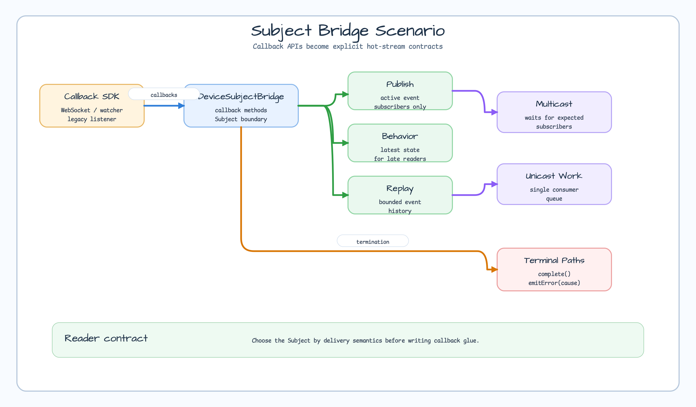
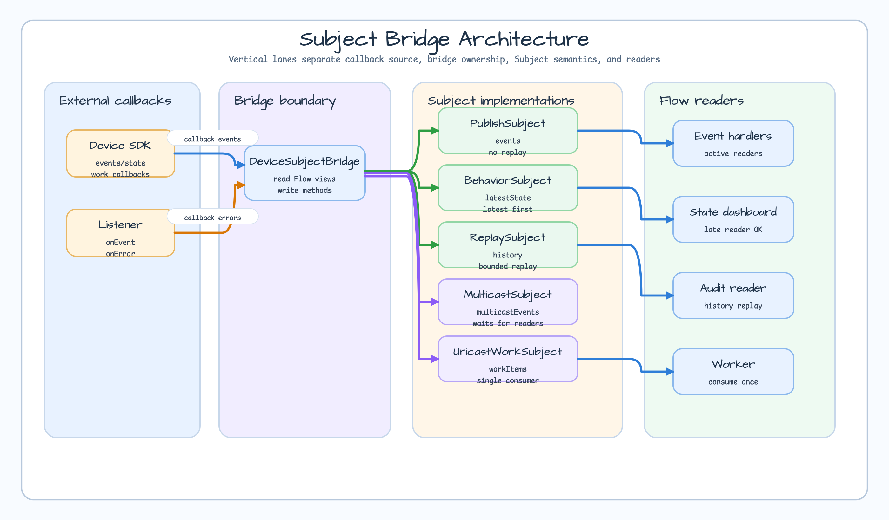
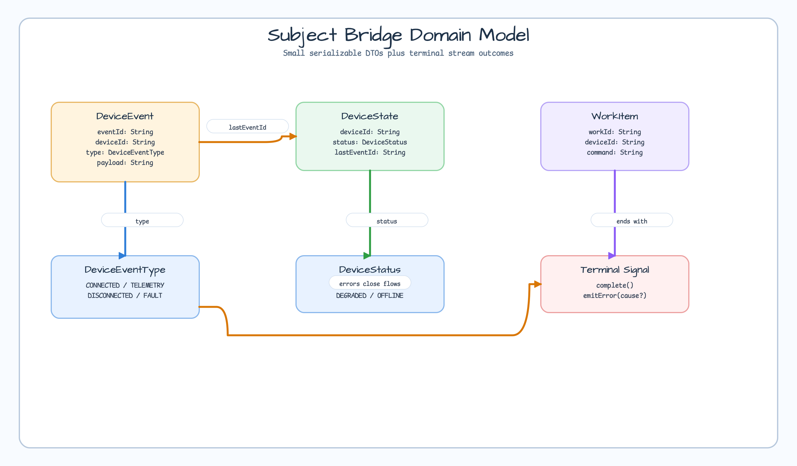
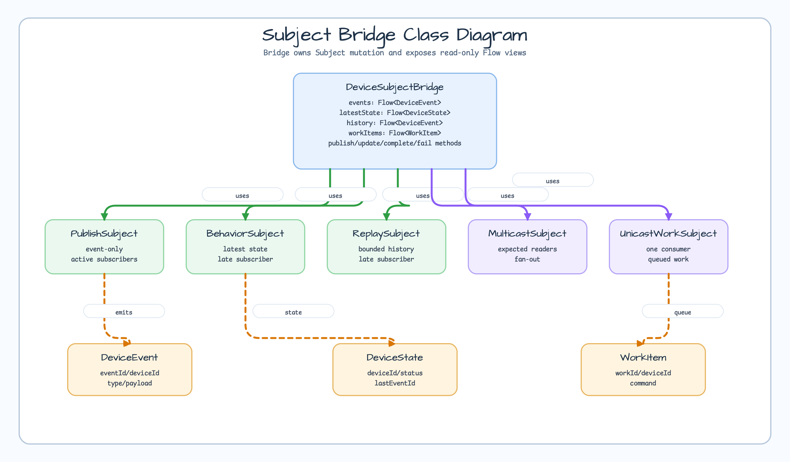
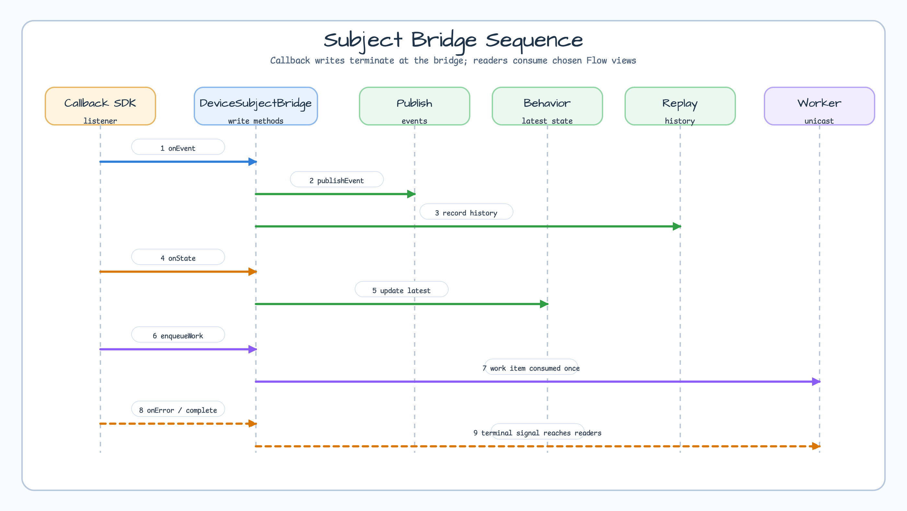

# Flow Extensions Subject Bridge

[한국어](README.ko.md) | English

This example demonstrates how to bridge callback-style APIs into `Flow` with bluetape4k Subject types.

Use Subjects for narrow bridge boundaries, not as the default architecture for every Flow pipeline.

## Scenario



A device SDK pushes callbacks for events, state changes, and work requests. The bridge exposes those callbacks as typed Flow streams:

- event broadcasts for currently active subscribers
- latest-state snapshots for late subscribers
- replayable event history
- coordinated multicast fan-out
- a single-consumer work queue
- normal completion, error termination, and `emitError(null)` no-op behavior

## Before: raw callback wiring

```kotlin
fun rawBridge(listener: DeviceSdkListener): Flow<DeviceEvent> = callbackFlow {
    listener.onEvent = { event -> trySend(event) }
    listener.onError = { cause -> close(cause) }
    listener.onComplete = { close() }
    awaitClose { listener.onEvent = null }
}
```

This works, but every stream has to rediscover replay, latest-state, multicast, unicast, and terminal behavior by hand.

## After: Subject selection

```kotlin
val bridge = DeviceSubjectBridge(
    initialState = DeviceState("device-01", DeviceStatus.OFFLINE, "boot")
)

launch { bridge.events.collect(::handleEvent) }
bridge.awaitEventSubscribers()
bridge.publishEvent(DeviceEvent("event-01", "device-01", DeviceEventType.CONNECTED, "online"))
```

## Architecture



`DeviceSubjectBridge` keeps Subject mutation inside the bridge and exposes read-only `Flow` views to callers.

## Subject selection guide

| Need | Subject | Reader contract |
|---|---|---|
| Event-only callback stream | `PublishSubject` | Late subscribers do not receive old events |
| Latest device state | `BehaviorSubject` | Late subscribers receive the newest state first |
| Bounded callback history | `ReplaySubject` | Late subscribers receive buffered events |
| Coordinated fan-out | `MulticastSubject` | Producer waits for expected subscribers |
| Single-consumer queue | `UnicastWorkSubject` | Queued work is consumed once |

## Domain model



The model is intentionally small: `DeviceEvent`, `DeviceState`, and `WorkItem`.

## Class model



## Sequence model



## Used Bluetape4k features

| Feature | Usage |
|---|---|
| `PublishSubject` | event-only stream for active subscribers |
| `BehaviorSubject` | latest device state |
| `ReplaySubject` | bounded callback history |
| `MulticastSubject` | coordinated fan-out to two subscribers |
| `UnicastWorkSubject` | single-consumer work queue |
| `awaitCollector(s)` | deterministic test and callback handoff synchronization |

## Build and test

```bash
./gradlew :kotlin-flow-extensions-subject-bridge:test
```

## References

- [bluetape4k-coroutines Subject API](../../../../bluetape4k-projects/bluetape4k/coroutines/src/main/kotlin/io/bluetape4k/coroutines/flow/extensions/subject/SubjectApi.kt)
- [PublishSubject](../../../../bluetape4k-projects/bluetape4k/coroutines/src/main/kotlin/io/bluetape4k/coroutines/flow/extensions/subject/PublishSubject.kt)
- [BehaviorSubject](../../../../bluetape4k-projects/bluetape4k/coroutines/src/main/kotlin/io/bluetape4k/coroutines/flow/extensions/subject/BehaviorSubject.kt)
- [ReplaySubject](../../../../bluetape4k-projects/bluetape4k/coroutines/src/main/kotlin/io/bluetape4k/coroutines/flow/extensions/subject/ReplaySubject.kt)
- [MulticastSubject](../../../../bluetape4k-projects/bluetape4k/coroutines/src/main/kotlin/io/bluetape4k/coroutines/flow/extensions/subject/MulticastSubject.kt)
- [UnicastWorkSubject](../../../../bluetape4k-projects/bluetape4k/coroutines/src/main/kotlin/io/bluetape4k/coroutines/flow/extensions/subject/UnicastWorkSubject.kt)
