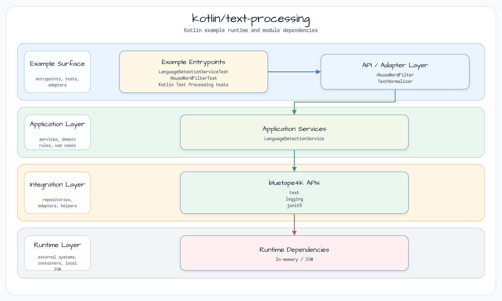
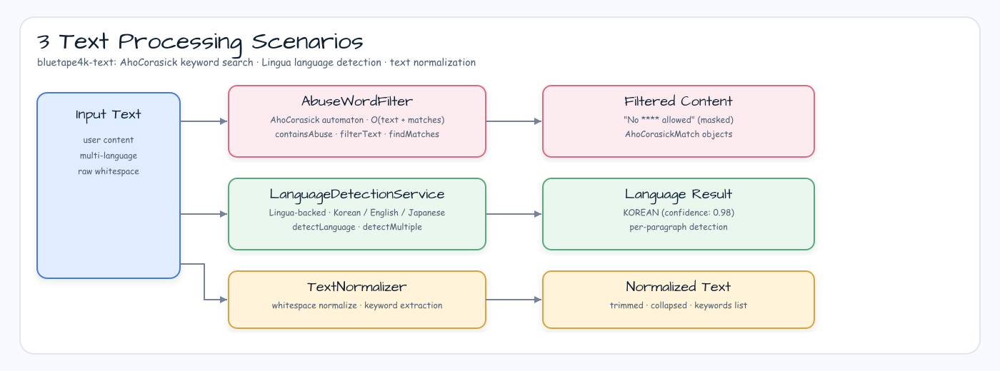
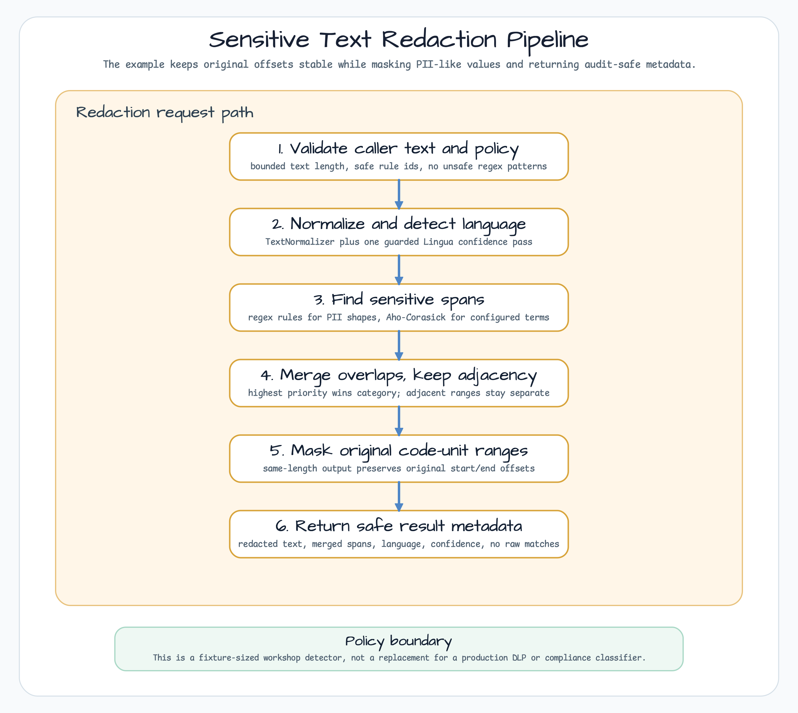

# kotlin/text-processing

[한국어](README.ko.md) | English

This module demonstrates in-process text utilities built on `bluetape4k-text` and small Kotlin
helpers. It covers abuse-word filtering, language detection, text normalization before indexing,
startup dictionary readiness, sync/coroutine multilingual search indexes with highlighted results,
atomic whole-index generation replacement, and a small sensitive-text redaction pipeline with
audit-safe span metadata.

## Architecture



## Processing flow



## Redaction pipeline



## Components

| class | backing API | contract |
|---|---|---|
| `AbuseWordFilter` | `AhoCorasickAutomaton` from `text-search` | Case-insensitive NFC/NFKC matching with overlaps; maps matches back to source spans and masks them with `*` |
| `LanguageDetectionService` | Lingua detector from `bluetape4k-text-lingua` | Reuses one detector and returns `null` for blank or unknown text |
| `CoroutineLanguageDetectionService` | `LanguageDetectionService`, `Mutex`, `Dispatchers.Default` | Serializes detector access for concurrent coroutine callers |
| `TextNormalizer` | pure Kotlin object | Lowercases text, collapses whitespace, extracts deduplicated keywords |
| `MultilingualSearchIndex` | `LanguageDetectionService`, `KoreanProcessor`, `JapaneseProcessor`, `TextNormalizer`, `AhoCorasickAutomaton` | Detects document/query language, builds an inverted term index, ranks matched documents, and emits source-span highlights |
| `CoroutineMultilingualSearchIndex` | `CoroutineLanguageDetectionService`, immutable index snapshot, `AhoCorasickAutomaton` | Provides suspend `indexOf` and `search` APIs for coroutine services while keeping detector access guarded |
| `TokenizerDictionaryReadiness` | `KoreanProcessor.preload`, `JapaneseProcessor.preload`, `Mutex` | Shares one suspend preload attempt and rejects request work until both dictionaries are ready |
| `VersionedMultilingualSearchIndex` | Korean `DictionarySnapshot`, exact-noun Aho-Corasick matcher, `VersionedDictionary` | Publishes one completed noun-dictionary/index generation and returns the exact revision used by each search |
| `SensitiveTextRedactionPipeline` | `LanguageDetectionService`, `TextNormalizer`, regex rules, `AhoCorasickAutomaton` | Applies a selectable keyword normalization policy, restores source spans, merges overlaps, masks same-length output, and returns safe metadata |

## Usage

### Abuse-word filtering

```kotlin
val filter = AbuseWordFilter(listOf("spam", "abuse", "badword"))

filter.containsAbuse("There is some spam here")   // true
filter.filterText("No spam allowed")              // "No **** allowed"
filter.findMatches("spam and abuse")              // AhoCorasickMatch list
```

The automaton is built once from the keyword collection. After construction, matching is a single
pass over the input text plus the number of matches.

Choose NFKC when a policy term must also match compatibility characters:

```kotlin
val corporateFilter = AbuseWordFilter(
    abuseWords = listOf("(\uC8FC)"),
    normalization = NormalizationForm.NFKC,
)

corporateFilter.findMatches("Company: \u3231 Bluetape").single().let { it.start to it.end }
// source range of U+3231, not the three-character normalized range
corporateFilter.filterText("Company: \u3231 Bluetape")
// "Company: * Bluetape"
```

NFC remains the default. NFKC expands the U+3231 compatibility character only for matching; returned
offsets and masking still use the original Kotlin `String` span. An interacting normalization
segment longer than 1,024 code units fails fast without echoing caller text.

### Language detection

```kotlin
val service = LanguageDetectionService()

service.detectLanguage("Hello, World!")      // Language.ENGLISH
service.detectLanguage("\uC548\uB155\uD558\uC138\uC694.") // Language.KOREAN
service.detectLanguage("東京は首都です。")      // Language.JAPANESE

val scores = service.computeConfidenceValues("This is English text.")
```

Reuse one `LanguageDetectionService` instance when possible because language detector construction is
expensive.

### Text normalization

```kotlin
TextNormalizer.normalize("  Hello   WORLD  ")                 // "hello world"
TextNormalizer.extractKeywords("the quick brown fox")          // ["the", "quick", "brown", "fox"]
TextNormalizer.extractKeywords("a b quick", minKeywordLength = 4) // ["quick"]
```

### Sensitive text redaction

```kotlin
val pipeline = SensitiveTextRedactionPipeline.default()

val result = pipeline.redact(
    "Contact user@example.test at 555-010-1234 with token=demo_token_value_123456."
)

result.redactedText
// "Contact ***************** at ************ with *****************************."

result.spans.map { it.category }
// ["contact", "contact", "secret"]
```

The default policy is deliberately small and fixture-oriented. It demonstrates the mechanics that
matter in application logs and support-ticket examples:

- rule ids and categories are validated as safe metadata slugs;
- regex rules reject backreferences, nested unbounded quantifiers, and unbounded `.*` patterns;
- keyword rules use NFC-aware Aho-Corasick matching, so original offsets are preserved;
- overlapping spans merge by priority, but adjacent spans remain separate;
- `toString()`, debug logs, exceptions, and span metadata avoid raw sensitive values.

Use a stronger detector when the input contains jurisdiction-specific identifiers, free-form
addresses, names, OCR output, multilingual PII beyond the fixture rules, or compliance-driven DLP
requirements. This workshop pipeline is a learning example, not a full classifier.

For NFKC keyword redaction, set the policy explicitly:

```kotlin
val policy = SensitiveRedactionPolicy.of(
    rules = listOf(SensitiveRedactionRule.keyword("keyword.corp", "keyword", "(\uC8FC)")),
    keywordNormalization = NormalizationForm.NFKC,
)
val result = SensitiveTextRedactionPipeline.of(policy).redact("Company: \u3231 Bluetape")

result.spans.single().matchedLength // 1: the original U+3231 span
```

### Multilingual search index

```kotlin
val index = MultilingualSearchIndex.indexOf(
    listOf(
        SearchDocument.of(
            id = "ko-1",
            title = "Korean indexing",
            text = "\uCF54\uD2C0\uB9B0 \uAC80\uC0C9 \uC778\uB371\uC2A4\uB294 \uD55C\uAD6D\uC5B4 \uBA85\uC0AC\uB97C \uD1A0\uD070\uC73C\uB85C \uC0AC\uC6A9\uD569\uB2C8\uB2E4.",
        ),
        SearchDocument.of(
            id = "ja-1",
            title = "Japanese indexing",
            text = "検索インデックスは日本語の名詞をトークンとして保存します。",
        ),
    ),
)

val hits = index.search("\uD55C\uAD6D\uC5B4 \uAC80\uC0C9")
hits.first().highlightedText   // source text with <mark>...</mark> fragments
hits.first().matches           // original start/end offsets for matched terms
```

The example deliberately keeps the index in memory so the language-processing path is easy to
inspect:

- Korean text uses `KoreanProcessor.normalize` plus noun tokens.
- Japanese text uses `JapaneseProcessor.tokenize` plus noun filtering.
- English and unknown text use `TextNormalizer.extractKeywords`.
- `SearchDocument.id` is the index key and must be unique within one index.
- `LanguageDetectionService` is reused for every document and query because Lingua detector
  construction is expensive.
- Highlighting is literal term matching against the original source text. It is not stemming,
  semantic search, or typo-tolerant search.
- Overlapping matches are preserved in `SearchHighlightHit.matches`. The rendered
  `highlightedText` uses deterministic non-overlapping fragments from Aho-Corasick tokenization,
  so nested `<mark>` tags are intentionally avoided.

### Versioned runtime search index

Use `VersionedMultilingualSearchIndex` when Korean noun dictionaries and documents must change
without exposing a partially rebuilt search generation:

```kotlin
val index = VersionedMultilingualSearchIndex.indexOf(
    source = VersionedMultilingualSearchSource(
        koreanDictionary = KoreanDictionaryProvider.currentDictionarySnapshot(),
        documents = v1Documents,
    ),
    historyCapacity = 2,
)

val v1 = index.search("서울카페")
val v2Dictionary = KoreanDictionaryProvider.reloadDictionaries(
    DictionaryVersion("korean-dictionary", 2),
    newKoreanDictionaries,
)
index.reload(VersionedMultilingualSearchSource(v2Dictionary, v2Documents))
val v2 = index.search("서울카페")
index.rollback()
```

`search` returns `VersionedSearchResult`, which pairs the captured revision with its hits. The
versioned path builds an exact Korean noun Aho-Corasick matcher from the supplied public snapshot
and injects that same matcher into document and query tokenization. It therefore never reads the
global Korean provider after publication. The loader and full `MultilingualSearchIndex` build
finish before the completed `DictionarySnapshot` is published. Failed or stale candidates leave
the current generation and bounded rollback history unchanged. This exact-noun behavior is
deliberately narrower than the existing morphology-oriented `MultilingualSearchIndex`; Japanese
and English retain their existing tokenizer paths. Coroutine callers should prepare source data on
their own dispatcher before synchronous publication. Candidate documents and nouns are copied into
bounded snapshots with per-entry and aggregate character limits before index construction.

### Coroutine-safe search index

Use the coroutine variant when the same index is queried from many coroutine workers:

```kotlin
val detection = CoroutineLanguageDetectionService()
val index = CoroutineMultilingualSearchIndex.indexOf(
    documents = documents,
    detectionService = detection,
)

val hits = index.search("\uC11C\uC6B8 \uCE74\uD398")
```

The coroutine index keeps the synchronous API separate on purpose. `MultilingualSearchIndex` remains
small for single-threaded examples, while `CoroutineMultilingualSearchIndex` adds a guarded detector
wrapper, an immutable index snapshot, and suspend APIs that run CPU-bound text work on
`Dispatchers.Default`.

### Dictionary preload and readiness

Preload both tokenizer dictionaries during startup, before building an index or accepting requests:

```kotlin
val dictionaries = TokenizerDictionaryReadiness()
dictionaries.preload()

val index = CoroutineMultilingualSearchIndex.indexOf(documents)
val result = dictionaries.runWhenReady { index.search("\uC11C\uC6B8 \uCE74\uD398") }

when (result) {
    is DictionaryReadyResult.Ready -> result.value
    is DictionaryReadyResult.NotReady -> emptyList()
}
```

The initial state is `NOT_READY`; an active attempt publishes `LOADING`, and `READY` is visible only
after both `KoreanProcessor.preload()` and `JapaneseProcessor.preload()` complete. Concurrent startup
callers share one attempt. Failure or cancellation is rethrown after the state returns to `NOT_READY`,
so the next caller can retry with a new attempt number. A cancellation check after both loaders also
prevents a loader that accidentally swallows cancellation from publishing `READY`.

`runWhenReady` returns `NotReady` without running its block while startup is incomplete. This avoids
partially initialized request results. The existing synchronous tokenizer facade is still compatible,
but it may block on first use when startup preload is skipped. For predictable request latency, use the
order shown above: preload, build the existing index, then expose the readiness-gated search path.

### Japanese tokenizer backend comparison

Compare the existing Kuromoji IPADic path with Sudachi JVM using one dictionary session and the
approved corpus (`選挙管理委員会`, `東京都へ行く`, and `外国人参政権`):

```kotlin
val reports = runJapaneseBackendComparisons()
val oneReport = runJapaneseBackendComparison("選挙管理委員会")
```

Both helpers retain surface and broad POS observations for Kuromoji and Sudachi. Sudachi also
records `Tokenizer.SplitMode.A/B/C` surfaces so a migration review can see mode-specific
segmentation changes without claiming accuracy or latency superiority. The multi-input helper
opens one dictionary/tokenizer session for the whole corpus; use the single-input helper only when
one fixture is needed.

The default `test` task does not download a dictionary. Without the
`bluetape4k.sudachi.system-dictionary` system property, the candidate is reported as
`UNAVAILABLE` with a `prepareSudachiDictionary` recovery hint. Run the dictionary-backed examples
explicitly when the local environment permits the download:

```bash
./gradlew :kotlin-text-processing:test
./gradlew :kotlin-text-processing:sudachiTest
```

`sudachiTest` is a local/manual-only check because it downloads a 72,238,136-byte official
`SudachiDict v20260428 core` archive and extracts a 217,374,303-byte `system_core.dic`. The archive
URL is `https://github.com/WorksApplications/SudachiDict/releases/download/v20260428/sudachi-dictionary-20260428-core.zip`,
licensed Apache-2.0, and pinned to archive SHA-256
`40c8ffc095283f07aa06cae922e7b8147bf2919ec8830567b0b3f7a7efa3239f`; the extracted dictionary is
pinned to SHA-256 `6c1d5adc8a2389875713056e7b39bbcd0073d6122ffd509866e1d3a196f8608e`. Both files
remain build-only outputs under `kotlin/text-processing/build/sudachi-dictionary/v20260428` and
are never committed.

## Dependencies

The module uses the repository version catalog and resolves bluetape4k modules through the single
`bluetape4k-dependencies:2.0.0` BOM:

```kotlin
dependencies {
    implementation(libs.bluetape4k.text.search)
    implementation(libs.bluetape4k.text.lingua)
    implementation(libs.bluetape4k.text.korean)
    implementation(libs.bluetape4k.text.japanese)
    implementation(libs.sudachi)
    implementation(libs.kotlinx.coroutines.core.lib)
}
```
