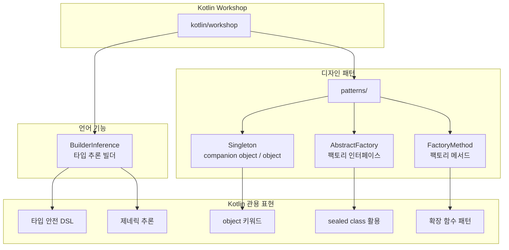

# Kotlin Workshop

Kotlin 언어의 기능을 익히고, 실습을 통해 활용하는 워크샵 자료입니다.

## Kotlin 기능 카테고리



## 학습 주제 목록

| 파일 | 주제 | 핵심 개념 |
|------|------|-----------|
| `BuilderInferenceExamples.kt` | Builder 타입 추론 | `MutableList<V>.() -> Unit`, `ItemHolder<T>`, 제네릭 람다 수신자 |
| `patterns/Singleton.kt` | 싱글톤 패턴 | `object` 키워드, `data object`, 클래스 위임(`by`) |
| `patterns/AbstractFactory.kt` | 추상 팩토리 패턴 | `companion object`, `sealed` 계층, `data class` |
| `patterns/FactoryMethod.kt` | 팩토리 메서드 패턴 | `when` 표현식, 인터페이스 기반 다형성 |

## 코드 예제

### Builder 타입 추론 (Builder Inference)

Kotlin 컴파일러가 람다 본문에서 타입을 자동으로 추론하는 기능입니다.
`@BuilderInference` 없이도 `ItemHolder<Int>` 타입을 명시하지 않고 빌더를 사용할 수 있습니다.

```kotlin
// 수동으로 타입을 지정하지 않아도 Int 로 추론된다
val itemHolder = itemHolderBuilder {
    addAllItems(listOf(1, 2, 3))  // List<Int> 에서 T = Int 추론
}
```

### Singleton 패턴

Kotlin `object` 선언은 JVM 레벨 싱글톤을 보장합니다.
클래스 위임(`by`)을 활용하면 인터페이스 구현 코드를 대폭 줄일 수 있습니다.

```kotlin
// List<String> 의 모든 메서드를 emptyList() 에 위임
object NoMoviesList : List<String> by emptyList()

// data object 는 toString() 이 클래스명만 반환
data object NoMoviesListDataObject
```

### 팩토리 메서드 패턴

`when` 표현식으로 타입 분기 로직을 간결하게 표현합니다.

```kotlin
fun createPiece(notation: String): ChessPiece {
    val (type, file, rank) = notation.toCharArray()
    return when (type) {
        'q' -> Queen(file, rank)
        'p' -> Pawn(file, rank)
        else -> throw IllegalArgumentException("Unknown piece type: $type")
    }
}
```

## 빌드 및 테스트

```bash
./gradlew :kotlin-workshop:test
./gradlew :kotlin-workshop:test --tests "io.bluetape4k.workshop.kotlin.BuilderInferenceExamples"
./gradlew :kotlin-workshop:test --tests "io.bluetape4k.workshop.kotlin.patterns.*"
```
