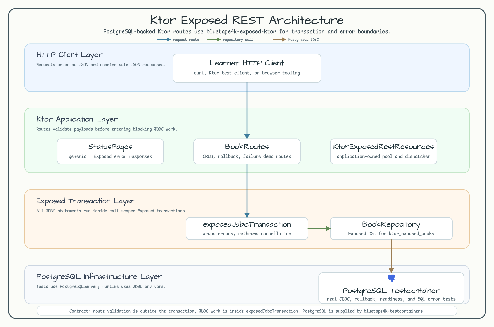
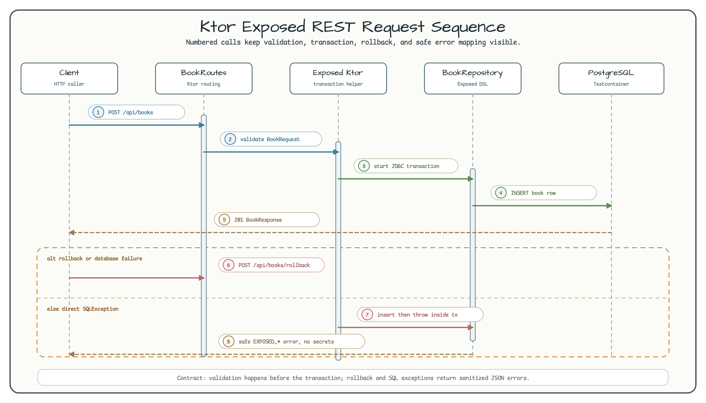

# Ktor Exposed REST

[한국어](README.ko.md) | English

This module is a compact Ktor REST example for the backend-selective
`bluetape4k-exposed-ktor-core` and `bluetape4k-exposed-ktor-jdbc` artifacts. It
uses real PostgreSQL in tests through `PostgreSQLServer.Launcher.postgres`, then
shows how Ktor route handlers enter Exposed JDBC transactions without letting
database failures leak JDBC URLs, SQL text, usernames, or passwords.



## What You Learn

| Topic | Where to look | Why it matters |
|---|---|---|
| Route validation | `BookRoutes.kt` | Request validation happens before blocking JDBC work. |
| Transaction boundary | `call.exposedJdbcTransaction(...)` | Exposed statements run on an application-owned dispatcher. |
| Selective backend boundary | `bluetape4kExposedHealthRoutes(...)` + JDBC probe | The backend-neutral core owns the deadline and route contract; JDBC owns blocking readiness and transactions. |
| Resource ownership | `KtorExposedRestResources.kt` | Ktor owns Hikari, Exposed `Database`, and dispatcher lifecycles. |
| Safe failures | `StatusPages` + `bluetape4kExposedErrors()` | SQL and transaction details are mapped to safe JSON errors. |
| PostgreSQL tests | `KtorExposedRestApplicationTest.kt` | Default module tests use the shared PostgreSQL Testcontainer wrapper. |

## Dependency Shape

The module uses the root `bluetape4k-dependencies` BOM only. The important
consumer aliases are versionless and resolve from the `2.0.0` BOM:

```kotlin
implementation(libs.bluetape4k.ktor.core)
implementation(libs.exposed.ktor.core)
implementation(libs.exposed.ktor.jdbc)
implementation(libs.exposed.jdbc)
implementation(libs.jetbrains.exposed.jdbc)
testImplementation(libs.bluetape4k.testcontainers)
```

The application deliberately does not depend on the optional R2DBC or cache
adapters. Add `libs.exposed.ktor.r2dbc` or `libs.exposed.ktor.cache` only when a
consumer actually puts that backend on its classpath. The legacy
`libs.exposed.ktor` aggregator remains available for compatibility, but new
consumer code should select the smallest backend surface it needs. Do not add
a local bluetape4k module version; if the BOM changes, update the root catalog
line instead.

## Runtime Flow



The application installs Ktor JSON support through `installBluetape4kKtorCore`,
then composes generic Ktor errors and Exposed-specific errors in one
`StatusPages` block:

```kotlin
install(StatusPages) {
    bluetape4kExposedCoreErrors()
    bluetape4kExposedJdbcErrors()
    bluetape4kErrorResponses()
}

val readinessProbes = listOf(
    exposedKtorJdbcReadinessProbe(
        db = resources.jdbcDatabase,
        blockingDispatcher = resources.jdbcDispatcher,
        jdbcQueryTimeout = 2.seconds,
    ),
)

routing {
    bluetape4kExposedHealthRoutes(
        probes = readinessProbes,
        readinessProbeTimeout = 2.seconds,
    )
}
```

Each database route validates input first and then enters the transaction
helper:

```kotlin
val request = call.receive<BookRequest>().validated()
val book = call.exposedJdbcTransaction(
    db = resources.jdbcDatabase,
    blockingDispatcher = resources.jdbcDispatcher,
) {
    BookRepository.create(request)
}
```

## Routes

| Method | Path | Result |
|---|---|---|
| `POST` | `/api/books` | Creates a book and returns `201 BookResponse`. |
| `GET` | `/api/books` | Lists books ordered by generated id. |
| `GET` | `/api/books/{id}` | Reads one book or returns a safe 404 error. |
| `PUT` | `/api/books/{id}` | Replaces title, author, and ISBN. |
| `DELETE` | `/api/books/{id}` | Deletes the row and returns `204 No Content`. |
| `POST` | `/api/books/rollback` | Inserts and then fails inside one transaction to prove rollback. |
| `GET` | `/api/failures/sql` | Throws `SQLException` to demonstrate sanitized database errors. |
| `GET` | `/healthz/exposed` | Exposed liveness route. |
| `GET` | `/readyz/exposed` | Exposed JDBC readiness route. |

Example request:

```bash
curl -s -X POST http://localhost:8080/api/books \
  -H 'content-type: application/json' \
  -d '{"title":"Ktor with Exposed","author":"Blue Tape","isbn":"978-0-001"}'
```

## Run It

The test path is the primary workshop path because it starts PostgreSQL through
`bluetape4k-testcontainers`:

```bash
./gradlew :ktor-exposed-rest:test --warning-mode all --console=plain --max-workers=1
```

Manual runtime does not start Testcontainers. Point it at an existing
PostgreSQL instance:

```bash
POSTGRES_JDBC_URL=jdbc:postgresql://localhost:5432/postgres \
POSTGRES_USERNAME=postgres \
POSTGRES_PASSWORD=postgres \
./gradlew :ktor-exposed-rest:run
```

## Error Contract

- Blank title, author, or ISBN is rejected before the transaction helper.
- Transaction failures become `EXPOSED_TRANSACTION_FAILED`.
- Direct SQL failures become `EXPOSED_DATABASE_UNAVAILABLE`.
- Cancellation is rethrown by the Exposed helper and is not converted into an
  Exposed database error payload.
- Core readiness uses one monotonic deadline and returns `TIMEOUT` without
  exposing backend details.
- Error responses never echo PostgreSQL JDBC URLs, SQL text, usernames, or
  passwords.
