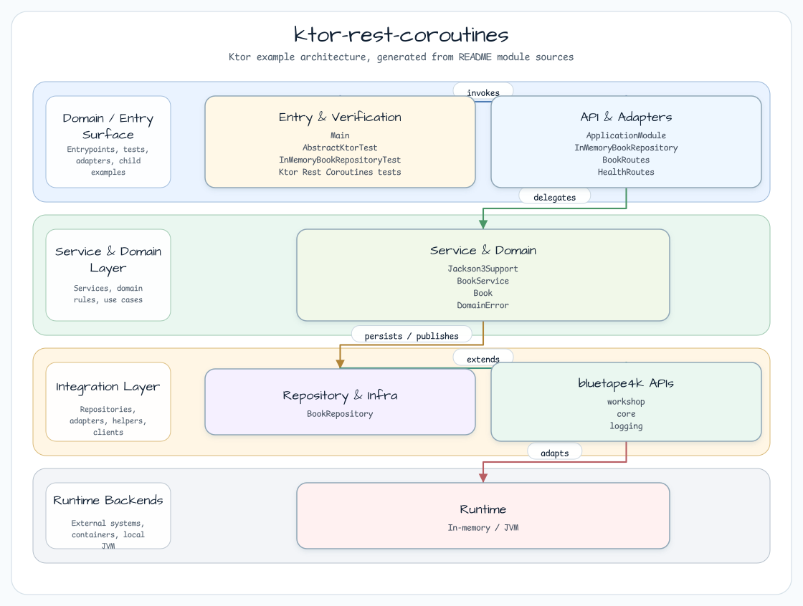

# ktor-rest-coroutines

[English](README.md) | 한국어

## 예제 시나리오

이 예제는 **ktor-rest-coroutines** 모듈을 실행 가능한 Ktor 코루틴 REST 서비스 예제로 보여줍니다. 개발자가 먼저 확인할 경로인 모듈 설정, 샘플 또는 테스트 실행, 반복적인 인프라 코드를 줄이는 라이브러리 또는 프레임워크 API 사용 방식을 중심으로 설명합니다.

## 시퀀스 다이어그램

**Ktor 3** + Kotlin 코루틴 기반 Kotlin-first REST API 워크샵 모듈.
Spring이나 리액티브 스트림 없이 관용적인 코루틴 HTTP, SSE 스트리밍, NDJSON 내보내기를 시연합니다.

---

## 아키텍처



---

## 주요 기능

| 기능 | 구현 방식 |
|------|----------|
| REST CRUD | Ktor 라우팅 + kotlinx-serialization-json |
| SSE 실시간 스트림 | `sse("/books/stream")` + `MutableSharedFlow` |
| NDJSON 내보내기 | `respondBytesWriter` + Jackson 3 (`tools.jackson.*`) |
| 에러 매핑 | `StatusPages` — 400/404/409/500 + `"type"` 필드 |
| 백프레셔 | `BufferOverflow.SUSPEND` + 5초 emit 타임아웃 |
| 로깅 | Ktor `CallLogging` + bluetape4k `KLoggingChannel` |

---

## 엔드포인트

| 메서드 | 경로 | 설명 | 상태 코드 |
|--------|------|------|----------|
| `GET` | `/books` | 전체 도서 목록 | 200 |
| `GET` | `/books/{id}` | ID로 조회 | 200 / 404 |
| `POST` | `/books` | 도서 생성 | 201 / 400 / 409 |
| `PUT` | `/books/{id}` | 도서 수정 | 200 / 400 / 404 |
| `DELETE` | `/books/{id}` | 도서 삭제 | 204 / 404 |
| `GET` | `/books/export` | NDJSON 내보내기 | 200 |
| `GET` | `/books/stream` | SSE 실시간 스트림 | 200 (chunked) |
| `GET` | `/health` | 활성 프로브 | 200 |

### 에러 응답 형식

```json
{"error": "Book not found: id=x", "type": "NotFound"}
```

`type` 값: `NotFound`, `Conflict`, `BadRequest`, `Internal`.

---

## curl 예제

```bash
# List all books
curl http://localhost:8080/books

# Create a book
curl -X POST http://localhost:8080/books \
     -H "Content-Type: application/json" \
     -d '{"id":"b-1","title":"Kotlin in Action","author":"Jemerov","year":2017}'

# Get by id
curl http://localhost:8080/books/b-1

# Update a book
curl -X PUT http://localhost:8080/books/b-1 \
     -H "Content-Type: application/json" \
     -d '{"id":"b-1","title":"Kotlin in Action 2e","author":"Jemerov","year":2024}'

# Delete a book
curl -X DELETE http://localhost:8080/books/b-1

# NDJSON export
curl http://localhost:8080/books/export

# SSE stream (stays open — Ctrl-C to stop)
curl -N http://localhost:8080/books/stream

# Health check
curl http://localhost:8080/health
```

---

## Jackson 3 사용 방침

이 모듈은 두 가지 직렬화 라이브러리를 목적에 따라 구분하여 사용합니다.

| 목적 | 라이브러리 | 패키지 접두사 |
|------|----------|-------------|
| HTTP ContentNegotiation + SSE 인코딩 | kotlinx-serialization-json | `kotlinx.serialization.*` |
| NDJSON 내보내기 (`/books/export`) | Jackson 3 (bluetape4k-jackson3) | `tools.jackson.*` |

`com.fasterxml.jackson.*` (Jackson 2)는 **사용하지 않으며** 소스 import에 나타나서는 안 됩니다.

---

## 실행

```bash
# Start the server
./gradlew :ktor-rest-coroutines:run

# Run tests
./gradlew :ktor-rest-coroutines:test

# Build fat JAR
./gradlew :ktor-rest-coroutines:build
```

---

## 설정

| 파라미터 | 기본값 | 설명 |
|---------|--------|------|
| 포트 | `8080` | Netty 리슨 포트 |
| SSE 버퍼 크기 | `64` | `MutableSharedFlow.extraBufferCapacity` |
| SSE emit 타임아웃 | `5 000 ms` | 느린 SSE 구독자 최대 대기 시간 |

---

## 의존성

```kotlin
implementation(platform(libs.ktor.bom))          // version coordination
implementation(libs.ktor.server.core)
implementation(libs.ktor.server.netty)
implementation(libs.ktor.server.content.negotiation)
implementation(libs.ktor.server.call.logging)
implementation(libs.ktor.server.status.pages)
implementation(libs.ktor.server.sse)
implementation(libs.ktor.serialization.kotlinx.json)
implementation(libs.kotlinx.serialization.json)
implementation(libs.bluetape4k.jackson3)          // NDJSON export only
implementation(libs.jackson3.module.kotlin)
```

---

## 프로덕션 한계

이 워크샵 모듈은 의도적으로 최소한의 구현입니다.
[spec §12 Production Gaps](../../docs/superpowers/specs/2026-05-25-ktor-rest-coroutines-design.md)에서 아래 항목을 포함한 전체 목록을 확인하세요.

- 인증/인가 없음
- 인메모리 스토리지만 지원 (DB 백엔드 없음)
- 페이지네이션/커서 없음
- 레이트 리미팅 없음
- SSE reconnect/replay 미구현 (`lastEventId` 미지원)

---

## 후속 작업: bluetape4k-ktor

계획 중인 `bluetape4k-ktor` 라이브러리 모듈은 이 워크샵에서 재사용 가능한 패턴
(SSE helper, NDJSON responder, StatusPages builder, structured error model)을 추출하여
bluetape4k 소비자가 사용할 수 있는 publishable artifact로 제공하는 것을 목표로 합니다.
