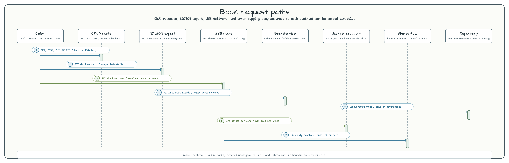

# ktor-rest-coroutines

[English](README.md) | 한국어

작은 도서 카탈로그를 Ktor 3 코루틴 REST 서비스로 구현한 예제입니다. Spring이나 reactive-stream adapter 없이 HTTP 라우팅, 입력 검증, 에러 매핑, SSE 스트리밍, NDJSON 내보내기를 명시적으로 구성하는 방식을 보여줍니다.

## 아키텍처


`Application.module`은 Ktor 플러그인을 설치하고 `BookService`를 만든 뒤 `InMemoryBookRepository`와 `Jackson3Support`를 주입합니다. 저장소는 의도적으로 인메모리입니다. `ConcurrentHashMap`은 현재 카탈로그를 보관하고, `MutableSharedFlow`는 SSE 구독자에게 생성/수정 이벤트를 전달합니다.

## 요청 흐름



각 엔드포인트는 독립적으로 테스트하기 쉬운 계약을 갖습니다.

| 경로 | 계약 |
|------|------|
| `GET /books` | 저장된 모든 `Book`을 JSON으로 반환합니다. |
| `GET /books/{id}` | 단일 도서를 반환하거나 typed `NotFound` 응답을 반환합니다. |
| `POST /books` | 요청 본문을 검증하고, 도서를 생성하고, SSE 이벤트를 발행한 뒤 `201 Created`를 반환합니다. |
| `PUT /books/{id}` | 본문을 검증하고, path id 기준으로 도서를 교체하고, SSE 이벤트를 발행한 뒤 JSON을 반환합니다. |
| `DELETE /books/{id}` | 도서를 삭제하고 `204 No Content`를 반환합니다. |
| `GET /books/export` | Jackson 3와 `respondBytesWriter`로 newline-delimited JSON을 스트리밍합니다. |
| `GET /books/stream` | SSE 연결을 유지하고 이후 생성/수정 이벤트를 전송합니다. |
| `GET /health` | smoke test에 사용할 liveness 응답을 반환합니다. |

## 주요 동작

| 영역 | 구현 세부 사항 |
|------|---------------|
| JSON REST body | Ktor `ContentNegotiation`이 공유 `AppJson` `kotlinx.serialization.json.Json` 인스턴스를 사용합니다. |
| SSE 경로 | `sse("/books/stream")`을 최상위 routing scope에 등록해 경로가 중복되지 않게 합니다. |
| SSE backpressure | `MutableSharedFlow`는 `extraBufferCapacity = 64`를 사용하고, repository emit은 최대 5초까지만 대기합니다. |
| NDJSON export | `Jackson3Support`는 `tools.jackson.*`만 사용하며 Jackson 2 `com.fasterxml.jackson.*` import를 사용하지 않습니다. |
| 에러 매핑 | `StatusPages`가 `NotFound`, `Conflict`, bad request, 예기치 못한 실패를 typed JSON error body로 매핑합니다. |

### 에러 응답

```json
{"error": "Book not found: id=x", "type": "NotFound"}
```

알려진 `type` 값은 `NotFound`, `Conflict`, `BadRequest`, `Internal`입니다.

## 실행

```bash
# 서버 시작
./gradlew :ktor-rest-coroutines:run

# 테스트 실행
./gradlew :ktor-rest-coroutines:test

# 모듈 빌드
./gradlew :ktor-rest-coroutines:build
```

## curl 예제

```bash
curl http://localhost:8080/books

curl -X POST http://localhost:8080/books \
  -H "Content-Type: application/json" \
  -d '{"id":"b-1","title":"Kotlin in Action","author":"Jemerov","year":2017}'

curl http://localhost:8080/books/b-1

curl -X PUT http://localhost:8080/books/b-1 \
  -H "Content-Type: application/json" \
  -d '{"id":"b-1","title":"Kotlin in Action 2e","author":"Jemerov","year":2024}'

curl -X DELETE http://localhost:8080/books/b-1

curl http://localhost:8080/books/export

curl -N http://localhost:8080/books/stream

curl http://localhost:8080/health
```

## 의존성

```kotlin
implementation(platform(libs.ktor.bom))
implementation(libs.ktor.server.core)
implementation(libs.ktor.server.netty)
implementation(libs.ktor.server.content.negotiation)
implementation(libs.ktor.server.call.logging)
implementation(libs.ktor.server.status.pages)
implementation(libs.ktor.server.sse)
implementation(libs.ktor.serialization.kotlinx.json)
implementation(libs.kotlinx.serialization.json)
implementation(libs.bluetape4k.jackson3)
implementation(libs.jackson3.module.kotlin)
```

## 범위

이 모듈은 프로덕션 서비스가 아니라 워크샵 예제입니다. 인증, 인가, 데이터베이스 저장, 페이지네이션, 레이트 리미팅, SSE reconnect/replay 지원은 의도적으로 제외했습니다. 자세한 production gap 목록은 [설계 노트](../../docs/superpowers/specs/2026-05-25-ktor-rest-coroutines-design.md)에 정리되어 있습니다.
