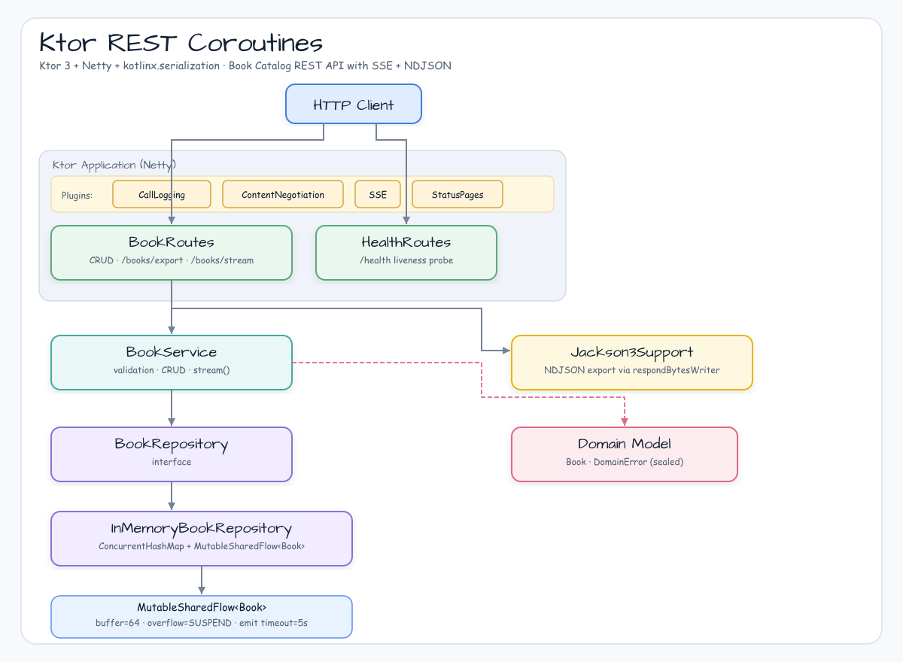

# ktor-rest-coroutines

[한국어](README.ko.md) | English

## Example Scenario

This example exercises **ktor-rest-coroutines** as a runnable Ktor coroutine REST service workshop slice. It focuses on the path a developer would inspect first: configure the module, run the sample or tests, and observe the library or framework APIs that remove repetitive infrastructure code.

## Sequence Diagram

Kotlin-first REST API workshop built with **Ktor 3** and Kotlin coroutines.
Demonstrates idiomatic coroutine-first HTTP, SSE streaming, and NDJSON export without Spring or reactive streams.

---

## Architecture



---

## Features

| Feature | Implementation |
|---------|---------------|
| REST CRUD | Ktor routing + kotlinx-serialization-json |
| SSE live stream | `sse("/books/stream")` + `MutableSharedFlow` |
| NDJSON export | `respondBytesWriter` + Jackson 3 (`tools.jackson.*`) |
| Error mapping | `StatusPages` — 400 / 404 / 409 / 500 with `"type"` field |
| Backpressure | `BufferOverflow.SUSPEND` + 5 s emit timeout |
| Logging | Ktor `CallLogging` + bluetape4k `KLoggingChannel` |

---

## Endpoints

| Method | Path | Description | Status |
|--------|------|-------------|--------|
| `GET` | `/books` | List all books | 200 |
| `GET` | `/books/{id}` | Get by id | 200 / 404 |
| `POST` | `/books` | Create book | 201 / 400 / 409 |
| `PUT` | `/books/{id}` | Update book | 200 / 400 / 404 |
| `DELETE` | `/books/{id}` | Delete book | 204 / 404 |
| `GET` | `/books/export` | NDJSON export | 200 |
| `GET` | `/books/stream` | SSE live stream | 200 (chunked) |
| `GET` | `/health` | Liveness probe | 200 |

### Error response format

```json
{"error": "Book not found: id=x", "type": "NotFound"}
```

`type` values: `NotFound`, `Conflict`, `BadRequest`, `Internal`.

---

## curl Examples

```bash
# List all books
curl http://localhost:8080/books

# Create a book
curl -X POST http://localhost:8080/books \
     -H "Content-Type: application/json" \
     -d '{"id":"b-1","title":"Kotlin in Action","author":"Jemerov","year":2017}'

# Get by id
curl http://localhost:8080/books/b-1

# Update a book
curl -X PUT http://localhost:8080/books/b-1 \
     -H "Content-Type: application/json" \
     -d '{"id":"b-1","title":"Kotlin in Action 2e","author":"Jemerov","year":2024}'

# Delete a book
curl -X DELETE http://localhost:8080/books/b-1

# NDJSON export
curl http://localhost:8080/books/export

# SSE stream (stays open — Ctrl-C to stop)
curl -N http://localhost:8080/books/stream

# Health check
curl http://localhost:8080/health
```

---

## Jackson 3 Stance

This module uses two serialization libraries for different purposes:

| Purpose | Library | Package prefix |
|---------|---------|----------------|
| HTTP ContentNegotiation + SSE encoding | kotlinx-serialization-json | `kotlinx.serialization.*` |
| NDJSON export (`/books/export`) | Jackson 3 via bluetape4k-jackson3 | `tools.jackson.*` |

`com.fasterxml.jackson.*` (Jackson 2) is **not used** and must not appear in source imports.

---

## Run

```bash
# Start the server
./gradlew :ktor-rest-coroutines:run

# Run tests
./gradlew :ktor-rest-coroutines:test

# Build fat JAR
./gradlew :ktor-rest-coroutines:build
```

---

## Configuration

| Parameter | Default | Description |
|-----------|---------|-------------|
| Port | `8080` | Netty listen port |
| SSE buffer capacity | `64` | `MutableSharedFlow.extraBufferCapacity` |
| SSE emit timeout | `5 000 ms` | Max time to wait for a slow SSE subscriber |

---

## Dependencies

```kotlin
implementation(platform(libs.ktor.bom))          // version coordination
implementation(libs.ktor.server.core)
implementation(libs.ktor.server.netty)
implementation(libs.ktor.server.content.negotiation)
implementation(libs.ktor.server.call.logging)
implementation(libs.ktor.server.status.pages)
implementation(libs.ktor.server.sse)
implementation(libs.ktor.serialization.kotlinx.json)
implementation(libs.kotlinx.serialization.json)
implementation(libs.bluetape4k.jackson3)          // NDJSON export only
implementation(libs.jackson3.module.kotlin)
```

---

## Production Gaps

This workshop module is intentionally minimal. See
[spec §12 Production Gaps](../../docs/superpowers/specs/2026-05-25-ktor-rest-coroutines-design.md)
for a full list, including:

- No authentication or authorization
- In-memory storage only (no DB backend)
- No pagination or cursor support
- No rate limiting
- SSE has no reconnect/replay (`lastEventId` not implemented)

---

## Follow-up: bluetape4k-ktor

A planned `bluetape4k-ktor` library module would extract reusable patterns from this workshop
(SSE helpers, NDJSON responder, StatusPages builder, structured error model) into a
publishable artifact for bluetape4k consumers.
