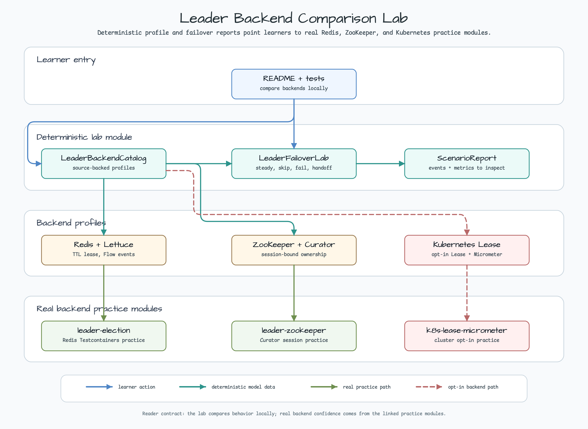
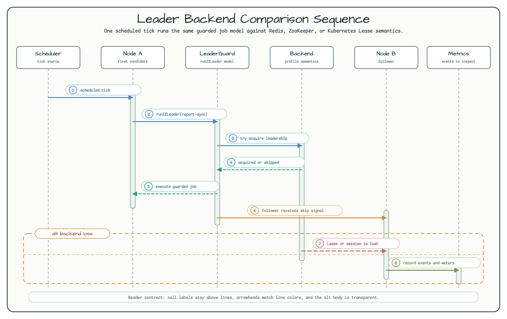

# 리더 백엔드 비교 Lab

[English](README.md) | 한국어

이 모듈은 Redis, ZooKeeper, Kubernetes Lease 리더 선출 백엔드를
결정론적인 Spring Boot 4 lab으로 비교합니다.

이 예제는 실제 백엔드별 실행 예제를 대체하지 않습니다. 이 모듈에서는 어떤
백엔드를 선택할지와 장애 조치 의미를 먼저 이해하고, 실제 백엔드 연습은 다음
모듈에서 진행합니다.

- [leader-election](../leader-election/): Redis + Lettuce.
- [leader-zookeeper](../leader-zookeeper/): ZooKeeper + Curator.
- [k8s-lease-micrometer](../k8s-lease-micrometer/): Kubernetes Lease +
  Micrometer.

## Architecture



`LeaderBackendCatalog`는 백엔드별 source-backed profile을 보관합니다.
`LeaderFailoverLab`은 이 profile을 사용해 steady leader 실행, follower skip,
action failure, backend-loss handoff를 결정론적인 report로 만듭니다. 기본
테스트는 Redis, ZooKeeper, Kubernetes, LocalStack이나 다른 인프라를 시작하지
않습니다.

이 lab은 `bluetape4k-leader` 1.0.0의 diagnostics SPI도 연결합니다.
`ProfiledLeaderElector`가 선택한 profile을 Spring Boot Actuator endpoint에
제공하고 `leader-micrometer` instrumentation으로 감쌉니다. leader operation은
local elector에 위임하므로 client를 만들거나 네트워크 연결을 열지 않고 새
observability 표면을 확인할 수 있습니다. 이 예제는 명시적인 backend
diagnostics decorator에 집중하므로 Micrometer Observation tracing은 기본
비활성화되어 있으며, diagnostics endpoint와 health probe는 그대로 사용할 수
있습니다.

## Diagnostics, Health, Metrics

passive diagnostics endpoint는 기본 활성화되지만 백엔드 호출을 실행하지
않습니다.

```bash
./gradlew :leader-backend-comparison-lab:bootRun
curl http://localhost:8080/actuator/leaderBackendDiagnostics
```

응답에는 선택한 backend descriptor와 `connectivity.status=NOT_CHECKED`가
포함됩니다. 이 기본값은 smoke test와 startup inspection에 안전합니다. 예제는
`bluetape4k.leader.observability.state-provider-bean=workshopLeaderElector`를
명시해 함께 존재하는 local suspend fallback보다 blocking diagnostics
provider를 우선 선택합니다. active connectivity probe는 명시적으로 켜야 하며,
예제 설정에서는 `250ms` bounded timeout을 사용합니다.

```bash
./gradlew :leader-backend-comparison-lab:bootRun \
  --args='--bluetape4k.leader.observability.backend-health.enabled=true --workshop.leader.probe-outcome=UP'
curl http://localhost:8080/actuator/health
```

자격 증명 없이 bounded probe와 health mapping을 확인하려면
`workshop.leader.probe-outcome`을 `DOWN`, `UNKNOWN`, `UNSUPPORTED`, `EXCEPTION`,
`CANCELLED`로 바꿔 실행합니다. health indicator는 `UP`/`DOWN`을 Spring status로
매핑하고, unsupported·uncertain·failed·cancelled 결과는 `UNKNOWN`으로
유지합니다. Micrometer decorator는 low-cardinality
`leader.backend.connectivity` counter에 `backend.name`, `status`, `reason` tag를
기록합니다. 이 예제는 credential, raw endpoint, write/action operation을
의도적으로 다루지 않으므로 실제 connectivity와 failover 검증은 백엔드별
practice module에서 수행합니다.

## Scenario Flow



1. scheduled tick이 모든 candidate에 도달합니다.
2. lab은 선택한 backend profile에 맞춰 `runIfLeader(report-sync)`를 모델링합니다.
3. backend profile은 leadership 획득 또는 skip 의미를 설명합니다.
4. 한 node만 guarded job을 실행하고 follower는 skip report를 받습니다.
5. backend-loss branch는 백엔드별 handoff trigger를 보여줍니다.
6. report는 실제 practice module에서 확인할 metric과 event를 알려줍니다.

## Backend Selection Matrix

| Backend | Status | Primitive | Failover trigger | Tuning surface | Practice module |
|---------|--------|-----------|------------------|----------------|-----------------|
| Redis + Lettuce | Stable | Redis key with lease TTL | Lease TTL expiry or explicit release | `waitTime`, `leaseTime`, `autoExtend` | [`leader-election`](../leader-election/) |
| ZooKeeper + Curator | Stable | Ephemeral znode / Curator mutex | ZooKeeper session loss | `sessionTimeoutMs`, `connectionTimeoutMs`, `groupMaxLeaders` | [`leader-zookeeper`](../leader-zookeeper/) |
| Kubernetes Lease | Preview opt-in | `coordination.k8s.io/v1` Lease object | Lease expiry and resource-version update | `namespace`, `identity`, `leaseTime`, `retryDelay`, `autoExtend` | [`k8s-lease-micrometer`](../k8s-lease-micrometer/) |

이미 Redis를 운영하고 있고 scheduled work를 빠른 TTL 기반 guard로 보호하고
싶다면 Redis가 적합합니다. session-bound ownership이나 group leadership이 더
중요하면 ZooKeeper가 잘 맞습니다. Kubernetes-native workload에서 Lease RBAC를
부여할 수 있고 Micrometer metric을 노출할 수 있다면 Kubernetes Lease를
검토합니다.

## Failover Lab Scenarios

| Scenario | What it teaches | Local behavior |
|----------|-----------------|----------------|
| `steady-leader` | 선출된 node 하나만 guarded job을 실행합니다. | `node-a`가 `report-sync`를 실행하고 `node-b`는 skip합니다. |
| `contention-skip` | follower가 같은 scheduled job을 중복 실행하면 안 됩니다. | 한 contender만 실행하고 나머지는 skip event를 기록합니다. |
| `action-failure-release` | 선출된 action이 실패해도 다음 eligible run이 숨겨지면 안 됩니다. | 실패를 기록하고 ownership이 release 또는 expire된 뒤 다음 candidate가 실행할 수 있습니다. |
| `backend-loss-handoff` | handoff 원인은 백엔드마다 다릅니다. | Redis는 lease expiry, ZooKeeper는 session loss, Kubernetes는 Lease expiry/resource update를 사용합니다. |

## Metrics And Events

| Backend | What to inspect |
|---------|-----------------|
| Redis + Lettuce | `LeaderElectionEvent` Flow, listener callback, skip/elected/revoked event. |
| ZooKeeper + Curator | single-leader result, group-leader slot result, Curator connection state. |
| Kubernetes Lease | `leader-micrometer` meter, `workshop.k8s.lease.*` meter, Prometheus scrape. |

이 표는 학습 가이드일 뿐 production benchmark ranking이 아닙니다. 실제 선택은
기존 인프라, 가용성 요구사항, 장애 도메인, RBAC, 운영 역량, guarded work의
멱등성에 따라 결정해야 합니다.

## Run Locally

```bash
./gradlew :leader-backend-comparison-lab:test
./gradlew :leader-backend-comparison-lab:bootRun
```

테스트 경로는 결정론적이며 인프라가 필요 없습니다. Docker, kubeconfig,
service-account credential, 네트워크 백엔드 서비스 없이 smoke validation에서
안전하게 실행할 수 있습니다.

## Test Map

| Test class | What it protects |
|------------|------------------|
| `LeaderBackendCatalogTest` | backend ID, status, failover trigger, metrics/events, practice-module link, unknown-ID validation을 보호합니다. |
| `LeaderFailoverLabTest` | scenario ordering, follower skip report, action-failure recovery, backend-specific handoff summary를 보호합니다. |
| `LeaderBackendDiagnosticsProviderTest` | descriptor capability, passive `NOT_CHECKED`, bounded probe status/reason mapping, timeout validation, cancellation propagation을 보호합니다. |
| `LeaderBackendDiagnosticsPropertiesTest` | credential-free 기본값과 unknown backend fail-closed 선택을 보호합니다. |
| `LeaderBackendDiagnosticsContextTest` | Actuator opt-out, passive endpoint, opt-in health mapping, cancellation safety, low-cardinality Micrometer tag를 보호합니다. |

## Production Boundaries

이 모듈은 workshop 비교 lab입니다. Production 서비스에는 graceful shutdown,
멱등적인 guarded work, alerting, backend health check, retry policy,
credential/RBAC review, capacity planning, 선택한 backend에 대한 실제 failover
exercise가 필요합니다.

## Dependencies

```kotlin
implementation(libs.bluetape4k.core)
implementation(libs.bluetape4k.leader.core)
implementation(libs.bluetape4k.leader.spring.boot)
implementation(libs.bluetape4k.leader.micrometer)
implementation(libs.bluetape4k.logging)
implementation(libs.spring.boot.starter.actuator)
implementation(libs.spring.boot.starter.webmvc.lib)
runtimeOnly(libs.reactive.streams)
runtimeOnly(libs.reactor.core)
testImplementation(libs.bluetape4k.assertions)
testImplementation(libs.bluetape4k.junit5)
```

`reactive-streams`와 `reactor-core`는 현재 1.0.0 조건부
auto-configuration classpath를 만족하기 위한 versionless BOM 관리 runtime
bridge입니다. 이 MVC lab에서 WebFlux 서버를 활성화하지는 않습니다.
