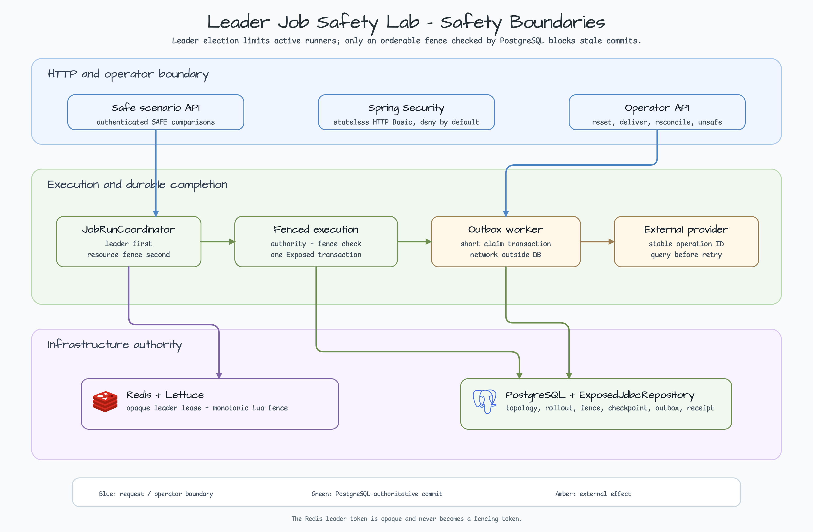
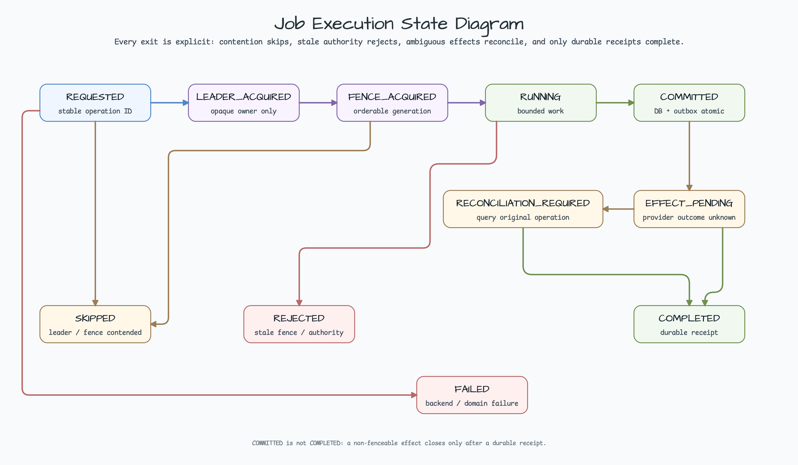
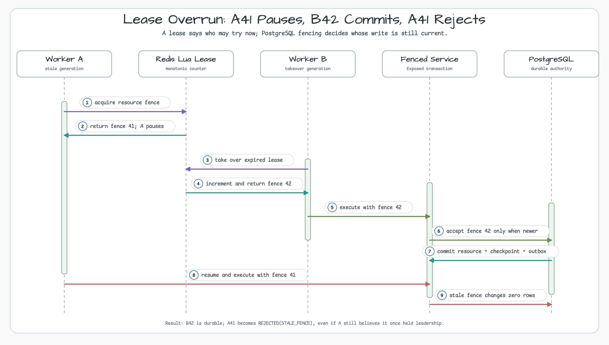
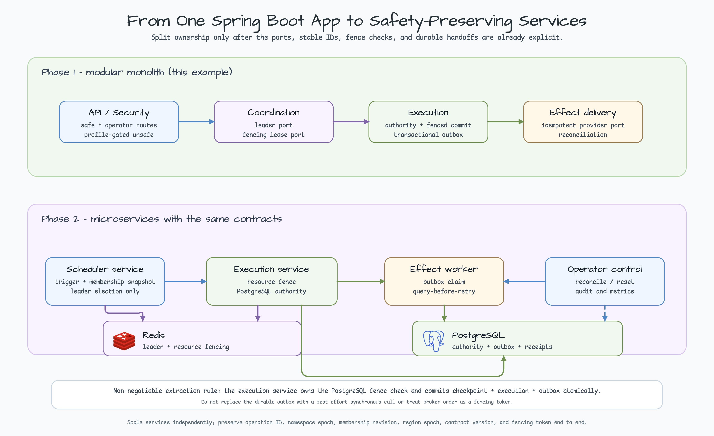

# Leader Job Safety Lab

[한국어](README.ko.md) | English

Winning leader election does not make a job result safe. A paused worker can resume after its lease expires, two differently named jobs can mutate the same business resource, and tenant, region, or rollout authority can change while work is running. This Spring Boot example shows which failures Redis can reduce and which decisions PostgreSQL must make at commit time.

The core rule is:

> Leader election decides who may try now; fencing proves at PostgreSQL commit time whether that write is still current.

The module uses Java 25, Spring Boot 4, `bluetape4k-leader-redis-lettuce`, `bluetape4k-lettuce`, JetBrains Exposed JDBC, `bluetape4k-exposed-jdbc`, PostgreSQL, and Redis. Every concrete repository implements `ExposedJdbcRepository`; there is no raw SQL or JDBC escape hatch.

## Architecture at a glance



Five guarantees are intentionally separate:

| Guarantee | Responsibility in this example |
| --- | --- |
| `mutual exclusion` | Redis leader and resource leases reduce concurrently active workers. |
| `failover` | Another worker can take over after expiry; this does not make the old worker's later write safe. |
| `replay safety` | Stable `OperationId`, an idempotent provider, and a receipt unique key make repeated delivery safe. |
| `fencing` | Redis Lua issues monotonic tokens and PostgreSQL accepts a write only when `incomingFence > lastAcceptedFence`. |
| `durable completion` | Business state, checkpoint, execution, and outbox commit in one Exposed transaction; a receipt completes the external effect. |

The leader backend owner token is opaque. It is never ordered or reused as a fencing token. A reusable generic fencing lease is tracked separately in [bluetape4k-projects #1068](https://github.com/bluetape4k/bluetape4k-projects/issues/1068).

## Six production failure scenarios

| Scenario | Unsafe assumption | SAFE containment |
| --- | --- | --- |
| `CROSS_JOB_COLLISION` | Different job names cannot collide | Both jobs derive one business `ConflictKey` and serialize on its resource fence. |
| `LEASE_OVERRUN` | Once acquired, a lease stays safe until work ends | After B42 commits, resumed A41 is rejected as `STALE_FENCE`. |
| `DYNAMIC_TENANT` | The trigger-time tenant set is still valid at commit | The transaction reloads current membership revision and active status from PostgreSQL. |
| `REGION_PARTITION` | A local Redis leader in each region may write | PostgreSQL checks write-home region and region epoch and rejects non-home writes. |
| `MIXED_VERSION_ROLLOUT` | An old worker may keep writing new checkpoints | Minimum writer version, checkpoint schema, and namespace epoch are checked before commit. |
| `NON_FENCEABLE_EFFECT` | A fencing token can cancel an email, payment, or webhook already sent | Stable operation ID, transactional outbox, query-before-retry, and durable receipt provide recovery. |

`UNSAFE` mode deliberately reproduces broken outcomes for comparison. Under the `prod` profile, the unsafe controller bean is absent regardless of its flag.

## Execution states



- `REQUESTED` means a trigger has a stable operation ID and authority snapshot.
- `LEADER_ACQUIRED` means this worker currently owns the opaque leader lease; it does not authorize a stale write.
- `FENCE_ACQUIRED` means Redis issued an orderable resource generation for the exact conflict key.
- `RUNNING` means bounded business work is executing with that immutable snapshot and fence.
- `SKIPPED` means leader or resource-fence contention. It is not a domain failure and a later trigger may retry.
- `REJECTED` means the snapshot no longer matches current fence, membership, region, version, or namespace authority. Do not retry the same stale snapshot unchanged.
- `FAILED` means a backend or domain execution failure that needs policy-based diagnosis and retry.
- `COMMITTED` means PostgreSQL business state and outbox are durable; it does not mean an external effect completed.
- `EFFECT_PENDING` means the committed outbox operation is waiting for delivery or confirmation.
- `RECONCILIATION_REQUIRED` means provider application is unknown. Query the original `OperationId`; never create a replacement operation.
- `COMPLETED` means the provider result and receipt are durable.

The timeline is bounded by `workshop.job-safety.timeline-limit`; `droppedTimelineEvents` reports omitted educational events.

## A41 → B42 takeover



An expired Redis lease does not prove Worker A stopped. A may resume after a GC pause, network partition, or long I/O.

1. A obtains fence 41 and pauses.
2. Its lease expires and B obtains fence 42.
3. B42 atomically commits resource, checkpoint, execution, and outbox.
4. A41 resumes, but the PostgreSQL conditional update changes zero rows.
5. A41 becomes `REJECTED(STALE_FENCE)` and B42 remains durable.

The Redis counter key must outlive the lease key. Restarting at 1 after losing counter history can make an old high token look newer. Recovery must either preserve counter history or advance a namespace epoch together with the PostgreSQL rollout marker. Epoch mismatch and counter overflow fail closed.

## Run locally

### Prerequisites

- JDK 25
- Docker or a compatible container runtime
- PostgreSQL 18-compatible server
- Redis 8-compatible server

Start local backends:

```bash
docker run --rm --name job-safety-postgres \
  -e POSTGRES_DB=jobsafety -e POSTGRES_USER=jobsafety -e POSTGRES_PASSWORD=jobsafety \
  -p 5432:5432 postgres:18-alpine

docker run --rm --name job-safety-redis -p 6379:6379 redis:8-alpine
```

In another terminal, start the safe application:

```bash
SPRING_DATASOURCE_URL=jdbc:postgresql://localhost:5432/jobsafety \
SPRING_DATASOURCE_USERNAME=jobsafety \
SPRING_DATASOURCE_PASSWORD=jobsafety \
SPRING_SECURITY_USER_NAME=viewer \
SPRING_SECURITY_USER_PASSWORD=change-me \
SPRING_SECURITY_USER_ROLES=JOB_SAFETY_VIEWER,JOB_SAFETY_OPERATOR \
./gradlew :leader-job-safety-lab:bootRun
```

List and run SAFE scenarios:

```bash
curl -u viewer:change-me http://localhost:8080/api/job-safety/scenarios

curl -u viewer:change-me -X POST \
  http://localhost:8080/api/job-safety/scenarios/LEASE_OVERRUN/run
```

Operator endpoints require `ROLE_JOB_SAFETY_OPERATOR`:

```bash
curl -u viewer:change-me -X POST http://localhost:8080/api/job-safety/effects/deliver
curl -u viewer:change-me -X POST http://localhost:8080/api/job-safety/effects/reconcile
curl -u viewer:change-me -X POST http://localhost:8080/api/job-safety/scenarios/LEASE_OVERRUN/reset
```

### Isolated UNSAFE lab

Unsafe endpoints require both the `lab-unsafe` profile and an explicit flag. Adding `prod` always suppresses the controller.

```bash
SPRING_PROFILES_ACTIVE=lab-unsafe \
WORKSHOP_JOB_SAFETY_LAB_UNSAFE_ENABLED=true \
SPRING_DATASOURCE_URL=jdbc:postgresql://localhost:5432/jobsafety \
SPRING_DATASOURCE_USERNAME=jobsafety \
SPRING_DATASOURCE_PASSWORD=jobsafety \
SPRING_SECURITY_USER_NAME=operator \
SPRING_SECURITY_USER_PASSWORD=change-me \
SPRING_SECURITY_USER_ROLES=JOB_SAFETY_OPERATOR \
./gradlew :leader-job-safety-lab:bootRun

curl -u operator:change-me -X POST \
  http://localhost:8080/api/job-safety/unsafe/scenarios/LEASE_OVERRUN/run
```

Never use this profile in a shared or production environment. It is a comparison baseline, not a switch that weakens the real persistence path.

## PostgreSQL authority and Exposed transaction

`FencedJobExecutionService` performs these steps inside one `JobSafetyJdbcExecutor.transaction`:

1. Load current tenant assignment and rollout marker.
2. Compare membership revision, region/epoch, contract version, and namespace epoch.
3. Update the resource only when its namespace is current and the incoming fence is newer.
4. Record checkpoint and execution, then enqueue the outbox row.
5. Roll back everything if any step fails.

All repositories extend `JobSafetyExposedJdbcRepository`, which implements Bluetape's `ExposedJdbcRepository` contract. The module uses no `JdbcTemplate`, raw JDBC, or `Transaction.exec`. Startup uses `SchemaUtils.createMissingTablesAndColumns` for workshop convenience; a production service should replace it with reviewed Flyway or Liquibase migrations.

On Spring shutdown, `JobSafetyJdbcExecutor` unregisters its process-wide Exposed `Database` before the `DataSource` closes. Without that lifecycle boundary, a restarted context can retain a closed Hikari source.

## External effects and reconciliation

Database fencing cannot undo an email, payment authorization, or webhook that already reached a provider.

- Commit the same stable `OperationId` with business state and outbox.
- Claim an outbox row in a short transaction, then close the transaction.
- Perform provider network I/O outside the database transaction.
- If a worker dies after claiming, let `workshop.job-safety.outbox.claim-timeout` expire and query the original operation; never blindly execute it again.
- On `UNKNOWN`, persist `RECONCILIATION_REQUIRED`; do not invent a new operation.
- Query the original operation and store a receipt unique on `(provider, operationId)`.

If a provider offers neither idempotency keys nor a lookup API, exactly-once external effects are impossible. Add domain-specific duplicate tolerance, manual verification, or compensating actions.

## Mixed-version rollout

Use expand → compatible readers → new writers → minimum writer version marker → cleanup.

1. Deploy readers that understand both old and new checkpoint schemas.
2. Advance the checkpoint schema.
3. After enough new writers are ready, raise PostgreSQL `minimumWriterVersion`.
4. Old writers fail closed as `INCOMPATIBLE_VERSION`.
5. Coordinate any Redis namespace change with the PostgreSQL namespace marker.

Broker order, image tags, and pod start times are not fencing tokens.

## Microservice extraction



Start with explicit ports and transaction boundaries in one Spring Boot application. Split only when operational ownership requires it:

- Scheduler service owns triggers, membership snapshots, and leader election.
- Execution service owns resource fencing, PostgreSQL authority checks, and the atomic checkpoint/execution/outbox commit.
- Effect worker owns outbox claims, provider idempotency, query-before-retry, and receipts.
- Operator control owns bounded reconciliation/reset, audit, and metrics access.

Commands must preserve `OperationId`, `ConflictKey`, membership revision, region epoch, namespace epoch, and contract version. Carry the fencing token to the execution service's commit boundary; never replace it with a broker offset or generic ordering ID. Replacing the outbox with a best-effort synchronous call removes durable completion.

## Security and operations

- CSRF is disabled only because this is a stateless JSON API using HTTP Basic. Revisit that choice before adding cookie-backed sessions.
- Authorization starts with `denyAll`; health, authenticated SAFE runs, and operator-only mutations are explicitly allowed.
- No users are hardcoded. Production must integrate its identity provider and credential policy.
- The unsafe controller has two gates: `lab-unsafe & !prod` and the explicit property.
- Timeline codes and rejection reasons are low-cardinality. Never put operation or tenant IDs in metric labels.
- Actuator health may be exposed, but detailed Redis/PostgreSQL errors and credentials must remain private.

## Tests

```bash
# Fast path; starts no containers
./gradlew :leader-job-safety-lab:test

# Real PostgreSQL + Redis; serialized
./gradlew :leader-job-safety-lab:integrationTest --max-workers=1
```

| Proof | Tests |
| --- | --- |
| Java 25 virtual threads and safe defaults | `JobSafetyRuntimeContractTest`, `JobSafetyPropertiesTest` |
| Opaque leader token separation | `RedisLeaderElectionAdapterTest` |
| Monotonic Lua tokens, owner-bound renew/release, script flush | `RedisJobFencingLeaseIntegrationTest` |
| Fence 42 commits and resumed fence 41 rejects | `FencedMutationPostgresIntegrationTest`, `JobSafetyEndToEndIntegrationTest` |
| Tenant, region, version, and namespace authority | `JobAuthorityPostgresIntegrationTest` |
| Provider call outside a transaction and restart recovery | `OutboxEffectWorkerTest`, `JobSafetyContextRestartIntegrationTest` |
| No raw DB access and Exposed repository contract | `KotlinPatternArchitectureTest`, `JobSafetyRepositoryContractTest` |
| Unsafe double gate and operator authorization | `UnsafeJobSafetyControllerConditionTest`, `JobSafetySecurityTest` |

## Limitations and next steps

- API scenario snapshots are deterministic teaching models; backend integration tests prove the real Redis/PostgreSQL safety contract.
- `DeterministicExternalEffectAdapter` is a failure-modeling fake. A production adapter needs timeout, lookup, idempotency, and rate-limit policies.
- This module uses one Redis deployment. Multi-region global fencing requires joint validation of Redis topology and PostgreSQL write-home authority.
- `SchemaUtils` is development-only; production needs migrations, backups, and a namespace-epoch runbook.
- Scenario reset is stateless here. A real reset endpoint needs approval, audit, bounded scope, and dry-run support.

Related material:

- [Tenant Scheduler example](../tenant-scheduler/README.md)
- [Leader Backend Comparison Lab](../backend-comparison-lab/README.md)
- [Leader election article PR #249](https://github.com/bluetape4k/bluetape4k.github.io/pull/249)
- [Workshop issue #548](https://github.com/bluetape4k/bluetape4k-workshop/issues/548)
- [Reusable fencing lease issue #1068](https://github.com/bluetape4k/bluetape4k-projects/issues/1068)
