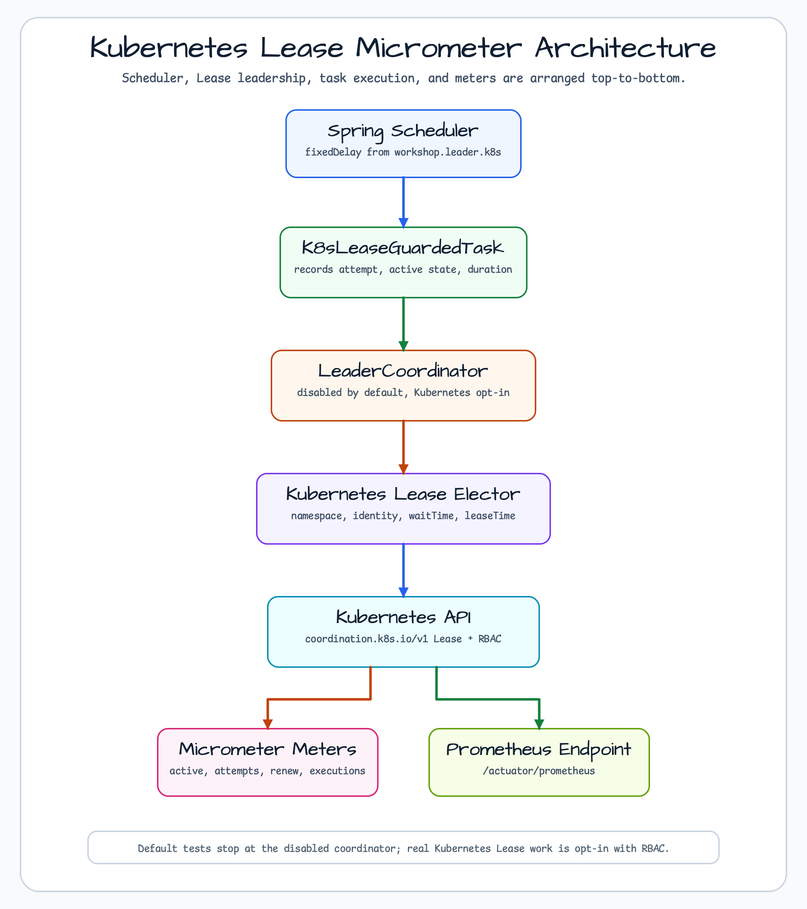
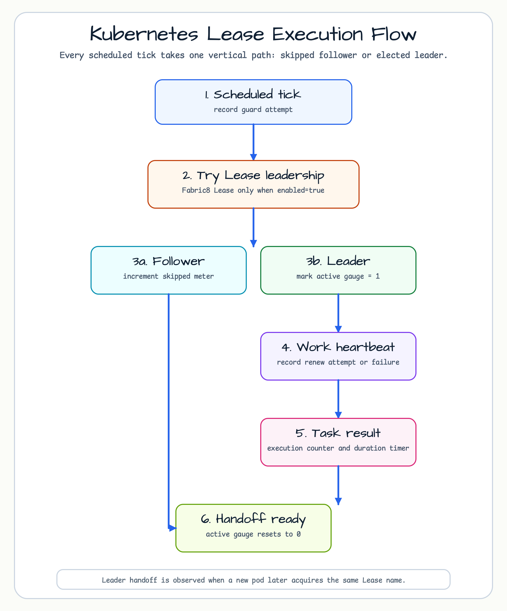

# Kubernetes Lease Micrometer Workshop

[한국어](README.ko.md) | English

This module demonstrates a Spring Boot 4 scheduled task guarded by
Kubernetes `coordination.k8s.io/v1` Lease leadership and observed with
Micrometer metrics.

The default path is smoke-safe: `workshop.leader.k8s.enabled=false` uses a
disabled coordinator, so tests and local context startup do not require kind,
K3s, minikube, kubeconfig, or service-account credentials. The real Kubernetes
Lease path is explicitly opt-in.

## Architecture



`K8sLeaseMicrometerConfig` creates a `DisabledLeaderCoordinator` by default.
When `workshop.leader.k8s.enabled=true`, it creates a Fabric8
`KubernetesClient`, a `KubernetesLeaseSuspendLeaderElector`, and an upstream
`InstrumentedSuspendLeaderElector`. `K8sLeaseGuardedTask` is the scheduled
workload that records application-level meters around each leader guard tick.

## Execution Flow



1. Spring Scheduling triggers one tick on every instance.
2. The task records `workshop.k8s.lease.guard.attempts`.
3. `LeaderCoordinator.runIfLeader(leaseName) { ... }` tries to enter the leader block.
4. Followers return `null` and increment `workshop.k8s.lease.guard.skipped`.
5. The elected instance marks `workshop.k8s.lease.leader.active=1`, emits a
   workshop heartbeat meter, runs the simulated task, records duration, then
   resets the active gauge to `0`.
6. A handoff is visible when another pod later acquires the same Lease name and
   begins incrementing its task execution counter.

## Configuration

```yaml
workshop:
  leader:
    k8s:
      enabled: false
      namespace: workshop
      identity: ${HOSTNAME:local-workshop}
      lease-name: workshop-nightly-export
      wait-time: 2s
      lease-time: 30s
      retry-delay: 50ms
      job-fixed-delay: 10s
      simulated-work-time: 100ms
      auto-extend: true
```

| Property | Meaning |
|----------|---------|
| `enabled` | Creates the real Fabric8 client and Kubernetes Lease elector only when `true`. |
| `namespace` | Kubernetes namespace that stores the Lease object. |
| `identity` | Node identity mapped to `LeaderElectionOptions.nodeId`. |
| `lease-name` | Kubernetes Lease name and Micrometer `lock.name` tag. |
| `wait-time` | How long a candidate waits before skipping a tick. |
| `lease-time` | Lease duration used by the Kubernetes backend. Must be greater than or equal to `wait-time`. |
| `retry-delay` | Retry delay for Kubernetes resource-version contention. |
| `job-fixed-delay` | Spring scheduler fixed delay. |
| `simulated-work-time` | Demo task latency; keep it short for smoke tests. |
| `auto-extend` | Enables the `bluetape4k-leader` auto-extension path while the action runs. |

## Metrics

Application-level workshop meters:

| Meter | Type | Tags |
|-------|------|------|
| `workshop.k8s.lease.leader.active` | gauge | `lock.name`, `namespace` |
| `workshop.k8s.lease.guard.attempts` | counter | `lock.name`, `namespace` |
| `workshop.k8s.lease.guard.skipped` | counter | `lock.name`, `namespace`, `reason` |
| `workshop.k8s.lease.renew.attempts` | counter | `lock.name`, `namespace` |
| `workshop.k8s.lease.renew.failures` | counter | `lock.name`, `namespace`, `reason` |
| `workshop.k8s.lease.task.executions` | counter | `lock.name`, `namespace`, `result` |
| `workshop.k8s.lease.task.duration` | timer | `lock.name`, `namespace` |

The `renew.*` meters are workshop heartbeats emitted while elected work is
active. They make the renewal window visible to learners; the actual
owner-conditional Lease renewals are handled inside `bluetape4k-leader-k8s`.

When the real coordinator is enabled, `leader-micrometer` also records library
decorator meters such as:

- `shedlock.leader.acquired`
- `shedlock.leader.not_acquired`
- `shedlock.leader.duration`
- `shedlock.leader.active`

## Run Locally

```bash
# Smoke-safe default: starts without Kubernetes and skips leader work
./gradlew :leader-k8s-lease-micrometer:bootRun

# Deterministic tests: no cluster, no kubeconfig
./gradlew :leader-k8s-lease-micrometer:test
```

Metrics are exposed through Spring Boot Actuator:

```bash
curl -s http://localhost:8080/actuator/metrics/workshop.k8s.lease.guard.skipped
curl -s http://localhost:8080/actuator/prometheus | grep workshop_k8s_lease
```

## kind RBAC Example

Apply the namespace, service account, Role, and RoleBinding before enabling the
real Kubernetes path:

```yaml
apiVersion: v1
kind: Namespace
metadata:
  name: workshop
---
apiVersion: v1
kind: ServiceAccount
metadata:
  name: lease-runner
  namespace: workshop
---
apiVersion: rbac.authorization.k8s.io/v1
kind: Role
metadata:
  name: lease-runner
  namespace: workshop
rules:
  - apiGroups: ["coordination.k8s.io"]
    resources: ["leases"]
    verbs: ["get", "list", "watch", "create", "update", "patch", "delete"]
---
apiVersion: rbac.authorization.k8s.io/v1
kind: RoleBinding
metadata:
  name: lease-runner
  namespace: workshop
subjects:
  - kind: ServiceAccount
    name: lease-runner
    namespace: workshop
roleRef:
  apiGroup: rbac.authorization.k8s.io
  kind: Role
  name: lease-runner
```

Run with a real cluster:

```bash
./gradlew :leader-k8s-lease-micrometer:bootRun \
  --args='--workshop.leader.k8s.enabled=true \
          --workshop.leader.k8s.namespace=workshop \
          --workshop.leader.k8s.identity=local-dev-1'
```

Start two instances with different `identity` values. Only one instance should
increment `workshop.k8s.lease.task.executions{result="success"}` at a time. Stop
the elected instance and watch the other instance acquire the same Lease after
the current lease expires.

## Test Map

| Test class | What it protects |
|------------|------------------|
| `K8sLeaseMicrometerPropertiesTest` | Property defaults, validation, and conversion to `KubernetesLeaseOptions`. |
| `K8sLeaseMetricsTest` | Stable meter names, tags, counters, timer, and active gauge reset. |
| `K8sLeaseGuardedTaskTest` | Elected, skipped, and task-failure paths without Kubernetes. |
| `K8sLeaseMicrometerContextTest` | Default Spring context uses the disabled coordinator and creates no `KubernetesClient`. |

## Production Boundaries

This is a workshop, not a production operator. Production services still need
pod disruption budgets, readiness gates, Kubernetes API retry policy, alerting,
RBAC review, identity naming rules, graceful shutdown, and business-specific
idempotency for the guarded task.

## Dependencies

```kotlin
implementation(libs.bluetape4k.leader.k8s)
implementation(libs.bluetape4k.leader.micrometer)
implementation(libs.fabric8.kubernetes.client)
implementation(libs.micrometer.core)
implementation(libs.micrometer.registry.prometheus)
implementation(libs.spring.boot.starter.actuator)
implementation(libs.spring.boot.starter.webmvc.lib)
testImplementation(libs.bluetape4k.assertions)
testImplementation(libs.kotlinx.coroutines.test.lib)
```
