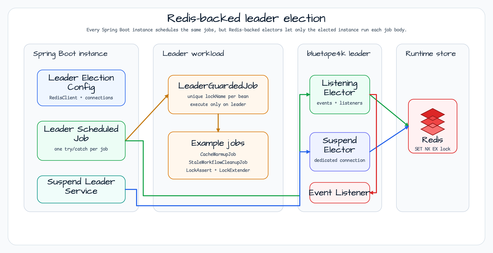
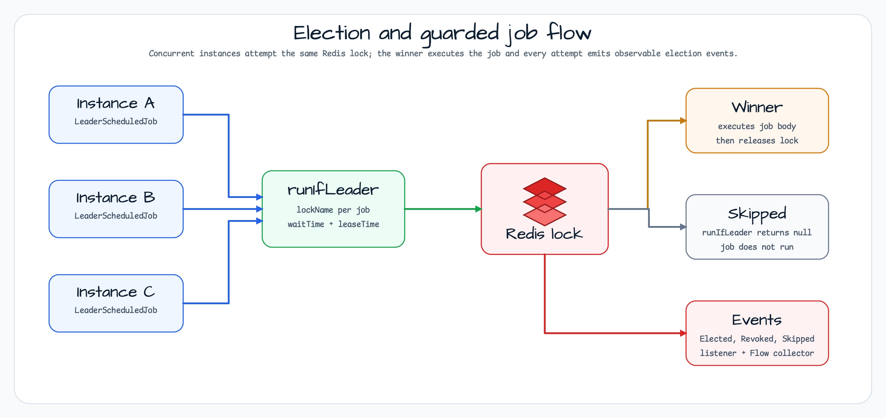

# Leader Election Workshop

[English](README.md) | 한국어

이 모듈은 Redis 기반 리더 선출로 scheduled background job을 보호하는 방법을 보여줍니다. 모든 애플리케이션 인스턴스가 같은 scheduler를 실행하지만, `bluetape4k-leader`가 선출된 인스턴스 하나만 guarded job을 실행하게 합니다.

캐시 워밍, 오래된 워크플로 정리, lock assertion, lease extension 확인처럼 멀티 파드 환경에서 동시에 실행되면 안 되는 작업을 다룰 때 참고할 수 있습니다.

## 아키텍처



`LeaderElectionConfig`는 Redis client, blocking `ListeningLeaderElector`, coroutine-friendly `LettuceSuspendLeaderElector`를 만듭니다. Blocking elector는 `LeaderScheduledJobService`가 사용하고, suspend elector는 별도 Lettuce connection을 가진 `SuspendLeaderService`에서 시연합니다.

## 선출 흐름



1. 모든 인스턴스가 설정된 fixed delay마다 `LeaderScheduledJobService`를 트리거합니다.
2. 각 `LeaderGuardedJob`은 고유한 `lockName`을 제공합니다.
3. `runIfLeader(lockName) { ... }`가 `waitTime`, `leaseTime`으로 Redis lock 획득을 시도합니다.
4. Winner는 `job.execute()`를 실행하고 block 종료 시 lock을 해제합니다.
5. 선출되지 못한 인스턴스는 `null`을 받고 job body를 실행하지 않습니다.
6. `ListeningLeaderElector`는 elected, revoked, skipped event를 listener와 Flow consumer에 전달합니다.

## 핵심 계약

| 영역 | 계약 |
|------|------|
| Lock backend | `LettuceLeaderElector`가 Lettuce를 통해 Redis `SET NX EX` 방식의 lock을 사용합니다. |
| Job uniqueness | 중복 `LeaderGuardedJob.lockName`은 Spring context 시작 시 실패합니다. |
| Job isolation | 각 job은 자체 `try/catch`로 감싸며, 하나의 실패가 다음 job 실행을 막지 않습니다. |
| Duration binding | Spring은 `java.time.Duration`으로 바인딩하고, `LeaderElectionOptions`에는 명시적으로 `toKotlinDuration()` 값을 전달합니다. |
| Event observation | `LeaderEventListenerService`는 callback listener와 Flow collection 패턴을 모두 보여줍니다. |
| Coroutine path | `SuspendLeaderService`는 별도 Redis connection으로 suspend leader work를 시연합니다. |

## 주요 타입

| 타입 | 역할 |
|------|------|
| `LeaderElectionProperties` | `leader.*` 설정을 바인딩하고 `leaseTime >= waitTime`을 검증합니다. |
| `LeaderElectionConfig` | Redis, blocking elector, listening wrapper, suspend elector를 구성합니다. |
| `LeaderScheduledJobService` | 현재 인스턴스가 lock을 획득한 경우에만 등록된 `LeaderGuardedJob`을 실행합니다. |
| `LeaderGuardedJob` | exactly-one-instance 실행이 필요한 job의 marker contract입니다. |
| `CacheWarmupJob`, `StaleWorkflowCleanupJob` | 실제 scheduled job 예제입니다. |
| `LeaderEventListenerService` | elected, revoked, skipped event를 집계하고 로그로 남깁니다. |
| `SuspendLeaderService` | coroutine-first `runIfLeader` 예제입니다. |

## 설정

```yaml
leader:
  redis:
    url: redis://localhost:6379
  wait-time: 2s
  lease-time: 30s
  job-fixed-delay: PT10S
```

`lease-time`은 `wait-time` 이상이어야 하며, 잘못된 설정이면 모듈이 빠르게 실패합니다.

## 실행

```bash
# localhost:6379 Redis 필요
./gradlew :leader-leader-election:bootRun

# 기본 테스트는 timing-sensitive smoke test를 제외합니다
./gradlew :leader-leader-election:test

# smoke test를 수동 또는 nightly에서 포함
./gradlew :leader-leader-election:test -Djunit.jupiter.execution.exclude.tags=
```

## 테스트 맵

| 테스트 클래스 | 보호하는 동작 |
|---------------|--------------|
| `LeaderElectionContextTest` | Spring context와 leader bean 구성이 정상 로드됩니다. |
| `LeaderElectionSingleRunnerTest` | 단일 인스턴스가 lock-protected block을 획득하고 실행합니다. |
| `ConcurrentLeaderElectionTest` | 동시 contender 중 정확히 하나의 winner만 나옵니다. |
| `LeaderElectionJobRecoveryTest` | 예외 후 lock이 해제되어 이후 재선출이 가능합니다. |
| `MultiJobIndependenceTest` | 서로 다른 lock name이 job을 분리합니다. |
| `DuplicateLockNameTest` | 중복 job lock name은 빠르게 실패합니다. |
| `JobIsolationTest` | 실패한 job이 후속 job 실행을 막지 않습니다. |
| `PropertiesValidationTest` | 잘못된 duration 순서를 거부합니다. |
| `LeaderEventListenerTest` | listener와 Flow event observation이 연결되어 있습니다. |
| `SuspendLeaderServiceTest` | coroutine leader election 경로가 정상 실행됩니다. |
| `LeaseExpiryTest`, `RedisFailureTest` | TTL과 Redis 장애 같은 timing-sensitive smoke 동작을 확인합니다. |

## 의존성

```kotlin
implementation(libs.bluetape4k.leader.core)
implementation(libs.bluetape4k.leader.redis.lettuce)
implementation(libs.lettuce.core)
implementation(libs.bluetape4k.logging)
implementation(libs.spring.boot.autoconfigure.lib)
implementation(libs.spring.boot.starter.actuator)
testImplementation(libs.bluetape4k.testcontainers)
testImplementation(libs.bluetape4k.junit5)
testImplementation(libs.bluetape4k.assertions)
```
