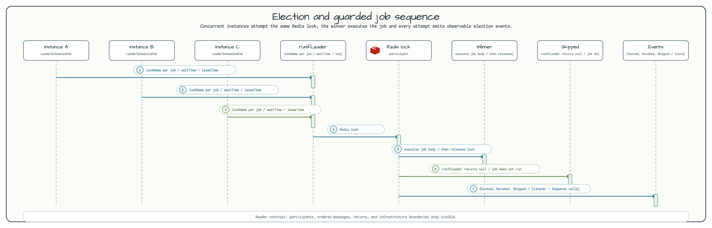

# Leader Election Workshop

[한국어](README.ko.md) | English

This module demonstrates Redis-backed leader election for scheduled background jobs. Every application instance runs the same scheduler, but `bluetape4k-leader` lets only the elected instance execute each guarded job.

Use this example when a multi-pod service has work that must not run concurrently, such as cache warmup, stale workflow cleanup, lock assertions, or lease-extension checks.

## Architecture


`LeaderElectionConfig` creates the Redis client, a blocking `ListeningLeaderElector`, and a coroutine-friendly `LettuceSuspendLeaderElector`. The blocking elector is used by `LeaderScheduledJobService`; the suspend elector is demonstrated by `SuspendLeaderService` with a dedicated Lettuce connection.

## Election Flow



1. Every instance triggers `LeaderScheduledJobService` on the configured fixed delay.
2. Each `LeaderGuardedJob` supplies a unique `lockName`.
3. `runIfLeader(lockName) { ... }` attempts the Redis lock with `waitTime` and `leaseTime`.
4. The winner executes `job.execute()` and releases the lock when the block exits.
5. Losing instances receive `null` and skip the job body.
6. `ListeningLeaderElector` emits elected, revoked, and skipped events for listener and Flow consumers.

## Key Contracts

| Area | Contract |
|------|----------|
| Lock backend | `LettuceLeaderElector` uses Redis `SET NX EX` style locking through Lettuce. |
| Job uniqueness | Duplicate `LeaderGuardedJob.lockName` values fail the Spring context at startup. |
| Job isolation | Each job is wrapped in its own `try/catch`; one failed job does not block the next one. |
| Duration binding | Spring binds `java.time.Duration`; `LeaderElectionOptions` receives explicit `toKotlinDuration()` values. |
| Event observation | `LeaderEventListenerService` shows both callback listener and Flow collection patterns. |
| Coroutine path | `SuspendLeaderService` demonstrates suspend leader work with a separate Redis connection. |

## Main Types

| Type | Role |
|------|------|
| `LeaderElectionProperties` | Binds `leader.*` configuration and validates `leaseTime >= waitTime`. |
| `LeaderElectionConfig` | Wires Redis, blocking elector, listening wrapper, and suspend elector. |
| `LeaderScheduledJobService` | Runs every registered `LeaderGuardedJob` only when this instance wins the lock. |
| `LeaderGuardedJob` | Marker contract for jobs that require exactly-one-instance execution. |
| `CacheWarmupJob`, `StaleWorkflowCleanupJob` | Concrete scheduled examples. |
| `LeaderEventListenerService` | Counts and logs elected, revoked, and skipped events. |
| `SuspendLeaderService` | Coroutine-first `runIfLeader` example. |

## Configuration

```yaml
leader:
  redis:
    url: redis://localhost:6379
  wait-time: 2s
  lease-time: 30s
  job-fixed-delay: PT10S
```

`lease-time` must be greater than or equal to `wait-time`; the module fails fast when the configuration is invalid.

## Run

```bash
# Requires Redis on localhost:6379
./gradlew :leader-leader-election:bootRun

# Default tests exclude timing-sensitive smoke tests
./gradlew :leader-leader-election:test

# Include smoke tests manually or in nightly runs
./gradlew :leader-leader-election:test -Djunit.jupiter.execution.exclude.tags=
```

## Test Map

| Test class | What it protects |
|------------|------------------|
| `LeaderElectionContextTest` | Spring context and leader beans load correctly. |
| `LeaderElectionSingleRunnerTest` | One instance can acquire and execute the lock-protected block. |
| `ConcurrentLeaderElectionTest` | Exactly one winner appears among concurrent contenders. |
| `LeaderElectionJobRecoveryTest` | Exceptions release the lock and allow later election. |
| `MultiJobIndependenceTest` | Different lock names isolate different jobs. |
| `DuplicateLockNameTest` | Duplicate job lock names fail fast. |
| `JobIsolationTest` | A failing job does not stop subsequent jobs. |
| `PropertiesValidationTest` | Invalid duration ordering is rejected. |
| `LeaderEventListenerTest` | Listener and Flow event observation remain wired. |
| `SuspendLeaderServiceTest` | Coroutine leader election path executes correctly. |
| `LeaseExpiryTest`, `RedisFailureTest` | Smoke coverage for timing-sensitive TTL and Redis failure behavior. |

## Dependencies

```kotlin
implementation(libs.bluetape4k.leader.core)
implementation(libs.bluetape4k.leader.redis.lettuce)
implementation(libs.lettuce.core)
implementation(libs.bluetape4k.logging)
implementation(libs.spring.boot.autoconfigure.lib)
implementation(libs.spring.boot.starter.actuator)
testImplementation(libs.bluetape4k.testcontainers)
testImplementation(libs.bluetape4k.junit5)
testImplementation(libs.bluetape4k.assertions)
```
