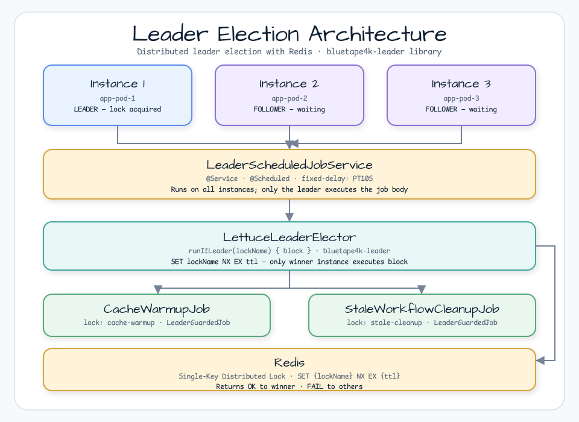
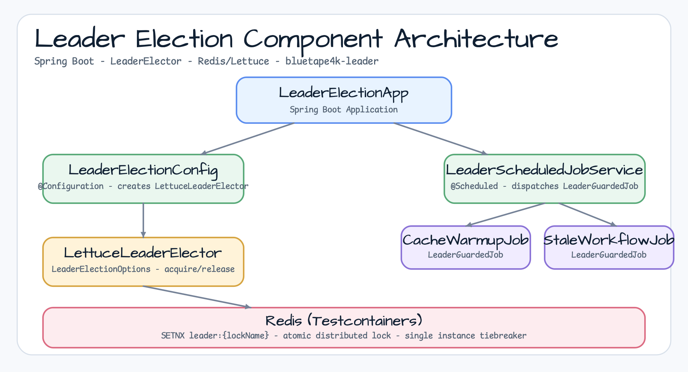
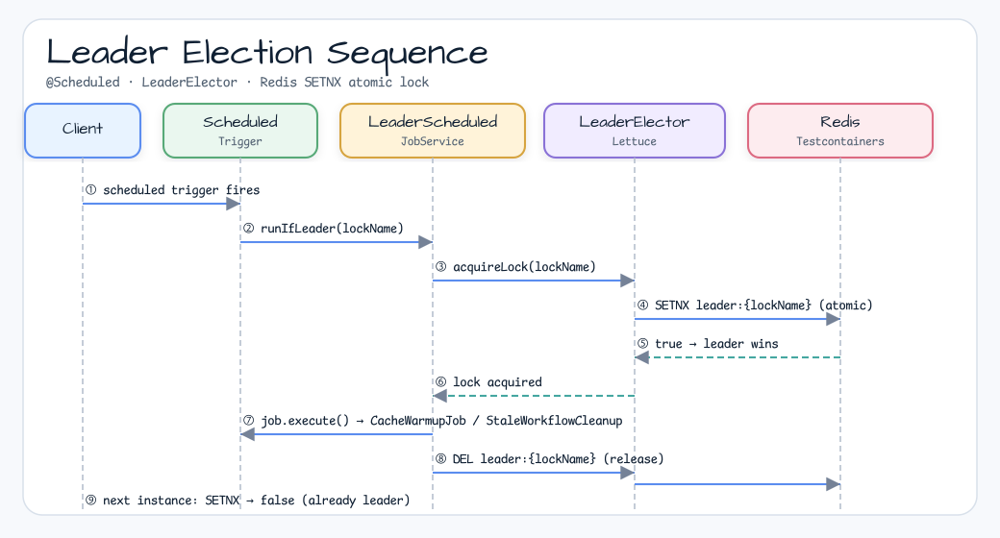

# Leader Election Workshop

[한국어](README.ko.md) | English

## Example Scenario

This example exercises **Leader Election Workshop** as a runnable leader-election coordination workshop slice. It focuses on the path a developer would inspect first: configure the module, run the sample or tests, and observe the library or framework APIs that remove repetitive infrastructure code.

## Flow Diagram

1. Prepare the local runtime required by `leader-leader-election`.
2. Execute the application, controller, service, or test fixture that owns the example scenario.
3. Delegate repetitive infrastructure work to bluetape4k utilities or Spring/Kotlin integrations.
4. Assert the visible result through the sample output, HTTP response, repository state, metric, trace, or test expectation.

A Spring Boot workshop example demonstrating **distributed leader election** for scheduled jobs
in multi-instance deployments, using the `bluetape4k-leader` library.

## Overview

In a multi-instance (multi-pod) deployment, scheduled background jobs—such as cache warmup,
outbox publishing, or stale workflow cleanup—must run on **exactly one instance** at a time.
This module demonstrates how to use `bluetape4k-leader` (`LettuceLeaderElector`) to guarantee
single execution across all running instances.

## Architecture



Multiple app instances compete for a distributed lock via Redis `SET NX EX`.  
Only the **elected leader** instance executes each `LeaderGuardedJob`.

## Used Bluetape4k Features

| Feature | Artifact | Usage |
|---------|----------|-------|
| `bluetape4k-leader-core` | `bluetape4k.leader.core` | `LeaderElector` interface, `LeaderElectionOptions` |
| `bluetape4k-leader-redis-lettuce` | `bluetape4k.leader.redis.lettuce` | `LettuceLeaderElector` — Redis-backed implementation |
| `bluetape4k-logging` | `bluetape4k.logging` | `KLogging` companion + lambda logging extensions |
| `bluetape4k-junit5` | `bluetape4k.junit5` | `MultithreadingTester` for concurrent election tests |
| `bluetape4k-testcontainers` | `bluetape4k.testcontainers` | `RedisServer.Launcher.redis` singleton pattern |
| `bluetape4k-assertions` | `bluetape4k.assertions` | `shouldBeEqualTo`, `shouldNotBeNull`, `shouldHaveSize` |

## Key Patterns

### 1. Leader-Guarded Job Interface

```kotlin
interface LeaderGuardedJob {
    val lockName: String   // unique Redis key per job
    fun execute()          // called only on the elected leader
}
```

### 2. Leader Election with LettuceLeaderElector

```kotlin
val result: T? = leaderElector.runIfLeader(job.lockName) {
    job.execute()   // runs only if this instance wins the lock
}
// result == null → this instance is not the leader (skipped)
// result != null → this instance was elected and executed the action
```

### 3. Duration Type Conversion (Critical)

`@ConfigurationProperties` binds `java.time.Duration`.  
`LeaderElectionOptions` requires `kotlin.time.Duration`.  
**Conversion is mandatory**:

```kotlin
LeaderElectionOptions(
    waitTime  = props.waitTime.toKotlinDuration(),   // ← required
    leaseTime = props.leaseTime.toKotlinDuration(),  // ← required
)
```

### 4. Job Isolation in Scheduler

Each job is wrapped in an independent `try/catch`. One failing job does not block others:

```kotlin
jobs.forEach { job ->
    try {
        val result = leaderElector.runIfLeader(job.lockName) { job.execute() }
        if (result != null) log.info { "[LEADER] ${job.lockName} executed" }
        else log.debug { "[SKIPPED] ${job.lockName}" }
    } catch (e: Exception) {
        log.error(e) { "[ERROR] ${job.lockName}: ${e.message}" }
    }
}
```

## Class Diagram



## Sequence Diagram



## Running

### Start the application

```bash
# Requires Redis running on localhost:6379
./gradlew :leader-leader-election:bootRun
```

### Run tests

```bash
# Run all tests (smoke tests excluded by default)
./gradlew :leader-leader-election:test

# Run smoke tests explicitly (timing-sensitive, for manual/nightly)
./gradlew :leader-leader-election:test -Djunit.jupiter.execution.exclude.tags=
```

## Configuration

```yaml
leader:
  redis:
    url: redis://localhost:6379
  wait-time: 2s         # How long to wait for lock acquisition
  lease-time: 30s       # Lock TTL (Redis key expiry)
  job-fixed-delay: PT10S  # Fixed delay between job runs
```

## Test Coverage

| Test | Class | Description |
|------|-------|-------------|
| T0 | `LeaderElectionContextTest` | Spring Boot context loads with all leader beans |
| T1 | `LeaderElectionSingleRunnerTest` | Single instance acquires lock and executes |
| T2 | `ConcurrentLeaderElectionTest` | Exactly 1 winner among 3 concurrent instances (`MultithreadingTester`) |
| T3 | `LeaderElectionJobRecoveryTest` | Lock released after exception, re-election succeeds |
| T4 | `MultiJobIndependenceTest` | Two jobs with different lockNames both execute |
| T5 *(smoke)* | `LeaseExpiryTest` | Educational: lease TTL expiry behavior |
| T6 *(smoke)* | `RedisFailureTest` | Educational: Redis failure propagates as exception |
| T7 | `LockReleaseTest` | `finally { unlock }` enables instant re-acquisition |
| P3-11 | `DuplicateLockNameTest` | Duplicate lockName throws `IllegalStateException` at startup |
| P3-12 | `JobIsolationTest` | Failing job does not block subsequent jobs |
| P3-13 | `PropertiesValidationTest` | `leaseTime < waitTime` throws `IllegalArgumentException` |
