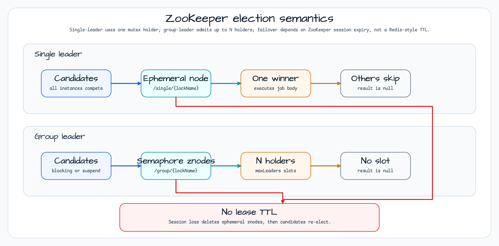

# Leader ZooKeeper Workshop

[English](README.md) | 한국어

이 모듈은 Apache Curator와 `bluetape4k-leader-zookeeper`를 사용한 ZooKeeper 기반 리더 선출 예제입니다. 정확히 하나의 인스턴스만 실행하는 single-leader 방식과, 최대 `N`개 인스턴스가 동시에 slot을 얻는 group-leader 방식을 함께 다룹니다.

서비스가 이미 ZooKeeper에 의존하거나, Redis식 lease TTL이 아니라 ZooKeeper session과 ephemeral znode에 leadership을 묶고 싶을 때 참고할 수 있습니다.

## 아키텍처


`LeaderZookeeperConfig`는 하나의 공유 `CuratorFramework` client와 네 가지 elector를 구성합니다.

| Elector | Service | 동작 |
|---------|---------|------|
| `ZooKeeperLeaderElector` | `BlockingLeaderService` | Single leader, blocking caller. |
| `ZooKeeperSuspendLeaderElector` | `SuspendLeaderZkService` | Single leader, suspend caller. |
| `ZooKeeperLeaderGroupElector` | `GroupLeaderService` | 최대 `groupMaxLeaders`개의 blocking holder. |
| `ZooKeeperSuspendLeaderGroupElector` | `SuspendGroupLeaderService` | 최대 `groupMaxLeaders`개의 coroutine holder. |

## 선출 의미



Single-leader 선출은 ZooKeeper mutex path를 사용합니다. 하나의 candidate가 ephemeral znode를 소유하고 job을 실행하며, 나머지는 `null`을 받습니다.

Group-leader 선출은 semaphore-style znode를 사용합니다. 최대 `groupMaxLeaders`개의 candidate가 동시에 들어가고, `waitTime` 안에 slot을 얻지 못한 candidate는 `null`을 받습니다.

## ZooKeeper의 핵심 차이

ZooKeeper에는 Redis식 lock TTL이 없습니다. Leadership은 ZooKeeper session에 묶입니다.

| Redis leader election | ZooKeeper leader election |
|-----------------------|---------------------------|
| TTL로 lease가 만료됩니다. | Session이 만료되면 ephemeral znode가 사라집니다. |
| `leaseTime`과 auto-extension이 중요합니다. | `leaseTime`은 없고 `autoExtend`는 의도적으로 무시됩니다. |
| Failover latency는 lock TTL을 따릅니다. | Failover latency는 `sessionTimeoutMs`를 따릅니다. |

`sessionTimeoutMs`는 scheduled job interval과 함께 조정하세요. 짧게 잡으면 failover는 빨라지지만 일시적인 네트워크 지연에도 재선출이 발생할 수 있습니다.

## 설정

```yaml
leader:
  zookeeper:
    zookeeper:
      connect-string: localhost:2181
      session-timeout-ms: 60000
      connection-timeout-ms: 15000
      block-until-connected-seconds: 10
    base-path: /workshop/leader-zookeeper
    wait-time: 2s
    group-max-leaders: 2
    job-fixed-delay: PT10S
    suspend-job-fixed-delay: PT12S
    group-job-fixed-delay: PT15S
    suspend-group-job-fixed-delay: PT18S
```

`base-path`, `connect-string`, timeout 값, `group-max-leaders`는 configuration binding 시 검증됩니다. 시작 시 `block-until-connected-seconds` 안에 연결하지 못하면 background thread leak을 막기 위해 `CuratorFramework`를 명시적으로 닫습니다.

## 실행

```bash
# localhost:2181 ZooKeeper 필요
./gradlew :leader-leader-zookeeper:bootRun

# 기본 테스트는 timing-sensitive smoke test를 제외합니다
./gradlew :leader-leader-zookeeper:test

# smoke test를 수동 또는 nightly에서 포함
./gradlew :leader-leader-zookeeper:test -Djunit.jupiter.execution.exclude.tags=
```

## 테스트 맵

| 테스트 클래스 | 보호하는 동작 |
|---------------|--------------|
| `LeaderZookeeperContextTest` | Spring context가 네 가지 elector bean을 모두 로드합니다. |
| `BlockingSingleLeaderTest` | Blocking single-leader 실행과 예외 격리를 확인합니다. |
| `ConcurrentBlockingLeaderTest` | 동시 contender가 ZooKeeper lock을 통해 직렬화됩니다. |
| `SuspendSingleLeaderTest` | Coroutine single-leader 실행 결과를 확인합니다. |
| `GroupLeaderTest` | `maxLeaders=2`가 정확히 두 blocking holder를 허용합니다. |
| `SuspendGroupLeaderTest` | `maxLeaders=2`가 정확히 두 coroutine holder를 허용합니다. |
| `ExtensionFunctionTest` | blocking, async, suspend, group helper API가 유지됩니다. |
| `R16AutoExtendIgnoredTest` | ZooKeeper에서 `autoExtend=true`가 경고 후 무시됩니다. |
| `SessionLossFailoverTest` | Session loss가 ephemeral node를 제거하고 재선출을 허용합니다. |
| `LeaderZookeeperPropertiesValidationTest` | 잘못된 path, connection string, group size를 빠르게 거부합니다. |

## 프로덕션 참고

| 항목 | 가이드 |
|------|--------|
| ACL | Curator `aclProvider`를 설정하세요. 이 워크샵은 개발용 기본값을 사용합니다. |
| TLS / SASL | ZooKeeper client security는 이 최소 예제 밖에서 구성하세요. |
| Ensemble | `host1:2181,host2:2181,host3:2181` 형태의 multi-node connection string을 사용하세요. |
| Session timeout | `sessionTimeoutMs`는 failover latency와 network jitter 사이에서 조정하세요. |
| Thread safety | `CuratorFramework`와 elector bean은 Spring singleton으로 공유해도 안전합니다. |

## 의존성

```kotlin
implementation(libs.bluetape4k.leader.zookeeper)
implementation(libs.bluetape4k.logging)
implementation(libs.spring.boot.autoconfigure.lib)
implementation(libs.spring.boot.starter.actuator)
testImplementation(libs.bluetape4k.testcontainers)
testImplementation(libs.bluetape4k.junit5)
testImplementation(libs.bluetape4k.assertions)
```
