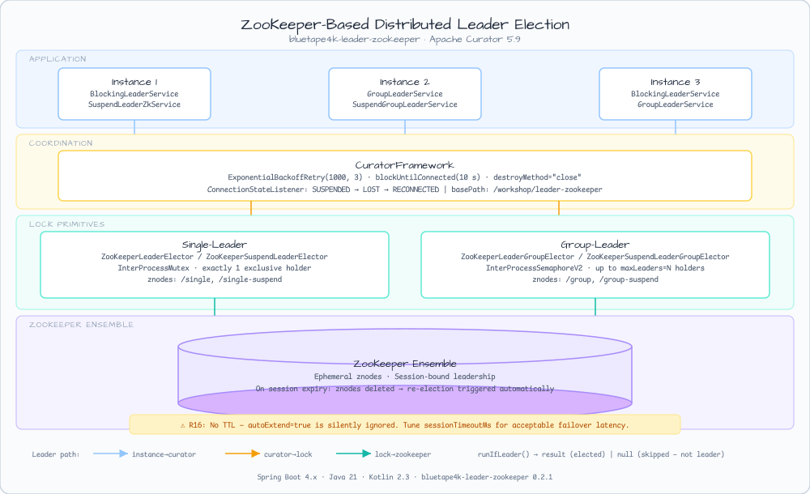

# Leader ZooKeeper Workshop

[한국어](README.ko.md) | English

## Example Scenario

This example exercises **Leader ZooKeeper Workshop** as a runnable leader-election coordination workshop slice. It focuses on the path a developer would inspect first: configure the module, run the sample or tests, and observe the library or framework APIs that remove repetitive infrastructure code.

## Flow Diagram

1. Prepare the local runtime required by `leader-leader-zookeeper`.
2. Execute the application, controller, service, or test fixture that owns the example scenario.
3. Delegate repetitive infrastructure work to bluetape4k utilities or Spring/Kotlin integrations.
4. Assert the visible result through the sample output, HTTP response, repository state, metric, trace, or test expectation.

## Sequence Diagram

The core sequence is: caller or test fixture -> workshop adapter -> bluetape4k helper/API -> external runtime or in-memory backend -> assertion/response. When this module has a dedicated sequence asset, the image below shows that interaction order; otherwise the source tests are the authoritative executable sequence.

A Spring Boot workshop example demonstrating **ZooKeeper-based distributed leader election**
for scheduled jobs in multi-instance deployments, using the `bluetape4k-leader-zookeeper` library.

## Overview

In a multi-instance (multi-pod) deployment, scheduled background jobs must run on **exactly one
instance** at a time (single-leader) or up to **N instances** simultaneously (group-leader).
This module demonstrates how to use `bluetape4k-leader-zookeeper` (Apache Curator 5.9) to
guarantee correct concurrent execution via ZooKeeper ephemeral nodes.

## Architecture



Multiple app instances compete for ZooKeeper locks backed by
[Apache Curator](https://curator.apache.org/) `InterProcessMutex` (single-leader) and
`InterProcessSemaphoreV2` (group-leader). Only the **elected leader(s)** execute each
scheduled job.


## ⚠️ R16 — ZooKeeper Has No TTL (Critical Difference from Redis)

ZooKeeper uses **session-bound ephemeral znodes** for leader election:

- Leadership is held until the ZooKeeper **session expires** or is explicitly released.
- There is **no lease TTL**. Setting `LeaderElectionOptions.autoExtend = true` emits a `WARN`
  log and is silently ignored.
- On process crash or network partition, the ZooKeeper session times out
  (`sessionTimeoutMs`, default 60 s), then the ephemeral znode is automatically deleted,
  triggering re-election.

**Practical guidance:**
- `leaseTime` / `autoExtend` are intentionally absent from `LeaderZookeeperProperties`.
- Tune `sessionTimeoutMs` relative to your job interval for acceptable failover latency.
- Use `waitTime` to bound how long a candidate waits before giving up on lock acquisition.

## Used Bluetape4k Features

| Feature | Artifact | Usage |
|---------|----------|-------|
| `bluetape4k-leader-zookeeper` | `bluetape4k.leader.zookeeper` | `ZooKeeperLeaderElector`, `ZooKeeperSuspendLeaderElector`, `ZooKeeperLeaderGroupElector`, `ZooKeeperSuspendLeaderGroupElector` |
| `bluetape4k-logging` | `bluetape4k.logging` | `KLogging` / `KLoggingChannel` + lambda logging |
| `bluetape4k-junit5` | `bluetape4k.junit5` | `MultithreadingTester`, `SuspendedJobTester` for concurrent tests |
| `bluetape4k-testcontainers` | `bluetape4k.testcontainers` | `ZooKeeperServer.Launcher.zookeeper` singleton pattern |
| `bluetape4k-assertions` | `bluetape4k.assertions` | `shouldBeEqualTo`, `shouldBeTrue`, `assertFailsWith` |

## Key Patterns

### 1. Blocking Single-Leader Election

```kotlin
@Scheduled(fixedDelayString = "\${leader.zookeeper.job-fixed-delay}")
fun scheduledJob() {
    val result = leaderElector.runIfLeader("my-job") {
        // runs only on the elected leader instance
        doWork()
    }
    // result == null  →  this instance is not the leader (skipped)
    // result != null  →  this instance was elected and executed the action
}
```

### 2. Suspend Single-Leader Election (Coroutines)

```kotlin
@Scheduled(fixedDelayString = "\${leader.zookeeper.suspend-job-fixed-delay}")
fun scheduledSuspendJob() {
    runBlocking {
        suspendLeaderElector.runIfLeader("my-suspend-job") {
            delay(100)   // ZK acquire is done in Dispatchers.IO
            doWork()
        }
    }
}
```

### 3. Group-Leader Election (up to N simultaneous holders)

```kotlin
@Scheduled(fixedDelayString = "\${leader.zookeeper.group-job-fixed-delay}")
fun scheduledGroupJob() {
    // Up to `groupMaxLeaders` instances run concurrently
    groupElector.runIfLeader("group-job") {
        doGroupWork()
    }
}
```

### 4. Bean Configuration

```kotlin
@Bean
fun zookeeperLeaderElector(curator: CuratorFramework, props: LeaderZookeeperProperties) =
    ZooKeeperLeaderElector(
        client = curator,
        basePath = "${props.basePath}/single",
        options = LeaderElectionOptions(waitTime = props.waitTime.toKotlinDuration()),
    )

@Bean
fun zookeeperGroupElector(curator: CuratorFramework, props: LeaderZookeeperProperties) =
    ZooKeeperLeaderGroupElector(
        client = curator,
        basePath = "${props.basePath}/group",
        options = LeaderGroupElectionOptions(
            maxLeaders = props.groupMaxLeaders,
            waitTime = props.waitTime.toKotlinDuration(),
        ),
    )
```

### 5. CuratorFramework Setup

```kotlin
@Bean
fun curatorFramework(props: LeaderZookeeperProperties): CuratorFramework {
    val client = CuratorFrameworkFactory.newClient(
        props.zookeeper.connectString,
        props.zookeeper.sessionTimeoutMs,
        props.zookeeper.connectionTimeoutMs,
        ExponentialBackoffRetry(1000, 3),
    )
    // Register connection state listener BEFORE start()
    client.connectionStateListenable.addListener(ConnectionStateListener { _, newState ->
        log.info { "ZooKeeper connection state changed: $newState" }
    })
    client.start()
    check(client.blockUntilConnected(props.zookeeper.blockUntilConnectedSeconds, TimeUnit.SECONDS)) {
        "Could not connect to ZooKeeper within ${props.zookeeper.blockUntilConnectedSeconds}s"
    }
    return client
}
```

## Configuration

```yaml
leader:
  zookeeper:
    zookeeper:
      connect-string: localhost:2181          # ZooKeeper connection string
      session-timeout-ms: 60000              # Failover window on hard crash
      connection-timeout-ms: 15000           # Initial connection timeout
      block-until-connected-seconds: 10      # Startup readiness timeout
    base-path: /workshop/leader-zookeeper    # ZooKeeper base path for all election znodes
    wait-time: 2s                            # Max wait time to acquire the lock
    group-max-leaders: 2                     # Max simultaneous group-leader holders
    job-fixed-delay: PT10S                   # Blocking single-leader job interval
    suspend-job-fixed-delay: PT12S           # Suspend single-leader job interval
    group-job-fixed-delay: PT15S             # Blocking group-leader job interval
    suspend-group-job-fixed-delay: PT18S     # Suspend group-leader job interval
```

> **Note:** `leaseTime` and `autoExtend` are intentionally absent — see [R16 note](#️-r16--zookeeper-has-no-ttl-critical-difference-from-redis).

## Running

### Start the application

```bash
# Requires ZooKeeper running on localhost:2181
./gradlew :leader-leader-zookeeper:bootRun
```

### Run tests

```bash
# Run all tests (smoke tests excluded by default)
./gradlew :leader-leader-zookeeper:test

# Run with explicit tag filter
./gradlew :leader-leader-zookeeper:test -Djunit.jupiter.execution.exclude.tags=
```

## Test Coverage

| Test | Class | Description |
|------|-------|-------------|
| T0 | `LeaderZookeeperContextTest` | Spring Boot context loads; all 4 elector beans present |
| T1 | `BlockingSingleLeaderTest` | Single blocking leader: `runIfLeader`, `runAsyncIfLeader`, exception isolation |
| T2 | `ConcurrentBlockingLeaderTest` | 8 threads compete; at least 3 executions within `waitTime=500ms` |
| T3 | `SuspendSingleLeaderTest` | Suspend single leader: result returned + 8 coroutines serialize correctly |
| T4 | `GroupLeaderTest` | `maxLeaders=2` admits exactly 2 simultaneous blocking holders (`MultithreadingTester`) |
| T5 | `SuspendGroupLeaderTest` | `maxLeaders=2` admits exactly 2 simultaneous coroutine holders (`SuspendedJobTester`) |
| T6 | `ExtensionFunctionTest` | Extension API: `runBlockingIfLeader`, `runAsyncIfLeader`, `runSuspendIfLeader`, `runGroupIfLeader` |
| T7 | `R16AutoExtendIgnoredTest` | `autoExtend=true` emits WARN and is silently ignored (R16 contract) |
| T8 | `SessionLossFailoverTest` | Session loss via `zookeeperClient.zooKeeper.close()`; re-election succeeds after reconnect |
| T9 | `LeaderZookeeperPropertiesValidationTest` | Blank `basePath`, zero `groupMaxLeaders`, blank `connectString` fail validation |

## Production Considerations

| Concern | Guidance |
|---------|----------|
| **ACL** | Use `CuratorFrameworkFactory.builder().aclProvider(...)` in production |
| **TLS / SASL** | Configure `ZooKeeperTls.setZKTLSConfig(...)` and appropriate `javax.net.ssl` properties |
| **Ensemble** | Use `host1:2181,host2:2181,host3:2181` for high availability |
| **Session timeout** | Set `sessionTimeoutMs` to 3–5× your job interval to avoid spurious re-elections |
| **Thread safety** | `CuratorFramework` and all elector instances are thread-safe and safe to share |
| **Spring Boot version** | Compatible with Spring Boot 4.x and Java 21+ |
