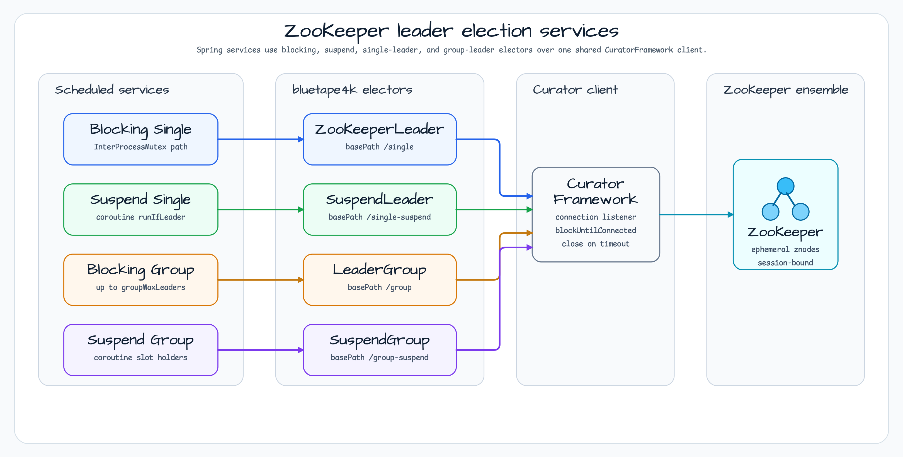
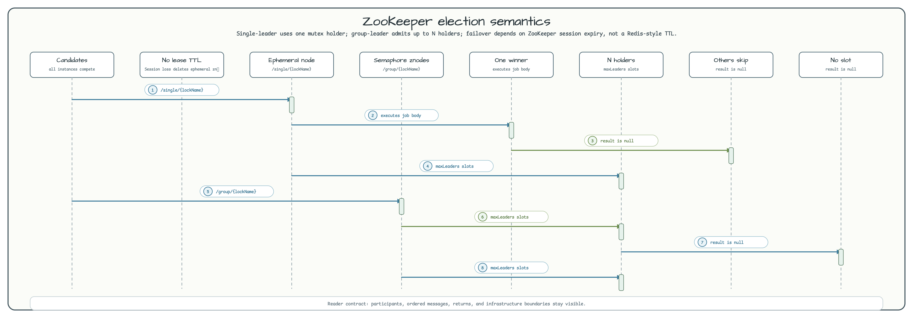

# Leader ZooKeeper Workshop

[한국어](README.ko.md) | English

This module demonstrates ZooKeeper-backed leader election with Apache Curator and `bluetape4k-leader-zookeeper`. It covers both exactly-one-instance execution and group-leader execution where up to `N` instances may hold a slot at the same time.

Use this example when a service already depends on ZooKeeper or when leadership should be tied to ZooKeeper sessions and ephemeral znodes instead of Redis-style lease TTLs.

## Architecture



`LeaderZookeeperConfig` creates one shared `CuratorFramework` client and four electors:

| Elector | Service | Behavior |
|---------|---------|----------|
| `ZooKeeperLeaderElector` | `BlockingLeaderService` | Single leader, blocking caller. |
| `ZooKeeperSuspendLeaderElector` | `SuspendLeaderZkService` | Single leader, suspend caller. |
| `ZooKeeperLeaderGroupElector` | `GroupLeaderService` | Up to `groupMaxLeaders` blocking holders. |
| `ZooKeeperSuspendLeaderGroupElector` | `SuspendGroupLeaderService` | Up to `groupMaxLeaders` coroutine holders. |

## Election Semantics



Single-leader election uses a ZooKeeper mutex path: one candidate owns the ephemeral znode and runs the job; the others receive `null`.

Group-leader election uses semaphore-style znodes: up to `groupMaxLeaders` candidates enter at the same time, and the rest receive `null` when no slot becomes available within `waitTime`.

## Critical ZooKeeper Difference

ZooKeeper has no Redis-style lock TTL. Leadership is bound to the ZooKeeper session:

| Redis leader election | ZooKeeper leader election |
|-----------------------|---------------------------|
| Lease expires by TTL. | Ephemeral znode disappears when the session expires. |
| `leaseTime` and auto-extension matter. | `leaseTime` is absent and `autoExtend` is ignored by design. |
| Failover latency follows lock TTL. | Failover latency follows `sessionTimeoutMs`. |

Tune `sessionTimeoutMs` relative to the scheduled job interval. Short values fail over faster but can cause unnecessary re-election during transient network pauses.

## Configuration

```yaml
leader:
  zookeeper:
    zookeeper:
      connect-string: localhost:2181
      session-timeout-ms: 60000
      connection-timeout-ms: 15000
      block-until-connected-seconds: 10
    base-path: /workshop/leader-zookeeper
    wait-time: 2s
    group-max-leaders: 2
    job-fixed-delay: PT10S
    suspend-job-fixed-delay: PT12S
    group-job-fixed-delay: PT15S
    suspend-group-job-fixed-delay: PT18S
```

`base-path`, `connect-string`, timeout values, and `group-max-leaders` are validated during configuration binding. `CuratorFramework` is closed explicitly if startup cannot connect within `block-until-connected-seconds`.

## Run

```bash
# Requires ZooKeeper on localhost:2181
./gradlew :leader-leader-zookeeper:bootRun

# Default tests exclude timing-sensitive smoke tests
./gradlew :leader-leader-zookeeper:test

# Include smoke tests manually or in nightly runs
./gradlew :leader-leader-zookeeper:test -Djunit.jupiter.execution.exclude.tags=
```

## Test Map

| Test class | What it protects |
|------------|------------------|
| `LeaderZookeeperContextTest` | Spring context loads all four elector beans. |
| `BlockingSingleLeaderTest` | Blocking single-leader execution and exception isolation. |
| `ConcurrentBlockingLeaderTest` | Concurrent contenders serialize through the ZooKeeper lock. |
| `SuspendSingleLeaderTest` | Coroutine single-leader execution returns the expected result. |
| `GroupLeaderTest` | `maxLeaders=2` admits exactly two blocking holders. |
| `SuspendGroupLeaderTest` | `maxLeaders=2` admits exactly two coroutine holders. |
| `ExtensionFunctionTest` | Blocking, async, suspend, and group helper APIs remain usable. |
| `R16AutoExtendIgnoredTest` | `autoExtend=true` warns and is ignored for ZooKeeper. |
| `SessionLossFailoverTest` | Session loss removes ephemeral nodes and allows re-election. |
| `LeaderZookeeperPropertiesValidationTest` | Invalid paths, connection strings, or group sizes fail fast. |

## Production Notes

| Concern | Guidance |
|---------|----------|
| ACL | Configure a Curator `aclProvider`; the workshop uses development defaults. |
| TLS / SASL | Configure ZooKeeper client security outside this minimal example. |
| Ensemble | Use a multi-node connection string such as `host1:2181,host2:2181,host3:2181`. |
| Session timeout | Set `sessionTimeoutMs` to a value that balances failover latency and network jitter. |
| Thread safety | `CuratorFramework` and the elector beans are safe to share as Spring singletons. |

## Dependencies

```kotlin
implementation(libs.bluetape4k.leader.zookeeper)
implementation(libs.bluetape4k.logging)
implementation(libs.spring.boot.autoconfigure.lib)
implementation(libs.spring.boot.starter.actuator)
testImplementation(libs.bluetape4k.testcontainers)
testImplementation(libs.bluetape4k.junit5)
testImplementation(libs.bluetape4k.assertions)
```
