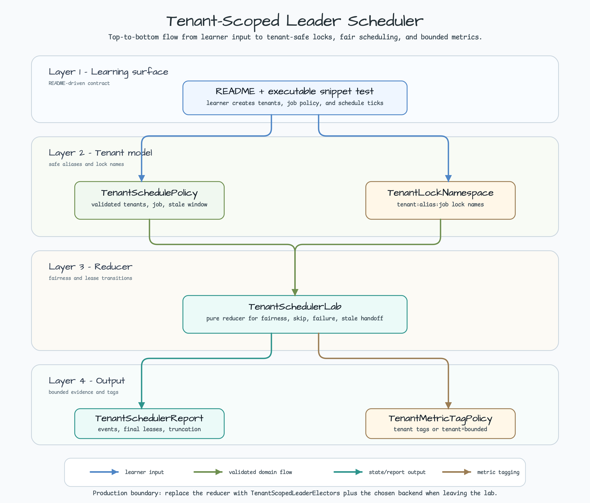
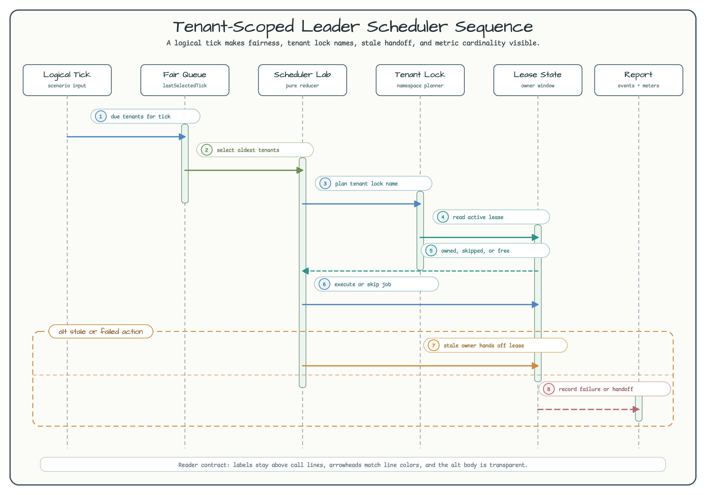

# Tenant-Scoped Leader Scheduler Lab

[한국어](README.ko.md) | English

This module teaches tenant-scoped leader scheduling with a deterministic Spring
Boot 4 lab. It focuses on the part that usually gets hidden inside production
schedulers: every tenant needs its own leader lock name, fair selection window,
stale-lock handoff rule, and bounded metric tags.

Use this lab before wiring a real backend. Once the scheduling contract is
clear, move to the production-facing practice modules:

- [leader-election](../leader-election/) for Redis + Lettuce leader election.
- [leader-zookeeper](../leader-zookeeper/) for ZooKeeper + Curator ownership.
- [k8s-lease-micrometer](../k8s-lease-micrometer/) for Kubernetes Lease and
  Micrometer metrics.
- [backend-comparison-lab](../backend-comparison-lab/) for backend selection.
- [spring-boot/multi-tenant-data-isolation](../../spring-boot/multi-tenant-data-isolation/)
  for tenant data-boundary thinking.

## Architecture



`TenantSchedulePolicy` validates the job, tenant aliases, tick capacity, stale
lease window, and bounded event history. `TenantLockNamePlanner` delegates to
`TenantLockNamespace`, so `tenant-a` and `tenant-b` never share the same
`invoice-sync` leader lock. `TenantSchedulerLab` is a pure logical-tick reducer:
it does not start Redis, ZooKeeper, Kubernetes, or a background scheduler.

## Sequence



1. A logical tick supplies due tenants and candidate nodes.
2. The lab selects tenants by the oldest `lastSelectedTick`, then by alias.
3. Each selected tenant receives a lock name from `TenantLockNamespace`.
4. Active leases run only on their current owner and skip other nodes.
5. Expired leases hand off at the boundary tick.
6. Failed actions are recorded without letting one tenant block another tenant.
7. The report keeps event rows bounded and records dropped rows.
8. Metric tags stay per-tenant only while the tenant cardinality is safe.

## Spring Boot YAML Policy Profile

The `scheduled-policy` profile connects a plain Spring `@Scheduled` method to
the `bluetape4k.leader.scheduling.policies` registry. It is opt-in so the
deterministic reducer remains the default path.

```bash
./gradlew :leader-tenant-scheduler:test --tests "*TenantScheduledPolicy*"
./gradlew :leader-tenant-scheduler:bootRun --args='--spring.profiles.active=scheduled-policy'
```

When the profile starts, confirm `Started TenantSchedulerLabAppKt`. The first
automatic callback may wait up to 60 seconds. The fixture uses `fixedDelay=5s`
and `min-lease-time=5s`, so the effective local period is at least about 10
seconds; each callback logs
`tenant-scheduler callback completed invocationCount=...` as a bounded smoke
signal. The deterministic test also records `leader.aop.acquire` and
`leader.aop.execution` observations. The fixture is an `open` Spring bean so
the upstream `LeaderElectionAspect` can be applied by a runtime Spring proxy.
`spring.aop.auto=false` avoids a second Boot proxy creator. This example does
not claim external-backend ownership or distributed failover.

`@LeaderElection`, `@LeaderGroupElection`, and `@LeaderScheduled` are covered as
explicit-annotation paths. When one is present, the annotation wins over a
matching property policy; a conflicting property is observed but not applied.
Empty, malformed, duplicate, unmatched, overloaded, or invalid-duration
policies fail during startup. Plain policies also reject negative `wait-time`,
non-positive `lease-time`, and `min-lease-time` greater than `lease-time`.
`SKIP` is the safe default for this local lab; `RETHROW` surfaces the job error,
while `FAIL_OPEN_RUN` must be reserved for idempotent work after an explicit
availability decision. Spring owns task registration and cancellation; the
example does not create an executor or thread.

```yaml
spring:
  aop:
    auto: false

bluetape4k:
  leader:
    history:
      retention:
        enabled: false
    scheduling:
      enabled: true
      policies:
        - selector: "tenantScheduledPolicyFixture#reconcile"
          name: "tenant-scheduler:reconcile"
          wait-time: 0s
          lease-time: 30s
          min-lease-time: 5s
          bean: "localLeaderElectionFactory"
          auto-extend: false
          stream-bounded: false
          failure-mode: SKIP
    aop:
      strict: true
      spel:
        allow-method-invocation: false
      metrics:
        tags:
          lock-name:
            mode: REDACT
            redacted-value: redacted-lock
    observability:
      tracing:
        enabled: true
        include-lock-name: false
        include-leader-id: false
        include-exception-details: false
```

The `history.retention.enabled=false` line keeps this local profile focused on
the scheduled policy instead of the unrelated retention job. The tracing and
metric settings keep lock names and exception details out of observations by
default; the test-only lock-name override demonstrates the `redacted-lock`
sentinel without exposing the raw policy name.

## Rollback / Runbook

1. Remove any external `bluetape4k.leader.scheduling.enabled=true` override
   before disabling the profile; that property is the real opt-in gate.
2. Stop the process with `Ctrl-C`, remove `scheduled-policy` from the active
   profiles, and roll back the profile YAML, configuration/fixture, and two
   leader dependency aliases together.
3. Restart the default application and verify there is no
   `tenantScheduledPolicyFixture`, no `LeaderScheduledPolicyRegistry` or policy
   BPP, and no `ScheduledTaskHolder` task for that fixture. Unrelated Spring
   tasks may remain. A normal startup should still report
   `Started TenantSchedulerLabAppKt`.

If the callback log or observation checks are missing after a change, do not
enable an external backend as a workaround; restore the exact selector, local
factory, profile, and proxy settings first.

## Executable Snippet

The README snippet is covered by `TenantSchedulerReadmeSnippetTest`.

```kotlin
val tenantA = TenantId("tenant-a")
val tenantB = TenantId("tenant-b")
val nodeA = TenantNodeId("node-a")

val policy = TenantSchedulePolicy(
    jobName = TenantJobName("invoice-sync"),
    tenants = listOf(tenantA, tenantB),
    staleAfterTicks = 2,
    maxTenantTagValues = 2,
)

val report = TenantSchedulerLab().run(
    policy = policy,
    ticks = listOf(
        TenantScheduleTick(
            tick = TenantLogicalTick(0),
            candidateNodes = listOf(nodeA),
            actionFailures = listOf(tenantB),
        ),
    ),
)

report.eventRows.map { it.outcome } shouldBeEqualTo listOf(
    TenantRunOutcome.EXECUTED,
    TenantRunOutcome.FAILED,
)

val lockName = TenantLockNamePlanner().lockName(tenantA, policy.jobName)
lockName shouldBeEqualTo "tenant:tenant-a:invoice-sync"

val tags = TenantMetricTagPolicy(maxTenantTagValues = policy.maxTenantTagValues)
    .decide(policy.tenants)

tags.cardinalityLimited.shouldBeFalse()
tags.metricRows.map { it.tags } shouldBeEqualTo listOf(
    mapOf("tenant" to "tenant-a"),
    mapOf("tenant" to "tenant-b"),
)
```

## Scenarios

| Scenario | What it teaches | Local behavior |
|----------|-----------------|----------------|
| Independent tenants | One tenant failure must not block another tenant. | `tenant-a` may fail while `tenant-b` still executes. |
| Stale lease boundary | A non-owner must skip before expiry and hand off at expiry. | tick `1` skips, tick `2` records `STALE_HANDOFF`. |
| Fair capacity | A bounded tick should not starve later tenants. | `maxTenantsPerTick=1` rotates by `lastSelectedTick`. |
| Bounded history | Large tenant sets must not create unbounded reports. | event rows stop at `eventHistoryLimit`; dropped rows are counted. |
| Metric tags | Tenant labels are useful only while cardinality is bounded. | high-cardinality reports degrade to `tenant=bounded`. |

## Run Locally

```bash
./gradlew :leader-tenant-scheduler:test
./gradlew :leader-tenant-scheduler:bootRun
./gradlew :leader-tenant-scheduler:bootRun --args='--spring.profiles.active=scheduled-policy'
```

The default test path is deterministic and infrastructure-free. It is safe for
smoke validation and can run without Docker, kubeconfig, Redis, ZooKeeper, or
Kubernetes credentials.

## Test Map

| Test class | What it protects |
|------------|------------------|
| `TenantIdentifierValidationTest` | Canonical tenant, job, and node aliases; raw-input-free validation messages; account-id-shaped identifier rejection. |
| `TenantLockNamePlannerTest` | `TenantLockNamespace` lock names and duplicate input handling after canonicalization. |
| `TenantMetricTagPolicyTest` | Per-tenant tags, `tenant=bounded` degradation, and local cardinality caps. |
| `TenantSchedulerLabTest` | Independent tenant execution, active lease skip, stale handoff, fairness rotation, deterministic reports, and bounded history. |
| `TenantSchedulerReadmeSnippetTest` | The README code path remains executable. |
| `TenantScheduledPolicyContextTest` | Profile binding, exact selector, annotation precedence, fail-fast validation, proxy observations, and opt-out boundaries. |
| `TenantScheduledPolicyLifecycleTest` | Spring task registration, immediate trigger, and bounded context-close behavior. |

## Production Boundaries

This module is a scheduler semantics lab, not a distributed lock backend. In a
production service, keep the tenant-safe names but replace the reducer with
`TenantScopedLeaderElectors` and the chosen Redis, ZooKeeper, or Kubernetes
Lease backend. Production jobs still need idempotency, retry policy, graceful
shutdown, alerting, backend health checks, lease tuning, and a real failover
exercise.

Do not put PII, email addresses, account IDs, or raw customer identifiers in
tenant aliases. Use a stable internal alias and let the metric policy degrade to
`tenant=bounded` when the tag set grows too large.

## Dependencies

```kotlin
implementation(libs.bluetape4k.core)
implementation(libs.bluetape4k.leader.core)
implementation(libs.bluetape4k.leader.spring.boot)
implementation(libs.bluetape4k.leader.micrometer)
implementation(libs.bluetape4k.logging)
implementation(libs.spring.boot.autoconfigure.lib)
implementation(libs.spring.boot.starter.actuator)
testImplementation(libs.bluetape4k.assertions)
testImplementation(libs.bluetape4k.junit5)
```
