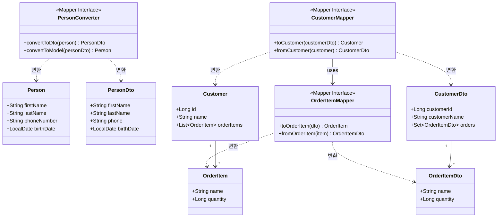

# Examples for MapStruct

[MapStruct](http://mapstruct.org/) 를 Kotlin 에서 사용하는 예제입니다.

## 매핑 구조

```mermaid
classDiagram
    class Person {
        +String firstName
        +String lastName
        +String phoneNumber
        +LocalDate birthDate
    }
    class PersonDto {
        +String firstName
        +String lastName
        +String phone
        +LocalDate birthDate
    }
    class PersonConverter {
        <<Mapper Interface>>
        +convertToDto(person) PersonDto
        +convertToModel(personDto) Person
    }

    class Customer {
        +Long id
        +String name
        +List~OrderItem~ orderItems
    }
    class CustomerDto {
        +Long customerId
        +String customerName
        +Set~OrderItemDto~ orders
    }
    class OrderItem {
        +String name
        +Long quantity
    }
    class OrderItemDto {
        +String name
        +Long quantity
    }
    class CustomerMapper {
        <<Mapper Interface>>
        +toCustomer(customerDto) Customer
        +fromCustomer(customer) CustomerDto
    }
    class OrderItemMapper {
        <<Mapper Interface>>
        +toOrderItem(dto) OrderItem
        +fromOrderItem(item) OrderItemDto
    }

    PersonConverter ..> Person : 변환
    PersonConverter ..> PersonDto : 변환
    CustomerMapper ..> Customer : 변환
    CustomerMapper ..> CustomerDto : 변환
    CustomerMapper --> OrderItemMapper : uses
    OrderItemMapper ..> OrderItem : 변환
    OrderItemMapper ..> OrderItemDto : 변환
    Customer "1" --> "*" OrderItem
    CustomerDto "1" --> "*" OrderItemDto
```
