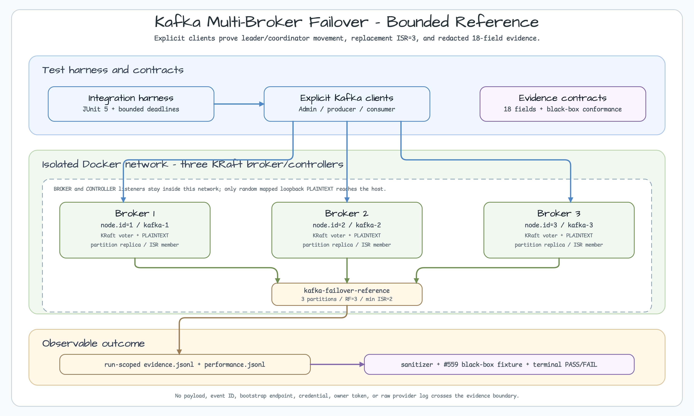
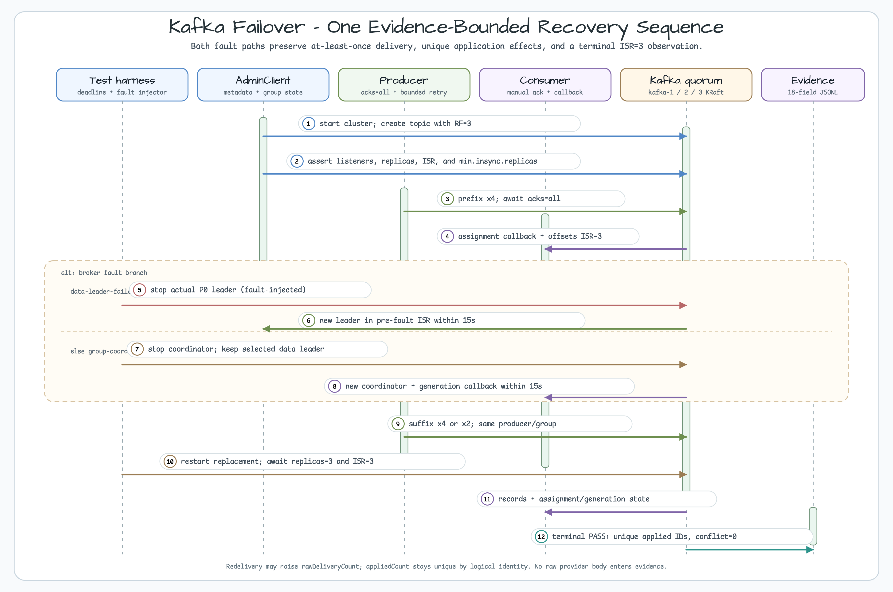

# Kafka Multi-Broker Failover Reference

[한국어](README.ko.md) | English

This module is a source-backed reference for Kafka failover behavior in a
fresh three-broker KRaft cluster. It exercises a real leader replacement and a
separate consumer-group coordinator replacement with Spring Kafka clients,
then records only bounded, redacted evidence. The result describes this
fixture's behavior; it is not a production-capacity or universal availability
guarantee.

## Scope

The module owns the reference event, strict JSON codec, explicit Kafka client
configuration, and the Testcontainers fixture used by the two integration
scenarios. Testcontainers, AdminClient inspection, broker faults, and evidence
writing stay in `src/test`; the application source does not open an HTTP
server. The first run is the integration test, not `bootRun` and not a
connection to an external Kafka cluster.



## Prerequisites

Use a local Docker engine (Docker Desktop, Colima, or an equivalent local
context). Stop before running the test when any preflight check fails; do not
substitute an external broker or a public endpoint.

```bash
colima status
docker context show
docker info
java -version
docker network ls
docker pull apache/kafka@sha256:9516fb7634bad307d17c33b589fde9023003b0cb761374f500002b980a3149b9
```

The expected Java version is 25. The fixture creates one isolated Docker
network and three brokers from the immutable
`apache/kafka@sha256:9516fb7634bad307d17c33b589fde9023003b0cb761374f500002b980a3149b9`
reference. Host clients receive only random mapped loopback `PLAINTEXT`
listeners; broker-to-broker `BROKER` and controller `CONTROLLER`
listeners never become host-client bootstrap addresses.

## Topology

| Item | Fixed contract |
|---|---|
| Runtime | Kafka 4.2.0 image, KRaft, three broker/controller nodes |
| Node IDs and aliases | `1/kafka-1`, `2/kafka-2`, `3/kafka-3` |
| Controller quorum | `1@kafka-1:9094,2@kafka-2:9094,3@kafka-3:9094` |
| Host listener | Random mapped loopback `PLAINTEXT` port for client traffic |
| Inter-broker/controller listeners | `BROKER`/`CONTROLLER`, Docker-network only |
| Reference topic | `kafka-failover-reference`, 3 partitions |
| Target partition | `0`, replication factor `3`, `min.insync.replicas=2` |
| Image identity | `apache/kafka@sha256:9516fb7634bad307d17c33b589fde9023003b0cb761374f500002b980a3149b9` |

The fixture rejects fixed host ports, host networking, non-loopback bindings,
listener drift, digest drift, and a missing or multiple `RepoDigest` result.
The topic is created explicitly with auto topic creation disabled. Internal
consumer-offset replication is checked only after the assignment barrier.

## Scenarios

Run the complete class first. Each scenario uses a fresh fixture and the full
module invocation has a cumulative 420-second (about seven-minute) budget;
the focused commands are independent diagnostic runs.

```bash
./gradlew :messaging-kafka-multi-broker-failover:test --tests "*KafkaMultiBrokerFailoverIntegrationTest" --max-workers=1
./gradlew :messaging-kafka-multi-broker-failover:test --tests '*KafkaMultiBrokerFailoverIntegrationTest.dataLeaderFailover' --max-workers=1
./gradlew :messaging-kafka-multi-broker-failover:test --tests '*KafkaMultiBrokerFailoverIntegrationTest.groupCoordinatorFailover' --max-workers=1
```

`data-leader-failover` records the selected partition's leader, replicas, and
ISR, acknowledges four deterministic prefix events, stops the actual leader,
waits for another pre-fault ISR member to lead, publishes a four-event suffix,
and restarts the stopped node until ISR returns to three. A leader or ISR
precondition failure is a failure with evidence, never a successful skip.

`group-coordinator-failover` first proves that the group coordinator and the
selected data leader are distinct, then stops the coordinator broker and
checks the new coordinator, generation/assignment callback, suffix fetch, and
replacement ISR. A topology that cannot provide the required separation is a
failure with an allowlisted summary.



## Event and client contract

`KafkaFailoverEvent` contains `eventId`, `sequence`, `payload`, and the fixed
`partitionKey=failover-partition-0`. Its topic is
`kafka-failover-reference`. `KafkaFailoverCodec` emits strict JSON with no
Spring type headers, wildcard trusted packages, default typing, or scalar
coercion; `fingerprint` is used to detect a conflicting payload for the same
logical ID.

`KafkaFailoverKafkaConfiguration` uses the root
`bluetape4k-dependencies` BOM and catalog aliases. The producer fixes
`acks=all`, idempotence, three client retries, bounded request/delivery/block
timeouts, and bounded backoff. The consumer fixes manual acknowledgment, no
auto-commit, `earliest` offset reset, a stable group ID, and poll/fetch
ceilings. Admin operations use bounded request and API timeouts.

## Evidence

Every scenario writes run-scoped files under
`build/reports/kafka-failover/{runId}/`. `evidence.jsonl` has one sanitized
JSON object per phase; `performance.jsonl` is reserved for timing and counter
observations; `broker-{brokerId}.log` is a redacted state summary, never a raw
broker log. The fixed field order is:

`runId`, `scenario`, `phase`, `image`, `imageDigest`, `topic`, `partition`,
`nodeCount`, `leader`, `replicas`, `isr`, `coordinator`, `assignmentCount`,
`rawDeliveryCount`, `appliedCount`, `conflictCount`, `retryCount`, `status`

```json
{"runId":"20260826T000000Z-123","scenario":"data-leader-failover","phase":"terminal","image":"apache/kafka","imageDigest":"sha256:9516fb7634bad307d17c33b589fde9023003b0cb761374f500002b980a3149b9","topic":"kafka-failover-reference","partition":0,"nodeCount":3,"leader":2,"replicas":[1,2,3],"isr":[1,2,3],"coordinator":null,"assignmentCount":1,"rawDeliveryCount":8,"appliedCount":8,"conflictCount":0,"retryCount":0,"status":"PASS"}
```

The phase order is `startup → topic-ready → assignment-ready → prefix-acked
→ fault-injected → recovery → suffix-acked → replacement-ready → isr-restored
→ terminal`. Intermediate rows are observations; the terminal row is `PASS` or
`FAIL`. Redelivery may increase `rawDeliveryCount`; `appliedCount` is the
unique application-level result, and a non-zero `conflictCount` means that one
logical ID carried a different payload fingerprint. `retryCount` counts
allowlisted AdminClient retries only. Producer-client retries are reported
separately in `performance.jsonl`.

No event ID, payload, bootstrap URL, environment variable, credential, owner
token, full exception, or raw provider/broker body is written to evidence.
The `#559` consumer reads the 18-field redacted JSONL and terminal evidence as
a black-box contract; it must not import the `#558` fixture or package.

## Failure runbook

All diagnostic commands are read-only. A live lock fails fast; a stale lock is
reported for explicit operator disposition and is not automatically deleted.
If the sanitizer fails, CI intentionally blocks artifact upload.

```bash
./scripts/with-kafka-failover-lock.sh -- ./gradlew :messaging-kafka-multi-broker-failover:test --max-workers=1 --console=plain
docker ps -a --filter 'label=bluetape4k.kafka-failover.run-id=<run-id>' --format '{{.ID}} {{.Names}} {{.Labels}}'
docker network ls --filter 'label=bluetape4k.kafka-failover.run-id=<run-id>'
docker inspect --format '{{json .HostConfig.PortBindings}}' <container-id>
docker inspect --format '{{json .NetworkSettings.Ports}}' <container-id>
export KAFKA_FAILOVER_RUN_ID=<run-id>
./scripts/validate-kafka-failover-artifacts.sh --module messaging/kafka-multi-broker-failover --run-id "$KAFKA_FAILOVER_RUN_ID" --staging messaging/kafka-multi-broker-failover/build/reports/kafka-failover/sanitized
```

Classify failures by phase: digest/listener drift and precondition failures
stop the run; an ISR timeout is investigated with the allowlisted AdminClient
state and redacted broker summary; a live or stale lock is never bypassed;
orphan inspection is limited to the labelled containers and network. Do not
restart a healthy Colima VM to work around a bind-mount error.

## Boundaries

| Issue | Boundary |
|---|---|
| #555 | Toxiproxy TCP-path recovery and usage/billing domain behavior |
| #558 | This three-broker KRaft leader/coordinator, replica, ISR, and evidence reference |
| #559 | Black-box behavior/evidence consumer; it does not import the #558 fixture |

## Unsupported

This is not a `bootRun` application or a production deployment. External Kafka
clusters, ZooKeeper, Kafka Connect, cloud credentials, XA, distributed
transactions, public endpoints, and production capacity claims are out of
scope. The tests demonstrate at-least-once transport with application-level
deduplication; they do not claim exactly-once business effects. The observed
three-broker/ISR result is reproducible fixture evidence, not a universal
guarantee.

## Related

- [Workshop serialization and messaging catalog](../../README.md#3-serialization--messaging)
- [Issue #558](https://github.com/bluetape4k/bluetape4k-workshop/issues/558)
- [Issue #559](https://github.com/bluetape4k/bluetape4k-workshop/issues/559)
