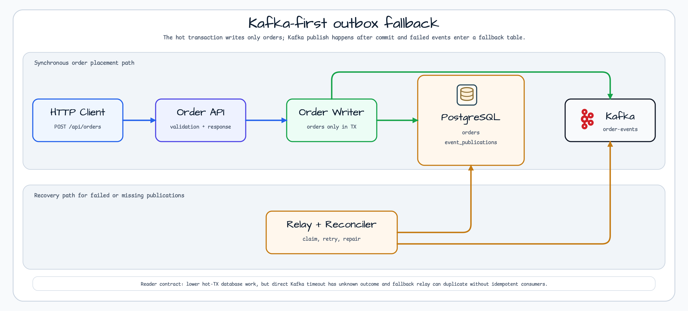
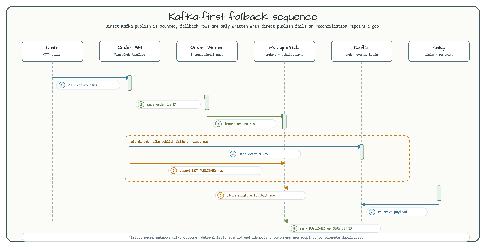
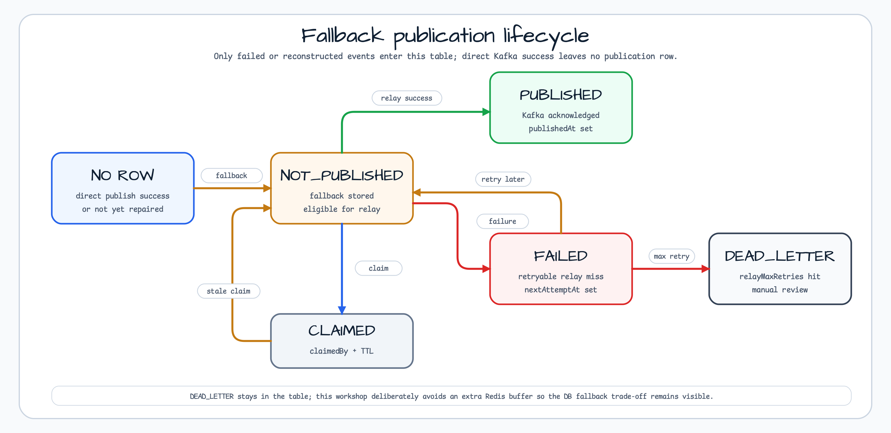

# Kafka Outbox Fallback

[한국어](README.ko.md) | English

This workshop shows a Kafka-first variation of the transactional outbox pattern.
The hot order transaction stores only the `orders` row. After commit, the app
publishes the `OrderPlaced` event directly to Kafka with three bounded attempts.
Only failed, timed out, disabled, or reconstructed publications enter the
`event_publications` fallback table.



## What This Teaches

| Classic transactional outbox | Kafka-first fallback |
|------------------------------|----------------------|
| Domain row and outbox row are written in the same transaction. | The transaction writes only the domain row. |
| A relay always reads the outbox table and publishes later. | Direct Kafka publish happens after commit first. |
| The outbox table is the source of every event. | The fallback table stores only failed or repaired events. |
| Lower loss risk, higher hot transaction write cost. | Lower hot transaction write cost, higher duplicate and recovery risk. |

Use this approach only when the hot transaction cost matters and consumers are
idempotent. A direct Kafka timeout has an unknown outcome: Kafka may have
accepted the record even if the caller timed out. The deterministic event id
(`order-placed:{orderId}:v1`) is therefore part of the contract.

## Flow



1. `POST /api/orders` validates the request.
2. `TransactionalOrderWriter` stores only `orders`.
3. `OrderEventPublisher` serializes `OrderPlacedEvent` after the order commit.
4. When `direct-publish-enabled=false`, the publisher does **not** call Kafka. It stores a `NOT_PUBLISHED` fallback row with `DIRECT_DISABLED` and returns `FALLBACK_STORED`.
5. When direct publish is enabled and succeeds, the API returns `PUBLISHED_DIRECT`; no fallback row exists.
6. When direct publish is enabled but fails or times out, the publisher retries three times, then upserts a `NOT_PUBLISHED` row.
7. `EventPublicationRelay` claims fallback rows and re-drives them to Kafka.
8. `PublicationReconciler` reconstructs missing rows from old `orders` rows when fallback persistence itself failed.

## Fallback Lifecycle



| State | Meaning |
|-------|---------|
| `NO ROW` | Direct Kafka publish succeeded, or reconciliation has not repaired a missing row yet. |
| `NOT_PUBLISHED` | A failed, disabled, timed out, or reconstructed event is eligible for relay. |
| `CLAIMED` | A relay worker set `claimedBy` and `claimedUntil` before sending. |
| `FAILED` | Relay send failed but `relayMaxRetries` has not been reached. |
| `PUBLISHED` | Kafka acknowledged a relay publish and `publishedAt` is set. |
| `DEAD_LETTER` | Relay reached `relayMaxRetries`; manual review is required. |

`CLAIMED` is represented by nullable claim columns, not by a separate enum value.

## REST API

Place an order:

```bash
curl -s -X POST http://localhost:8080/api/orders \
  -H 'Content-Type: application/json' \
  -d '{"customerId":"customer-1001","product":"coffee-beans","quantity":2}'
```

Example response:

```json
{
  "id": 1,
  "customerId": "customer-1001",
  "product": "coffee-beans",
  "quantity": 2,
  "status": "PENDING",
  "publicationStatus": "PUBLISHED_DIRECT",
  "createdAt": "2026-06-29T12:00:00",
  "updatedAt": "2026-06-29T12:00:00"
}
```

`publicationStatus` is caller-facing:

| Status | Meaning |
|--------|---------|
| `PUBLISHED_DIRECT` | The after-commit direct Kafka send completed successfully. |
| `FALLBACK_STORED` | Direct publish was disabled, failed, or timed out and a fallback row was stored. |
| `FALLBACK_STORE_FAILED` | Direct publish failed and fallback persistence also failed. The reconciler can later repair the gap from `orders`. |
| `UNKNOWN` | Read-only order endpoints do not expose internal publication state. |

Inspect fallback rows without raw payload:

```bash
curl -s http://localhost:8080/api/publications
```

The publication response intentionally excludes the `payload` column and returns
only safe metadata such as `eventId`, `status`, retry counts, sanitized error
summary, and timestamps.

Opt-in demo admin endpoints are disabled by default:

```yaml
workshop:
  kafka-outbox-fallback:
    demo-admin-endpoints-enabled: true
```

When enabled:

```bash
curl -s -X POST http://localhost:8080/api/publications/relay
curl -s -X POST http://localhost:8080/api/publications/reconcile
```

These endpoints are for workshop demos only. Production systems should protect
relay and reconciliation operations behind operator authentication and rate
limits.

## Configuration

```yaml
workshop:
  kafka-outbox-fallback:
    topic: order-events
    direct-publish-attempts: 3
    direct-publish-timeout: 500ms
    direct-publish-total-timeout: 1600ms
    relay-max-retries: 3
    relay-batch-size: 25
    relay-fixed-delay: 2000ms
    relay-claim-ttl: 30s
    reconciler-grace: 30s
    max-payload-bytes: 8192
    direct-publish-enabled: true
    relay-enabled: true
    reconciler-enabled: true
    demo-admin-endpoints-enabled: false
```

The demo locks `topic` to `order-events` and `direct-publish-attempts` to `3` so
the tests and diagrams stay deterministic.

Set `direct-publish-enabled: false` to demonstrate the fallback-only branch. In
that mode `OrderEventPublisher` skips `KafkaTemplate.send(...)`, writes a
`NOT_PUBLISHED` row with `DIRECT_DISABLED`, and returns `FALLBACK_STORED`.

## Metrics And Health

Micrometer counters:

| Metric | Tags |
|--------|------|
| `workshop.outbox.direct.publish.attempts` | `result=success|timeout|failure` |
| `workshop.outbox.fallback.stored` | `result=success|failure` |
| `workshop.outbox.relay.events` | `result=published|failure|dead-letter` |
| `workshop.outbox.reconciler.events` | `result=reconstructed` |

Actuator exposes `health`, `info`, and `prometheus`; health probes include
readiness and liveness endpoints when the app runs in a probe-aware environment.
Error responses do not echo rejected request values, raw payloads, stack traces,
or secret-looking text.

## Run

The application expects PostgreSQL and Kafka at the endpoints in
`src/main/resources/application.yml`. The tests start PostgreSQL and Kafka with
bluetape4k Testcontainers launchers.

```bash
./gradlew :messaging-kafka-outbox-fallback:test --max-workers=1
```

Useful focused checks:

```bash
./gradlew :messaging-kafka-outbox-fallback:test --tests '*direct publish*' --max-workers=1
./gradlew :messaging-kafka-outbox-fallback:test --tests '*relay*' --tests '*reconciler*' --max-workers=1
```

## Operational Notes

- Direct Kafka publish is after the order transaction. It must not be moved back
  into the transaction unless the example is intentionally changed back to the
  classic transactional outbox.
- A timeout means unknown Kafka outcome. Keep `eventId` deterministic and make
  consumers idempotent.
- `FALLBACK_STORE_FAILED` is a visible degraded state. The order exists, but no
  durable publication row exists until reconciliation repairs it.
- `DEAD_LETTER` rows stay in the table for manual review. Do not delete them in
  an automated relay loop.
- The relay and reconciler keep eligibility, ordering, limits, and missing-row
  detection in SQL. The reconciler is still deliberately simple; production
  systems should add tighter bounds, indexing, and operator controls.
