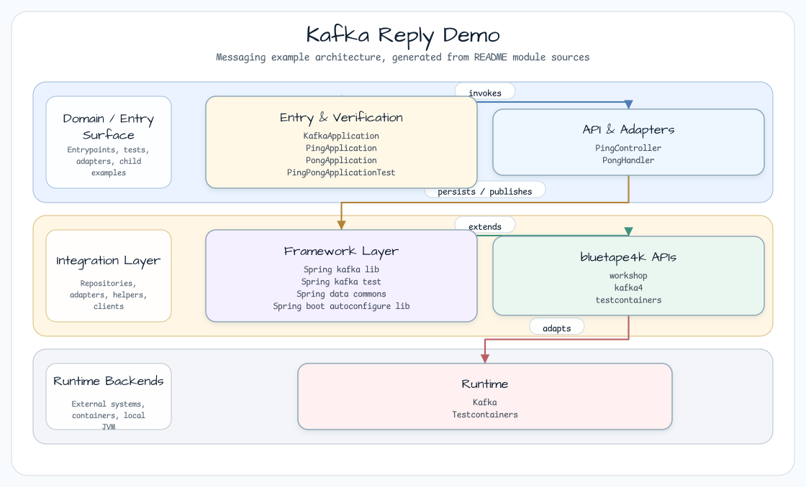
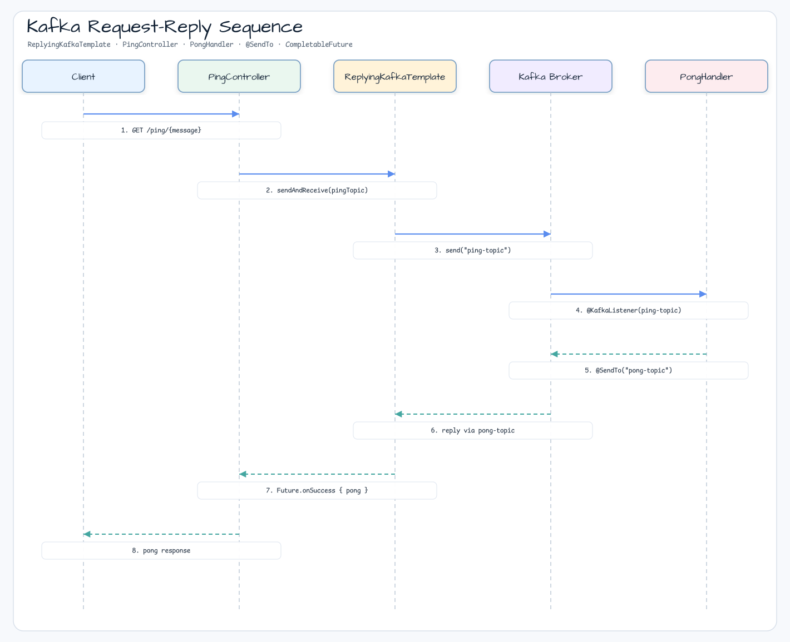

# Kafka Reply Demo

[English](README.md) | 한국어

## 예제 시나리오

이 예제는 **Kafka Reply Demo**를 실행 가능한 메시지 기반 워크플로우 워크샵 조각으로 다룹니다. 개발자가 먼저 확인할 경로인 모듈 설정, 샘플 또는 테스트 실행, 반복적인 인프라 코드를 줄이는 라이브러리나 프레임워크 API 관찰에 초점을 둡니다.

## 아키텍처 다이어그램



모듈은 샘플 진입점 또는 테스트 픽스처, bluetape4k 확장 계층, 예제가 사용하는 런타임 의존성을 중심으로 구성됩니다. README와 코드를 비교할 때는 `io.bluetape4k.workshop.messaging` 패키지 아래의 구현을 기준으로 삼습니다.

## 흐름 다이어그램

1. `messaging-kafka-reply`에 필요한 로컬 런타임을 준비합니다.
2. 예제 시나리오를 담당하는 애플리케이션, 컨트롤러, 서비스 또는 테스트 픽스처를 실행합니다.
3. 반복적인 인프라 작업을 bluetape4k 유틸리티 또는 Spring/Kotlin 통합 기능에 위임합니다.
4. 샘플 출력, HTTP 응답, 저장소 상태, metric, trace 또는 테스트 기대값으로 보이는 결과를 검증합니다.

## 시퀀스 다이어그램

핵심 시퀀스는 호출자 또는 테스트 픽스처 -> 워크샵 어댑터 -> bluetape4k 헬퍼/API -> 외부 런타임 또는 인메모리 백엔드 -> 검증/응답 순서입니다. 이 모듈에 전용 시퀀스 자산이 있으면 아래 이미지가 상호작용 순서를 보여주며, 그렇지 않으면 소스 테스트가 실행 가능한 시퀀스의 기준입니다.



이 예제는 `ReplyingKafkaTemplate`을 사용하는 Kafka request-reply 패턴을 보여줍니다.
bluetape4k의 `CompletableFuture.onSuccess/onFailure`, `uninitialized()`, `KLoggingChannel`을 사용합니다.
Spring Kafka 4 호환 Bluetape4k 모듈은 `bluetape4k-kafka4`를 사용합니다.

## 주요 구성 요소

| Class | Role |
|---|---|
| `PingController` | `ReplyingKafkaTemplate.sendAndReceive()`로 ping을 보내고 reply를 기다립니다. |
| `PongHandler` | `@KafkaListener` + `@SendTo`로 ping을 받은 뒤 pong reply를 반환합니다. |
| `PingApplication` | Ping app configuration |
| `PongApplication` | Pong app configuration |

## 사용된 bluetape4k 기능

| Feature | Artifact | Code Location | Benefit |
|---|---|---|---|
| `CompletableFuture.onSuccess/onFailure` | `bluetape4k-coroutines` | `PingController.ping()` | Java Future를 위한 Kotlin 스타일 callback 확장 |
| `bluetape4k-kafka4` dependency | `bluetape4k-kafka4` | `build.gradle.kts` | Spring Kafka 4 예제에서 Bluetape4k Kafka 확장을 사용할 수 있게 하는 호환 artifact |
| `uninitialized()` | `bluetape4k-core` | `PingController` | `lateinit` 초기화를 대체하는 타입 안전 대안 |
| `KLoggingChannel` | `bluetape4k-logging` | companion object | 코루틴 컨텍스트를 포함한 구조적 로깅 |

## Bluetape4k 경계

`messaging/kafka-reply`는 실제 request-reply 프로토콜을 Spring Kafka의 `ReplyingKafkaTemplate.sendAndReceive()`에 둡니다.
현재 검증된 `bluetape4k-kafka4` API는 `ReplyingKafkaTemplate`을 대체하는 전용 request/reply 추상화를 제공하지 않으므로, 이 예제는 Spring Kafka의 프로토콜 primitive와 Bluetape4k의 Future/coroutine 사용성을 결합합니다.

## bluetape4k Before / After

### 전통적인 Callback 대비 `CompletableFuture.onSuccess/onFailure`

```kotlin
// Before — addCallback (deprecated) or thenAccept/exceptionally
replyFuture.addCallback(
    { result -> logger.info("Sent ok: $result") },
    { e -> logger.error("Failed: ${e.message}") }
)

// After — bluetape4k onSuccess / onFailure extensions (chainable)
replyFuture
    .onSuccess { result -> log.info { "callback result: $result" } }
    .onFailure { e -> log.error(e) { "callback exception." } }
```

### Request-Reply 처리

```kotlin
@GetMapping("/ping")
suspend fun ping(): String {
    val record = ProducerRecord<String, String>(TOPIC_PINGPONG, "ping")
    val replyFuture = template.sendAndReceive(record)

    replyFuture
        .onSuccess { log.info { "Sent ok: $it" } }
        .onFailure { log.error(it) { "Send failed" } }

    val sendResult = replyFuture.sendFuture?.await()
    val consumerRecord = replyFuture.await()         // coroutines.future.await()
    return consumerRecord.value()
}

// Pong side — automatically replies with @SendTo
@KafkaListener(groupId = "pong", topics = [TOPIC_PINGPONG])
@SendTo
fun handle(request: String): String {
    log.info { "Received: $request" }
    return "pong at ${LocalDateTime.now()}"
}
```

## 실행

```bash
./gradlew :messaging-kafka-reply:bootRun
# Test with an HTTP file
# GET http://localhost:8080/ping
```

## 관련 모듈

- [`messaging/kafka`](../kafka) — `ReplyingKafkaTemplate`을 사용하는 기본 producer/consumer 패턴

## 참고

- [Spring Kafka ReplyingKafkaTemplate](https://docs.spring.io/spring-kafka/reference/kafka/sending-messages.html#replying-template)
- [bluetape4k-coroutines](https://github.com/bluetape4k/bluetape4k-projects)
