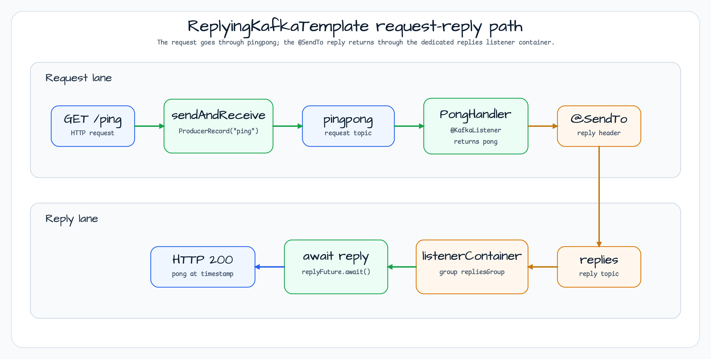

# Kafka Reply Demo

[English](README.md) | 한국어

`messaging/kafka-reply`는 Spring Kafka의 request-reply 흐름을 보여준다. WebFlux 엔드포인트가
`ReplyingKafkaTemplate`으로 `ping`을 보내고, `PongHandler`가 Kafka에서 요청을 소비한 뒤, 응답은 template에
연결된 reply listener container로 돌아온다.

## 아키텍처


이 예제는 request-reply 프로토콜 primitive를 Spring Kafka에 그대로 둔다. bluetape4k는 그 주변에서 coroutine/Future
사용성, 로깅, `uninitialized()` 주입 필드, Testcontainers Kafka 서버를 보조한다.

## Request-Reply 흐름



`PingController`는 두 결과를 기다린다.

1. `replyFuture.sendFuture?.await()`로 요청 record가 `pingpong`에 produce 되었는지 확인한다.
2. `replyFuture.await()`로 `replies` listener container가 `@SendTo` 응답을 받을 때까지 기다린다.

## 주요 구성 요소

| Component | Role |
|---|---|
| `KafkaApplicationKt` | 워크샵 데모를 위해 `PingApplication`과 `PongApplication`을 한 프로세스에서 시작한다. |
| `PingController` | `GET /ping`을 제공하고, `ping`을 보내며, success/failure callback을 기록한 뒤 reply body를 반환한다. |
| `ReplyingKafkaTemplate<String, String, String>` | 요청 record를 보내고 reply listener container가 소비한 응답을 correlation한다. |
| `listenerContainer("replies")` | group id `repliesGroup`을 쓰는 전용 reply consumer container이며 `ReplyingKafkaTemplate`에 연결된다. |
| `PongHandler` | `pingpong`을 listen하고 `@SendTo`로 `pong at <time>`을 반환한다. |
| `KafkaServer.Launcher.kafka` | 두 application이 사용하는 Testcontainers Kafka bootstrap server를 제공한다. |

## bluetape4k 사용 지점

| Feature | Where | Why it matters |
|---|---|---|
| `bluetape4k-kafka4` | `build.gradle.kts` | Spring Kafka 4 호환 bluetape4k artifact line을 사용한다. |
| `CompletableFuture.onSuccess/onFailure` | `PingController.ping()` | reply를 await하기 전에 읽기 쉬운 success/failure callback을 붙인다. |
| `kotlinx.coroutines.future.await()` | `PingController.ping()` | suspend endpoint가 event loop를 막지 않고 send/reply future를 기다리게 한다. |
| `uninitialized()` | `PingController.template` | Spring 주입 필드를 nullable이나 `lateinit` 없이 표현한다. |
| `KLoggingChannel` | Application and handler companions | 다른 bluetape4k 예제와 같은 방식으로 구조적 로그를 남긴다. |

## 요청 처리

```kotlin
@GetMapping("/ping")
suspend fun ping(): String {
    val record = ProducerRecord<String, String>(TOPIC_PINGPONG, "ping")
    val replyFuture = template.sendAndReceive(record)

    replyFuture
        .onSuccess { result -> log.info { "callback result: $result" } }
        .onFailure { e -> log.error(e) { "callback exception." } }

    replyFuture.sendFuture?.await()
    return replyFuture.await().value()
}
```

## 응답 처리

```kotlin
@KafkaListener(groupId = "pong", topics = [PongApplication.TOPIC_PINGPONG])
@SendTo
fun handle(request: String): String {
    return "pong at " + LocalDateTime.now()
}
```

## 실행

```bash
./gradlew :messaging-kafka-reply:bootRun
curl http://localhost:8080/ping
```

## 관련 모듈

- [`messaging/kafka`](../kafka) - `KafkaTemplate.suspendSend`를 사용하는 기본 publish/consume 경로.

## 참고

- [Spring Kafka ReplyingKafkaTemplate](https://docs.spring.io/spring-kafka/reference/kafka/sending-messages.html#replying-template)
- [bluetape4k Projects](https://github.com/bluetape4k/bluetape4k-projects)
