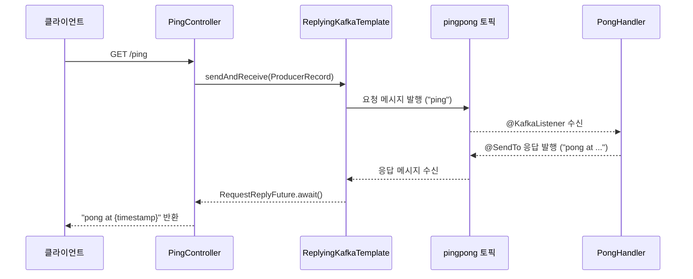

# Module Kafka Reply Demo

## 아키텍처 다이어그램



## 설명

`ReplyingKafkaTemplate` 사용에 대한 예제입니다. `ReplyingKafkaTemplate` 는 producing 후에 비동기로 응답을 받는 방식으로 kafka 를 사용합니다.

`ReplyingKafkaTemplate`를 이용해 전송 후, 응답을 기다립니다.

```kotlin
val record = ProducerRecord<String, String>(TOPIC_PINGPONG, "ping")
val replyFuture: RequestReplyFuture<String, String, String> = template.sendAndReceive(record)
replyFuture.addCallback(
    { result -> log.info { "callback result: $result" } },
    { e -> log.error(e) { "callback exception." } }
)

// 전송 결과
val sendResult = replyFuture.sendFuture.await()
log.info { "Sent ok: $sendResult" }

// 응답 결과
val consumerRecord = replyFuture.await()
log.info { "Return ok: key=${consumerRecord.key()}, value=${consumerRecord.value()}" }
```

ping 을 받는 `Consumer` 에 해당하는 `KafkaListener` 에서 message 를 받은 후에 `@SendTo` 를 이용하여, 다시 응답을 보냅니다.

```kotlin
    @KafkaListener(groupId = "pong", topics = [PongApplication.TOPIC_PINGPONG])
@SendTo // use default replyTo expression
fun handle(request: String): String {
    log.info { "Received: $request in ${this.javaClass.name}" }
    return "pong at " + LocalDateTime.now()
}
```

## 실행

1. `KafkaApplication` 을 실행한다
2. `pingpong.http` 를 실행한다
