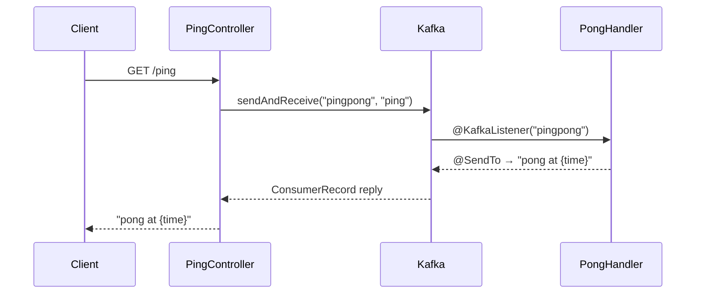

# Kafka Reply Demo

`ReplyingKafkaTemplate`을 이용한 Kafka 요청-응답(Request-Reply) 패턴 예제입니다.
bluetape4k의 `CompletableFuture.onSuccess/onFailure`, `uninitialized()`, `KLoggingChannel`을 활용합니다.

## 아키텍처


```mermaid
sequenceDiagram
    participant Client
    participant PingController
    participant Kafka
    participant PongHandler

    Client->>PingController: GET /ping
    PingController->>Kafka: sendAndReceive("pingpong", "ping")
    Kafka->>PongHandler: @KafkaListener("pingpong")
    PongHandler-->>Kafka: @SendTo → "pong at {time}"
    Kafka-->>PingController: ConsumerRecord reply
    PingController-->>Client: "pong at {time}"
```

## 주요 구성

| 클래스 | 역할 |
|---|---|
| `PingController` | `ReplyingKafkaTemplate.sendAndReceive()` 로 ping 발송 후 응답 대기 |
| `PongHandler` | `@KafkaListener` + `@SendTo` 로 ping 수신 → pong 응답 |
| `PingApplication` | Ping 앱 설정 |
| `PongApplication` | Pong 앱 설정 |

## 사용된 bluetape4k 기능

| 기능 | 아티팩트 | 코드 위치 | 이점 |
|---|---|---|---|
| `CompletableFuture.onSuccess/onFailure` | `bluetape4k-coroutines` | `PingController.ping()` | Java Future에 Kotlin 스타일 콜백 확장 |
| `uninitialized()` | `bluetape4k-core` | `PingController` | 타입 안전 lateinit 초기화 대체 |
| `KLoggingChannel` | `bluetape4k-logging` | companion object | 코루틴 컨텍스트 포함 구조적 로깅 |

## bluetape4k Before / After

### `CompletableFuture.onSuccess/onFailure` vs 전통적 콜백

```kotlin
// Before — addCallback (deprecated) 또는 thenAccept/exceptionally
replyFuture.addCallback(
    { result -> logger.info("Sent ok: $result") },
    { e -> logger.error("Failed: ${e.message}") }
)

// After — bluetape4k onSuccess / onFailure 확장 (체이닝 가능)
replyFuture
    .onSuccess { result -> log.info { "callback result: $result" } }
    .onFailure { e -> log.error(e) { "callback exception." } }
```

### 요청-응답 처리

```kotlin
@GetMapping("/ping")
suspend fun ping(): String {
    val record = ProducerRecord<String, String>(TOPIC_PINGPONG, "ping")
    val replyFuture = template.sendAndReceive(record)

    replyFuture
        .onSuccess { log.info { "Sent ok: $it" } }
        .onFailure { log.error(it) { "Send failed" } }

    val sendResult = replyFuture.sendFuture?.await()
    val consumerRecord = replyFuture.await()         // coroutines.future.await()
    return consumerRecord.value()
}

// Pong 쪽 — @SendTo로 자동 응답
@KafkaListener(groupId = "pong", topics = [TOPIC_PINGPONG])
@SendTo
fun handle(request: String): String {
    log.info { "Received: $request" }
    return "pong at ${LocalDateTime.now()}"
}
```

## 실행

```bash
./gradlew :messaging-kafka-reply:bootRun
# HTTP 파일로 테스트
# GET http://localhost:8080/ping
```

## 관련 모듈

- [`messaging/kafka`](../kafka) — 기본 Producer/Consumer 패턴

## 참고

- [Spring Kafka ReplyingKafkaTemplate](https://docs.spring.io/spring-kafka/reference/kafka/sending-messages.html#replying-template)
- [bluetape4k-coroutines](https://github.com/bluetape4k/bluetape4k-projects)
