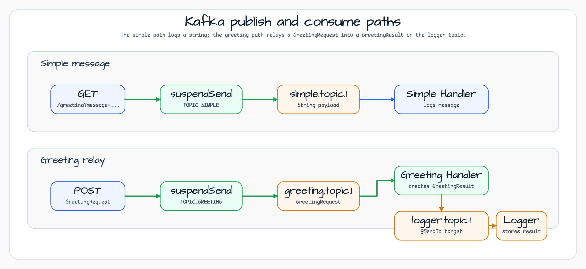

# Kafka Demo

[English](README.md) | 한국어

이 모듈은 coroutine-friendly WebFlux controller에서 메시지를 발행하고 `@KafkaListener` handler로 소비하는 Spring Kafka 4 워크샵 예제입니다.

Kafka는 `KafkaServer.Launcher.kafka`로 시작하므로, 샘플과 테스트가 수동 container lifecycle 코드 없이 Testcontainers 기반 broker를 사용할 수 있습니다.

## 아키텍처


`GreetingController`는 suspend endpoint를 제공하고 `bluetape4k-kafka4`의 `KafkaTemplate.suspendSend()`로 메시지를 발행합니다. 이후 Spring Kafka listener가 설정된 topic을 소비합니다.

## 메시지 흐름



| Endpoint | Kafka path |
|----------|------------|
| `GET /greeting?message=...` | 문자열을 `simple.topic.1`로 발행하고, `SimpleMessageHandler`가 로그로 남깁니다. |
| `POST /greeting` | `GreetingRequest`를 `greeting.topic.1`로 발행하고, `GreetingMessageHandler`가 `@SendTo(logger.topic.1)`로 `GreetingResult`를 relay하며, `LoggerMessageHandler`가 결과를 저장합니다. |

## 주요 타입

| 타입 | 역할 |
|------|------|
| `KafkaApplication` | `KafkaServer.Launcher.kafka`로 Testcontainers Kafka singleton을 시작합니다. |
| `KafkaConfig` | Kafka를 활성화하고 `ProducerFactory<String, Any>`와 `KafkaTemplate<String, Any>`를 제공합니다. |
| `GreetingController` | Suspend HTTP endpoint를 제공하고 `suspendSend`로 send 완료를 기다립니다. |
| `SimpleMessageHandler` | `TOPIC_SIMPLE` 문자열 메시지를 소비합니다. |
| `GreetingMessageHandler` | `GreetingRequest`를 소비하고 `GreetingResult`를 logger topic으로 relay합니다. |
| `LoggerMessageHandler` | `GreetingResult`를 소비하고 assertion을 위해 수신 메시지를 보관합니다. |

## Topics

| Constant | Topic |
|----------|-------|
| `KafkaTopics.TOPIC_SIMPLE` | `simple.topic.1` |
| `KafkaTopics.TOPIC_GREETING` | `greeting.topic.1` |
| `KafkaTopics.TOPIC_LOGGER` | `logger.topic.1` |

## Coroutine 경계

`KafkaOperations.suspendSend()`가 coroutine-friendly 발행 경계입니다. Suspend controller가 callback 코드를 노출하지 않고 Spring Kafka 4 send 결과를 기다릴 수 있게 합니다.

`@KafkaListener` method는 일반 함수로 유지됩니다. 비활성화된 `CoroutineSimpleMessageHandler`는 이 제약을 설명하기 위한 참고용이며, listener method 자체를 suspend endpoint처럼 모델링하지 않는 것이 좋습니다.

## 실행

```bash
./gradlew :messaging-kafka:bootRun
./gradlew :messaging-kafka:test
```

## 의존성

```kotlin
implementation(libs.bluetape4k.kafka4)
implementation(libs.bluetape4k.testcontainers)
implementation(libs.spring.boot.starter.webflux.lib)
implementation(libs.spring.kafka.lib)
implementation(libs.kafka.clients)
implementation(libs.testcontainers.kafka)
testImplementation(libs.spring.kafka.test)
```

## 관련 모듈

- [`messaging/kafka-reply`](../kafka-reply)는 `ReplyingKafkaTemplate` 기반 request-reply messaging을 보여줍니다.
