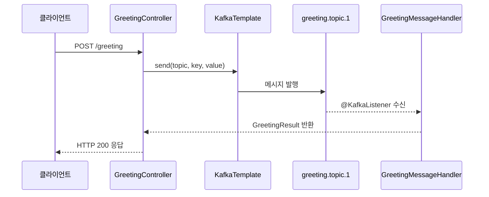

# Kafka Demo

Spring Kafka를 사용하는 기본 메시지 발행·소비 예제입니다.
Testcontainers로 Kafka 컨테이너를 자동으로 구동하여 통합 테스트를 수행합니다.

## 주요 내용

- `KafkaTemplate`을 이용한 메시지 발행 (Producer)
- `@KafkaListener`를 이용한 메시지 소비 (Consumer)
- Consumer Group 설정 및 파티션 할당
- 직렬화: String, JSON (Jackson) 포맷
- Kotlin Coroutines와 연동한 비동기 처리

## 아키텍처 다이어그램

```mermaid
flowchart LR
    subgraph 프로듀서 레이어
        GC[GreetingController\nPOST /greeting]
        KT[KafkaTemplate]
    end

    subgraph Kafka 브로커
        T1[greeting.topic.1]
        T2[simple.topic.1]
        T3[logger.topic.1]
    end

    subgraph 컨슈머 레이어
        GMH[GreetingMessageHandler\n@KafkaListener]
        SMH[SimpleMessageHandler\n@KafkaListener]
        CSMH[CoroutineSimpleMessageHandler\n@KafkaListener]
        LMH[LoggerMessageHandler\n@KafkaListener]
    end

    GC -->|send| KT
    KT -->|publish| T1
    KT -->|publish| T2
    KT -->|publish| T3
    T1 --> GMH
    T2 --> SMH
    T2 --> CSMH
    T3 --> LMH
```

## 실행 흐름



## 관련 모듈

- [`messaging/kafka-reply`](../kafka-reply) — `ReplyingKafkaTemplate`을 이용한 요청-응답 패턴

## 참고

- [Spring Kafka 공식 문서](https://docs.spring.io/spring-kafka/reference/)
- [Apache Kafka](https://kafka.apache.org/documentation/)
