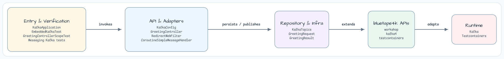
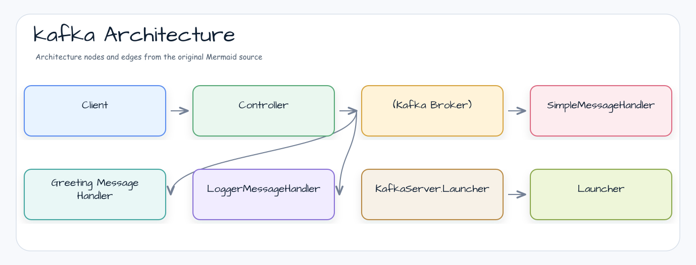
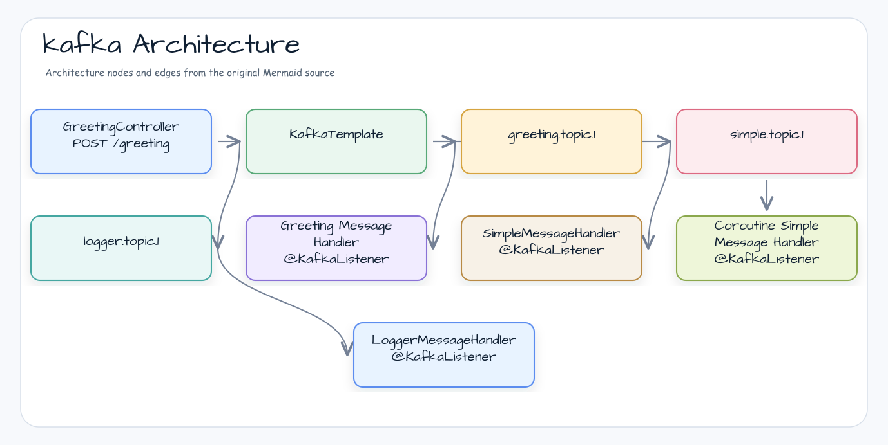
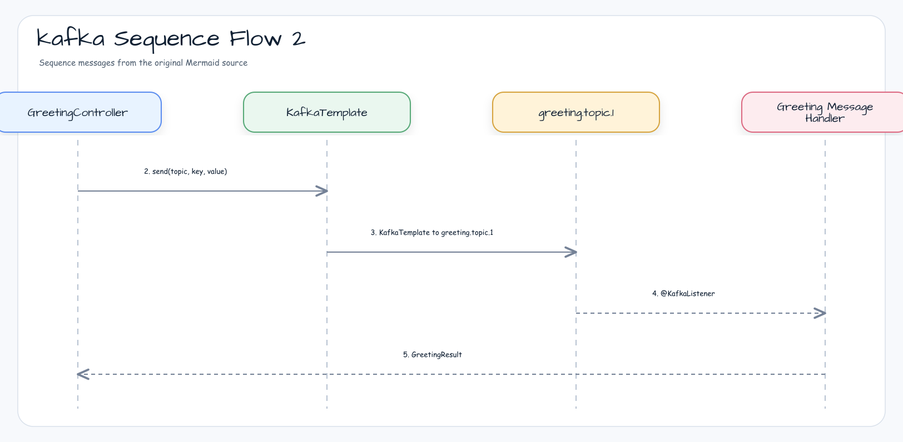

# Kafka Demo

[한국어](README.ko.md) | English

## Example Scenario

This example exercises **Kafka Demo** as a runnable message-driven workflow workshop slice. It focuses on the path a developer would inspect first: configure the module, run the sample or tests, and observe the library or framework APIs that remove repetitive infrastructure code.

## Architecture Diagram



The module is organized around the sample entry point or test fixture, the bluetape4k extension layer, and the runtime dependency used by the example. Keep the package under `io.bluetape4k.workshop.messaging` as the source of truth when comparing this README with the code.



## Flow Diagram

1. Prepare the local runtime required by `messaging-kafka`.
2. Execute the application, controller, service, or test fixture that owns the example scenario.
3. Delegate repetitive infrastructure work to bluetape4k utilities or Spring/Kotlin integrations.
4. Assert the visible result through the sample output, HTTP response, repository state, metric, trace, or test expectation.



## Sequence Diagram

The core sequence is: caller or test fixture -> workshop adapter -> bluetape4k helper/API -> external runtime or in-memory backend -> assertion/response. When this module has a dedicated sequence asset, the image below shows that interaction order; otherwise the source tests are the authoritative executable sequence.



This is a basic message publishing and consuming example that uses Spring Kafka.
It starts Testcontainers Kafka automatically with bluetape4k's `KafkaServer.Launcher`, and handles the Spring Kafka 4 publishing path in a coroutine-friendly way with `suspendSend()` from `bluetape4k-kafka4`.

## Architecture


## Key Components

| Class | Role |
|---|---|
| `KafkaApplication` | Starts Testcontainers Kafka automatically with `KafkaServer.Launcher.kafka` |
| `KafkaConfig` | Configures the `KafkaTemplate` bean |
| `GreetingController` | `suspend` endpoint that publishes messages with `KafkaTemplate.suspendSend()` |
| `SimpleMessageHandler` | Consumes string messages from `TOPIC_SIMPLE` |
| `GreetingMessageHandler` | Consumes JSON object messages from `TOPIC_GREETING` |
| `LoggerMessageHandler` | Logs all topics |

## Used bluetape4k Features

| Feature | Artifact | Code Location | Benefit |
|---|---|---|---|
| `KafkaServer.Launcher.kafka` | `bluetape4k-testcontainers` | `KafkaApplication` companion | Testcontainers Kafka singleton that starts automatically without `application.yml` |
| `KafkaOperations.suspendSend()` | `bluetape4k-kafka4` | `GreetingController` | Waits for Spring Kafka 4 `KafkaTemplate` publish results in coroutine style inside a suspend function |
| `KLoggingChannel` | `bluetape4k-logging` | All companion objects | Structured logging with coroutine context |
| `uninitialized()` | `bluetape4k-core` | `GreetingController` | Type-safe alternative to `lateinit` initialization |

## bluetape4k Before / After

### `KafkaServer.Launcher` vs Manual Testcontainers Setup

```kotlin
// Before — manual @DynamicPropertySource + KafkaContainer management
@SpringBootTest
class KafkaTest {
    companion object {
        @Container
        val kafka = KafkaContainer(DockerImageName.parse("confluentinc/cp-kafka:7.4.0"))

        @JvmStatic
        @DynamicPropertySource
        fun kafkaProperties(registry: DynamicPropertyRegistry) {
            registry.add("spring.kafka.bootstrap-servers") { kafka.bootstrapServers }
        }
    }
}

// After — KafkaServer.Launcher.kafka singleton (starts automatically on app startup)
@SpringBootApplication
class KafkaApplication {
    companion object: KLoggingChannel() {
        val kafka = KafkaServer.Launcher.kafka  // done in one line
    }
}
```

### `KLoggingChannel` — Coroutine Logging

```kotlin
// Before
private val logger = LoggerFactory.getLogger(SimpleMessageHandler::class.java)
logger.debug("Received message: {}", message)

// After — KLoggingChannel (lazy lambda + coroutine MDC context)
companion object: KLoggingChannel()
log.debug { "Received message: $message" }
```

## Message Publishing Examples

```kotlin
// Publish a string message
kafkaTemplate.suspendSend(KafkaTopics.TOPIC_SIMPLE, "Hello Kafka")

// Publish a JSON object message
kafkaTemplate.suspendSend(KafkaTopics.TOPIC_GREETING, GreetingRequest("Alice", "Hello"))
```

## @KafkaListener — Coroutine Limitations

> **Note**: `@KafkaListener` does not officially support `suspend` functions or Reactor.
> `CoroutineSimpleMessageHandler` is disabled (`// @Component`) and kept for reference.

```kotlin
// @Component disabled — KafkaListener does not support suspend
class CoroutineSimpleMessageHandler {
    @KafkaListener(topics = [TOPIC_SIMPLE])
    suspend fun handleWithCoroutines(message: String) { ... }  // does not work
}

// Alternative: wrap with mono { }
@KafkaListener(topics = [TOPIC_SIMPLE])
fun handleWithMono(message: String): Mono<Void> = mono {
    delay(100)
    null
}
```

## Running

```bash
./gradlew :messaging-kafka:bootRun
# Or run tests
./gradlew :messaging-kafka:test
```

## Related Modules

- [`messaging/kafka-reply`](../kafka-reply) — Request-reply pattern with `ReplyingKafkaTemplate`

## References

- [Spring Kafka official docs](https://docs.spring.io/spring-kafka/reference/)
- [Apache Kafka](https://kafka.apache.org/documentation/)
- [bluetape4k-testcontainers](https://github.com/bluetape4k/bluetape4k-projects)
- [bluetape4k-kafka4](https://github.com/bluetape4k/bluetape4k-projects)
