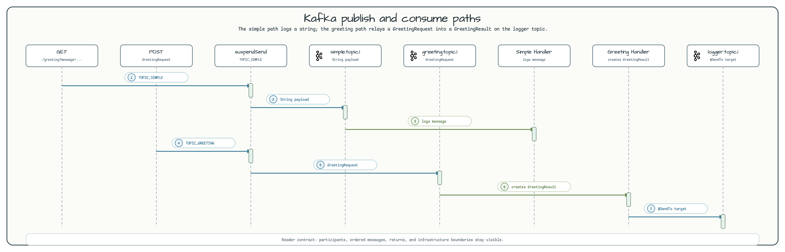

# Kafka Demo

[한국어](README.ko.md) | English

This module is a Spring Kafka 4 workshop slice for publishing messages from a coroutine-friendly WebFlux controller and consuming them with `@KafkaListener` handlers.

It starts Kafka through `KafkaServer.Launcher.kafka`, so the sample and tests can use a Testcontainers-backed broker without hand-written container lifecycle code.

## Architecture


`GreetingController` exposes suspend endpoints and publishes through `KafkaTemplate.suspendSend()` from `bluetape4k-kafka4`. Spring Kafka listeners then consume the configured topics.

## Message Flow



| Endpoint | Kafka path |
|----------|------------|
| `GET /greeting?message=...` | Publishes a string to `simple.topic.1`; `SimpleMessageHandler` logs it. |
| `POST /greeting` | Publishes a `GreetingRequest` to `greeting.topic.1`; `GreetingMessageHandler` returns a `GreetingResult` with `@SendTo(logger.topic.1)`; `LoggerMessageHandler` stores the result. |

## Main Types

| Type | Role |
|------|------|
| `KafkaApplication` | Starts the Testcontainers Kafka singleton through `KafkaServer.Launcher.kafka`. |
| `KafkaConfig` | Enables Kafka and provides `ProducerFactory<String, Any>` plus `KafkaTemplate<String, Any>`. |
| `GreetingController` | Provides suspend HTTP endpoints and waits for send completion with `suspendSend`. |
| `SimpleMessageHandler` | Consumes `TOPIC_SIMPLE` string messages. |
| `GreetingMessageHandler` | Consumes `GreetingRequest` and relays `GreetingResult` to the logger topic. |
| `LoggerMessageHandler` | Consumes `GreetingResult` and keeps received messages for assertions. |

## Topics

| Constant | Topic |
|----------|-------|
| `KafkaTopics.TOPIC_SIMPLE` | `simple.topic.1` |
| `KafkaTopics.TOPIC_GREETING` | `greeting.topic.1` |
| `KafkaTopics.TOPIC_LOGGER` | `logger.topic.1` |

## Coroutine Boundary

`KafkaOperations.suspendSend()` is the coroutine-friendly publishing boundary. It lets the suspend controller wait for Spring Kafka 4 send results without exposing callers to callback code.

`@KafkaListener` methods remain regular functions. The disabled `CoroutineSimpleMessageHandler` is kept as a reference for that limitation; listener methods themselves should not be modeled as suspend endpoints.

## Run

```bash
./gradlew :messaging-kafka:bootRun
./gradlew :messaging-kafka:test
```

## Dependencies

```kotlin
implementation(libs.bluetape4k.kafka4)
implementation(libs.bluetape4k.testcontainers)
implementation(libs.spring.boot.starter.webflux.lib)
implementation(libs.spring.kafka.lib)
implementation(libs.kafka.clients)
implementation(libs.testcontainers.kafka)
testImplementation(libs.spring.kafka.test)
```

## Related Module

- [`messaging/kafka-reply`](../kafka-reply) shows request-reply messaging with `ReplyingKafkaTemplate`.
