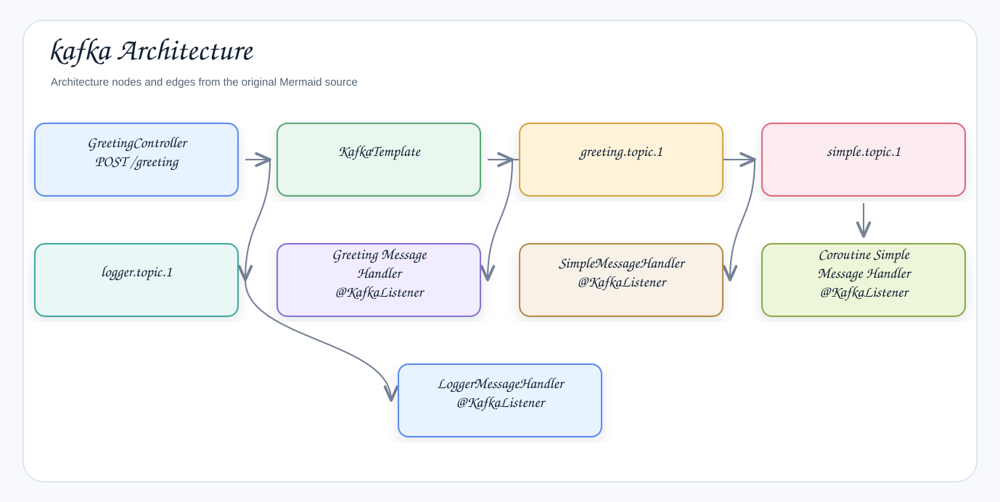
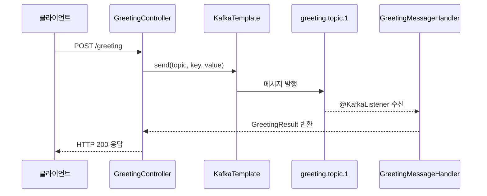

# Kafka Demo

Spring Kafka를 사용하는 기본 메시지 발행·소비 예제입니다.
Testcontainers로 Kafka 컨테이너를 자동으로 구동하여 통합 테스트를 수행합니다.

## 주요 내용

- `KafkaTemplate`을 이용한 메시지 발행 (Producer)
- `@KafkaListener`를 이용한 메시지 소비 (Consumer)
- Consumer Group 설정 및 파티션 할당
- 직렬화: String, JSON (Jackson) 포맷
- Kotlin Coroutines와 연동한 비동기 처리

## 아키텍처 다이어그램

## 실행 흐름

```mermaid
sequenceDiagram
    participant 클라이언트
    participant GreetingController
    participant KafkaTemplate
    participant greeting.topic.1
    participant GreetingMessageHandler

    클라이언트->>GreetingController: POST /greeting
    GreetingController->>KafkaTemplate: send(topic, key, value)
    KafkaTemplate->>greeting.topic.1: 메시지 발행
    greeting.topic.1-->>GreetingMessageHandler: @KafkaListener 수신
    GreetingMessageHandler-->>GreetingController: GreetingResult 반환
    GreetingController-->>클라이언트: HTTP 200 응답
```

## 관련 모듈

- [`messaging/kafka-reply`](../kafka-reply) — `ReplyingKafkaTemplate`을 이용한 요청-응답 패턴

## 참고

- [Spring Kafka 공식 문서](https://docs.spring.io/spring-kafka/reference/)
- [Apache Kafka](https://kafka.apache.org/documentation/)
