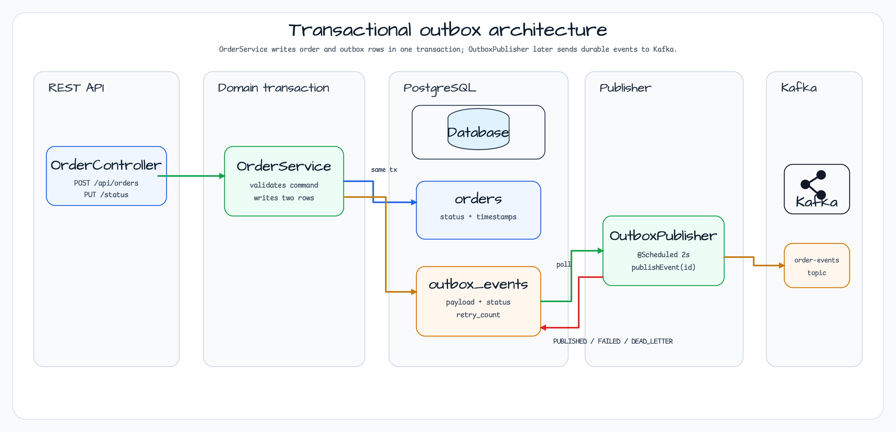
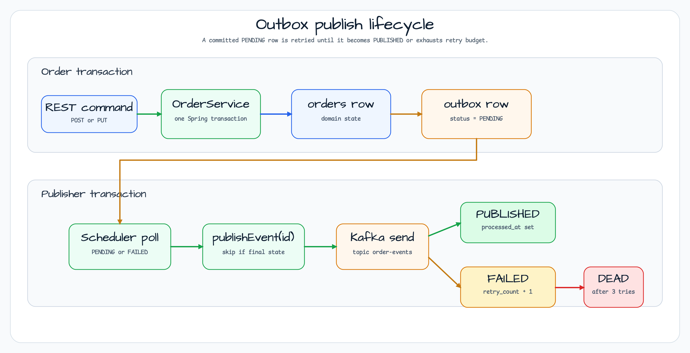
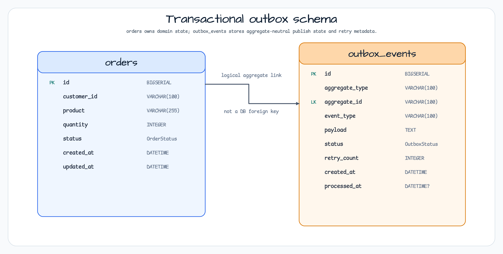

# Transactional Outbox Pattern

[English](README.md) | 한국어

`messaging/transactional-outbox`는 Spring Boot 4, JetBrains Exposed, PostgreSQL, Kafka로 Transactional Outbox
패턴을 보여준다. 주문 변경과 outbox row는 하나의 DB transaction으로 기록되고, scheduler publisher가 나중에 publish 가능한
outbox row를 Kafka로 보낸 뒤 delivery 상태를 저장한다.

## 아키텍처



이 모듈은 domain row와 Kafka message를 독립된 두 I/O로 쓰지 않는다. `OrderService`가 `orders`와
`outbox_events`를 같이 쓰고, `OutboxPublisher`가 `PENDING` 및 재시도 가능한 `FAILED` row를 poll한다. Kafka topic
`order-events`로 payload를 보낸 뒤, 별도 상태 transaction에서 row 상태를 갱신한다.

## Publish Lifecycle



`OutboxPublisher.publishEvent(id)`는 publish 가능한 상태가 아닌 row에 대해 멱등적으로 동작한다. Kafka send가 성공하면
`PUBLISHED`가 되고, 실패하면 `retry_count`를 증가시킨다. `MAX_RETRY`를 넘으면 `DEAD_LETTER`로 이동한다.

## Schema ERD



`outbox_events.aggregate_id`는 order id를 문자열로 저장한다. outbox table은 여러 aggregate를 담을 수 있도록 설계되어
있으므로, 이것은 DB foreign key가 아니라 `orders.id`에 대한 논리적 연결이다.

## REST API

| Method | Path | Behavior |
|---|---|---|
| `POST` | `/api/orders` | `orders` row와 `OrderPlaced` outbox row를 한 transaction에 insert한다. |
| `PUT` | `/api/orders/{id}/status` | `orders.status`를 바꾸고 `OrderStatusChanged` outbox row를 쓴다. |
| `GET` | `/api/orders/{id}` | 주문 하나를 조회한다. |
| `GET` | `/api/orders` | 주문을 id 순서로 조회한다. |
| `GET` | `/api/orders/outbox/pending` | pending outbox row를 확인하는 demo endpoint다. |

## 주요 구성 요소

| Component | Role |
|---|---|
| `OrderService` | 입력을 검증하고 order + outbox row를 같은 Spring transaction 안에서 쓴다. |
| `OrderTable` | `orders` Exposed table: customer, product, quantity, status, timestamp를 가진다. |
| `OutboxEventTable` | publish 가능한 integration event와 retry 상태를 저장하는 Exposed table이다. |
| `OutboxPublisher` | 2초마다 poll하고 Kafka topic `order-events`로 event를 발행하는 scheduler다. |
| `KafkaTemplate<String, String>` | `aggregate_id`를 key로, serialized payload를 value로 보낸다. |
| `ExposedConfig` | 시작 시 `orders`, `outbox_events` table을 생성하거나 누락 column을 보완한다. |

## 실패 의미

| State | Meaning |
|---|---|
| `PENDING` | 주문 transaction에서 event가 생성되었고 아직 전송되지 않았다. |
| `PUBLISHED` | Kafka send가 성공했고 `processed_at`이 설정되었다. |
| `FAILED` | 마지막 Kafka send가 실패했다. `retry_count < 3`이면 다시 시도한다. |
| `DEAD_LETTER` | 재시도 예산을 소진했으며 수동 점검이나 DLQ workflow가 필요하다. |

## bluetape4k 사용 지점

| Feature | Where | Why it matters |
|---|---|---|
| `requireNotBlank`, `requirePositiveNumber` | `OrderService.placeOrder` | transaction 경계 가까이에서 입력 계약을 검증한다. |
| `KLogging` | `OrderService`, `OutboxPublisher`, `ExposedConfig` | 간결한 구조적 로그를 제공한다. |
| `PostgreSQLServer.Launcher` | `AbstractOutboxTest` | integration test에서 공유 PostgreSQL Testcontainer를 시작한다. |
| `KafkaServer.Launcher` | `AbstractOutboxTest` | publisher test에서 공유 Kafka Testcontainer를 시작한다. |
| `Fakers.faker` | `AbstractOutboxTest` | 하드코딩 문자열 없이 현실적인 test data를 만든다. |

## Atomic Write

```kotlin
@Transactional
fun placeOrder(customerId: String, product: String, quantity: Int): OrderResponse {
    val orderId = OrderTable.insertAndGetId { /* domain row */ }

    OutboxEventTable.insert {
        it[aggregateType] = "Order"
        it[aggregateId] = orderId.value.toString()
        it[eventType] = "OrderPlaced"
        it[status] = OutboxStatus.PENDING
    }

    return getOrderResponse(orderId.value)
}
```

## Publisher

```kotlin
@Scheduled(fixedDelay = 2000)
@Transactional(readOnly = true)
fun publishPendingEvents() {
    val pendingIds = OutboxEventTable.selectAll()
        .where { publishableRowsWithRetryBudget }
        .map { it[OutboxEventTable.id].value }

    pendingIds.forEach { id -> publishEvent(id) }
}
```

## 테스트

```bash
./gradlew :messaging-transactional-outbox:test
```

테스트는 atomic write, REST endpoint, publish 성공, retry 증가, dead-letter 전이, duplicate publish 멱등성을 다룬다.

## 실행

Integration test가 Testcontainers를 사용하므로 Docker가 필요하다. `bootRun`은 `src/main/resources/application.yml`에
맞는 PostgreSQL database와 Kafka broker를 준비한 뒤 실행한다.

```bash
./gradlew :messaging-transactional-outbox:bootRun
```

Swagger UI는 `http://localhost:8080/swagger-ui/index.html`에서 확인할 수 있다.
