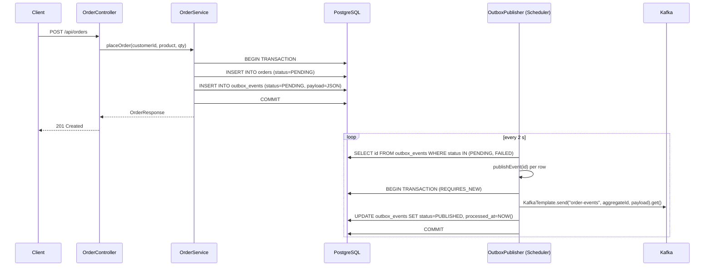

# Transactional Outbox Pattern — bluetape4k Workshop

Demonstrates the **Transactional Outbox** pattern using Kotlin, Spring Boot 4, JetBrains Exposed, and Kafka.
The pattern guarantees that domain state changes and the corresponding Kafka events are written atomically — no dual-write problem, no silent message loss.

---

## Architecture



---

## Problem / Solution

### Before — Naive dual-write (broken)

```kotlin
// WRONG: two independent I/O operations — no atomicity guarantee
orderRepository.save(order)          // succeeds
kafkaTemplate.send("order-events", …) // crashes → event lost forever
```

If the process crashes between the two calls the Kafka message is silently dropped.
If the Kafka send succeeds but the DB write fails the message is produced without a matching order row.

### After — Transactional Outbox (correct)

```kotlin
// RIGHT: one transaction, two table writes
@Transactional
fun placeOrder(…): OrderResponse {
    val orderId = OrderTable.insertAndGetId { … }          // domain row
    OutboxEventTable.insert { … }                          // outbox row (same tx)
    return getOrderResponse(orderId.value)
}
```

The background `OutboxPublisher` polls `outbox_events`, publishes to Kafka, and marks the row `PUBLISHED` — all in a separate `REQUIRES_NEW` transaction per event.
If Kafka is temporarily unavailable the row stays `FAILED` and is retried up to `MAX_RETRY` (3) times before moving to `DEAD_LETTER`.

---

## Key Concepts

| Concept | Detail |
|---------|--------|
| **Atomic write** | Order row + outbox event row share one ACID transaction. Either both land or neither does. |
| **At-least-once delivery** | The scheduler retries `PENDING`/`FAILED` events until they reach `PUBLISHED`. Consumers **must** be idempotent. |
| **Idempotent publisher** | `publishEvent(id)` returns `false` immediately when the event is already `PUBLISHED`, preventing double-sends on concurrent scheduler runs. |
| **Dead-letter escalation** | After `MAX_RETRY` (3) failed attempts the event moves to `DEAD_LETTER` for manual inspection or a dedicated DLQ consumer. |
| **REQUIRES_NEW retry counter** | `incrementRetry` and `markPublished` run in their own nested transactions so the retry count is always persisted even when the outer transaction rolls back. |

---

## bluetape4k Features Used

| Feature | Module | Code Reference | Benefit |
|---------|--------|----------------|---------|
| `KLogging` | `bluetape4k-logging` | `OrderService`, `OutboxPublisher` | Structured, context-aware logging with zero boilerplate |
| `requireNotBlank`, `requirePositiveNumber` | `bluetape4k-core` | `OrderService.placeOrder` | Validated, self-documenting input contracts |
| `PostgreSQLServer.Launcher` | `bluetape4k-testcontainers` | `AbstractOutboxTest` | Zero-config singleton PostgreSQL container shared across all tests |
| `KafkaServer.Launcher` | `bluetape4k-testcontainers` | `AbstractOutboxTest` | Zero-config singleton Kafka container shared across all tests |
| `Fakers.faker` | `bluetape4k-junit5` | `AbstractOutboxTest` | Realistic, locale-aware test data without hard-coded strings |

---

## Outbox Table Schema

```sql
CREATE TABLE outbox_events (
    id             BIGSERIAL    PRIMARY KEY,
    aggregate_type VARCHAR(100) NOT NULL,          -- e.g. "Order"
    aggregate_id   VARCHAR(100) NOT NULL,          -- string PK of the domain entity
    event_type     VARCHAR(100) NOT NULL,          -- e.g. "OrderPlaced", "OrderStatusChanged"
    payload        TEXT         NOT NULL,          -- JSON-serialised event payload
    status         VARCHAR(20)  NOT NULL DEFAULT 'PENDING',  -- PENDING | PUBLISHED | FAILED | DEAD_LETTER
    retry_count    INT          NOT NULL DEFAULT 0,
    created_at     TIMESTAMP    NOT NULL DEFAULT NOW(),
    processed_at   TIMESTAMP                       -- set when status → PUBLISHED
);
```

Managed by Exposed's `SchemaUtils.create()` at application startup via `ExposedConfig`.

---

## Test Coverage

| Test | Scenario |
|------|----------|
| `placeOrder creates order and outbox event in same transaction` | Verifies the atomic write — one order row and one outbox event row per `placeOrder` call |
| `POST api-orders creates order and returns 201` | HTTP layer smoke test — controller wires correctly to service |
| `PUT api-orders-id-status updates order status` | Status transition via REST produces `200 OK` with updated body |
| `publishEvent publishes to Kafka and marks event PUBLISHED` | Happy path — Kafka send succeeds, row transitions to `PUBLISHED` |
| `failed publish increments retry count and sets status FAILED` | Kafka unavailable — `retryCount` increments to 1, status becomes `FAILED` |
| `event exceeding max retries moves to DEAD_LETTER` | After `MAX_RETRY - 1` existing failures one more failure sets status to `DEAD_LETTER` |
| `duplicate publish call is idempotent` | Second `publishEvent` call on an already-`PUBLISHED` event returns `false`, status unchanged |

---

## Run

### Prerequisites

Docker must be running — Testcontainers starts PostgreSQL and Kafka automatically.

### Tests

```bash
# Run all tests in this module
./gradlew :messaging-transactional-outbox:test

# Run a specific test class
./gradlew :messaging-transactional-outbox:test \
    --tests "io.bluetape4k.workshop.messaging.outbox.OutboxTransactionTest"

# Run with verbose output
./gradlew :messaging-transactional-outbox:test --info
```

### Application (standalone)

Set environment variables pointing to a running PostgreSQL and Kafka instance, then:

```bash
./gradlew :messaging-transactional-outbox:bootRun
```

The scheduler starts automatically and polls `outbox_events` every 2 seconds.
Swagger UI is available at `http://localhost:8080/swagger-ui/index.html`.
