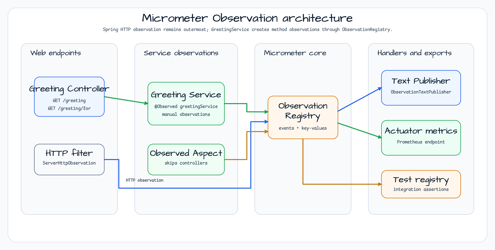
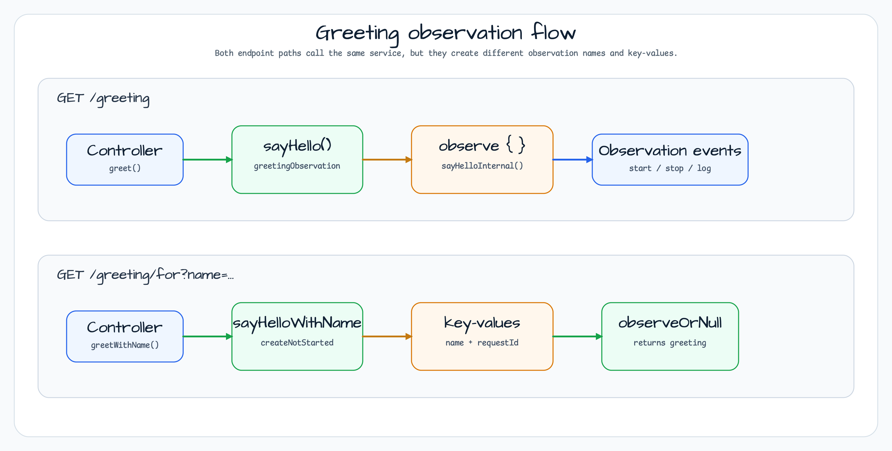

# Spring MVC용 Micrometer Observation

[English](README.md) | 한국어

`observability/micrometer-observation`은 Spring MVC service가 Micrometer Observation을 직접 사용하고 `@Observed`로
자동 관측되는 방식을 보여준다. 이 모듈은 application `ObservationRegistry`를 중심으로 `ObservedAspect`,
`ServerHttpObservationFilter`, `ObservationTextPublisher` handler를 연결한다.

## 아키텍처



HTTP controller는 의도적으로 `ObservedAspect` 대상에서 제외한다. Spring HTTP observation이 바깥 request span 역할을
하고, `GreetingService`가 method-level observation 대상이 된다. 서비스 내부에서는 `Observation.createNotStarted(...)`로
수동 observation도 만든다.

## Observation Flow



`sayHello()`는 재사용 가능한 `Observation`과 `observe { ... }`를 사용한다. `sayHelloWithName(name)`은 이름 있는
observation을 새로 만들고 low/high cardinality key-value를 붙인 뒤 bluetape4k `observeOrNull` extension으로 block을
실행한다.

## 주요 구성 요소

| Component | Role |
|---|---|
| `GreetingController` | `GET /greeting`, `GET /greeting/for?name=...`를 제공한다. |
| `GreetingService` | `@Observed(name = "greetingService")`; greeting method에 수동 nested observation을 만든다. |
| `ObservationAspectConfig` | `ObservedAspect`를 등록하고 `@Controller` / `@RestController` class는 건너뛴다. |
| `ObservationFilterConfig` | `ObservationRegistry`가 있을 때 `ServerHttpObservationFilter`를 등록한다. |
| `ObservationLoggingConfig` | observation event를 로그로 남기는 `ObservationTextPublisher`를 등록한다. |
| `ObservationSupport` | Kotlin 친화적인 `observe`, `observeOrNull`, `scopedOrNull` helper를 추가한다. |

## 확인할 경로

| Path | What it proves |
|---|---|
| `/greeting` | `GreetingService.sayHello()`를 호출하고 내부 greeting 주변에 service observation을 만든다. |
| `/greeting/for?name=Debop` | `greetingService.sayHelloWithName` observation에 `name`, `requestId` key-value를 붙인다. |
| `/actuator/prometheus` | Spring Boot Actuator와 Micrometer 설정으로 export되는 metric을 확인한다. |

## bluetape4k 사용 지점

| Feature | Where | Why it matters |
|---|---|---|
| `KLogging` / `KotlinLogging.logger` | Service and observation logger config | lazy Kotlin log lambda로 observation logging을 간결하게 유지한다. |
| `debug {}` / `info {}` | Source files | 명시적인 `isDebugEnabled` check를 없앤다. |
| `observeOrNull` extension | `GreetingService.sayHelloWithName` | observed block을 Kotlin 친화적인 nullable result 계약으로 감싼다. |
| bluetape4k assertions | Tests | `ObservationRegistry`와 tracing integration assertion을 간결하게 만든다. |

## 예제

```kotlin
fun sayHelloWithName(name: String): String {
    return Observation.createNotStarted("$GREETING_SERVICE_NAME.sayHelloWithName", observationRegistry)
        .contextualName("sayHello-with-name")
        .lowCardinalityKeyValue("name", name)
        .highCardinalityKeyValue("requestId", "1234")
        .observeOrNull { "Hello, $name" }!!
}
```

## 테스트

```bash
./gradlew :observability-micrometer-observation:test
```

테스트는 직접 `ObservationRegistry` 사용과 `TestObservationRegistry` 기반 service tracing을 다룬다.

## 실행

```bash
./gradlew :observability-micrometer-observation:bootRun
curl "http://localhost:8080/greeting/for?name=Debop"
curl "http://localhost:8080/actuator/prometheus"
```

## 참고

- [Micrometer Observation](https://micrometer.io/docs/observation)
- [Spring Boot Actuator metrics](https://docs.spring.io/spring-boot/reference/actuator/metrics.html)
- [`micrometer-tracing-coroutines`](../micrometer-tracing-coroutines) - coroutine observation propagation.
