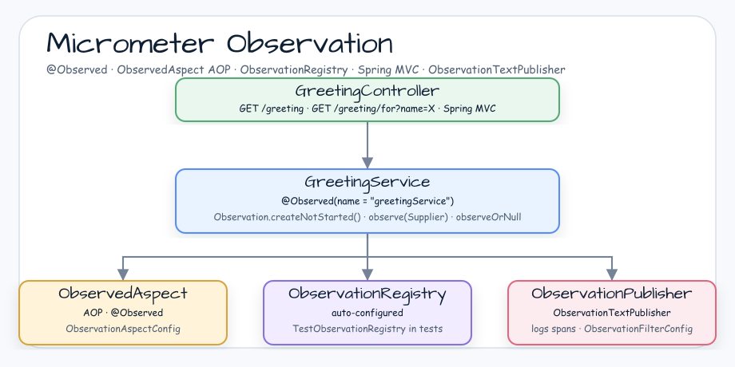

# Spring MVC용 Micrometer Observation

[English](README.md) | 한국어

## 예제 시나리오

이 예제는 **Spring MVC용 Micrometer Observation**을 실행 가능한 메트릭, 트레이싱, 관측 워크숍 조각으로 다룹니다. 개발자가 가장 먼저 확인할 경로인 모듈 설정, 샘플 또는 테스트 실행, 반복적인 인프라 코드를 줄여 주는 라이브러리와 프레임워크 API를 중심으로 설명합니다.

## 흐름 다이어그램

1. `observability-micrometer-observation`에 필요한 로컬 런타임을 준비합니다.
2. 예제 시나리오를 담당하는 애플리케이션, 컨트롤러, 서비스 또는 테스트 픽스처를 실행합니다.
3. 반복적인 인프라 작업을 bluetape4k 유틸리티 또는 Spring/Kotlin 통합에 위임합니다.
4. 샘플 출력, HTTP 응답, 저장소 상태, 메트릭, trace 또는 테스트 기대값으로 보이는 결과를 검증합니다.

## 시퀀스 다이어그램

핵심 시퀀스는 호출자 또는 테스트 픽스처 -> 워크숍 어댑터 -> bluetape4k 헬퍼/API -> 외부 런타임 또는 인메모리 백엔드 -> 검증/응답 순서입니다. 이 모듈에 전용 시퀀스 이미지가 있으면 아래 이미지가 상호작용 순서를 보여주며, 그렇지 않으면 소스 테스트가 실행 가능한 시퀀스의 기준입니다.

이 예제는 Micrometer Observation API를 Spring MVC와 통합합니다.
`@Observed` 애노테이션과 `ObservationRegistry`를 통해 메서드 실행에 메트릭과 트레이싱을 자동으로 연결합니다.

## 아키텍처




## 핵심 구성 요소

| 클래스 | 역할 |
|---|---|
| `ObservationAspectConfig` | `@Observed` AOP 처리를 위한 `ObservedAspect` 빈을 등록합니다 |
| `ObservationLoggingConfig` | 관측 이벤트를 로그로 남기는 `ObservationHandler`를 등록합니다 |
| `ObservationFilterConfig` | 특정 관측을 필터링합니다. 예: actuator 경로 제외 |
| `GreetingService` | `@Observed`가 적용된 서비스입니다. 메서드 호출마다 span이 자동 생성됩니다 |
| `GreetingController` | REST 엔드포인트(`/greeting`)입니다 |
| `ObservationSupport` | `ObservationRegistry` 유틸리티 확장 함수입니다 |

## `@Observed` 사용법

```kotlin
@Service
@Observed(name = "greeting.service")
class GreetingService(private val registry: ObservationRegistry) {

    fun greet(name: String): String {
        return Observation.createNotStarted("greet", registry)
            .observe { "Hello, $name!" }
    }
}
```

### Key-Value를 사용한 세밀한 Span

```kotlin
fun sayHelloWithName(name: String): String {
    return Observation.createNotStarted("$GREETING_SERVICE_NAME.sayHelloWithName", observationRegistry)
        .contextualName("sayHello-with-name")
        .lowCardinalityKeyValue("name", name)       // searchable tag
        .highCardinalityKeyValue("requestId", "1234") // high-cardinality for trace detail
        .observeOrNull { "Hello, $name" }!!
}
```

## 사용한 bluetape4k 기능

| 기능 | 아티팩트 | 코드 위치 | 이점 |
|---|---|---|---|
| 구조화 로깅(`KLogging`, `KotlinLogging.logger`) | `bluetape4k-logging` | `GreetingService`, `ObservationLoggingConfig` | Kotlin DSL의 lazy log lambda를 사용해 불필요한 문자열 할당을 피합니다 |
| `debug {}` / `info {}` 확장 함수 | `bluetape4k-logging` | 모든 소스 파일 | `if (log.isDebugEnabled)` 보일러플레이트를 제거합니다 |
| JUnit 5 확장(`@TestInstance`, `shouldNotBeNull` 등) | `bluetape4k-junit5` | `ObservationRegistryTest` | 간결한 Kotlin 스타일 assertion chain을 제공합니다 |
| Jackson 3.x 직렬화 지원 | `bluetape4k-jackson3` | REST API 응답 | Spring Boot 4 + Jackson 3 자동 설정 호환성을 제공합니다 |

## Before / After

### 구조화 로깅(Kotlin DSL)

```kotlin
// Before — standard SLF4J
import org.slf4j.LoggerFactory
private val log = LoggerFactory.getLogger(GreetingService::class.java)

fun sayHello(): String {
    if (log.isDebugEnabled) {
        log.debug("call sayHelloInternal")
    }
    return "Hello, World!"
}

// After — bluetape4k-logging
import io.bluetape4k.logging.KLogging
import io.bluetape4k.logging.debug

companion object: KLogging()

fun sayHello(): String {
    log.debug { "call sayHelloInternal" }  // lazy lambda — no string construction unless debug is enabled
    return "Hello, World!"
}
```

### 관측 이벤트 로깅 핸들러

```kotlin
// Before — standard Micrometer ObservationHandler, manual logger creation
@Configuration
class ObservationLoggingConfig {
    private val log = LoggerFactory.getLogger("ObservationLogger")

    @Bean
    fun observationLogger(): ObservationHandler<Observation.Context> {
        return ObservationHandler { event ->
            if (log.isDebugEnabled) log.debug("Observation event: $event")
        }
    }
}

// After — bluetape4k-logging + ObservationTextPublisher
import io.bluetape4k.logging.KotlinLogging
import io.bluetape4k.logging.debug

@Configuration(proxyBeanMethods = false)
class ObservationLoggingConfig {
    private val logger = KotlinLogging.logger("io.bluetape4k.workshop.observation.ObservationLogger")

    @Bean
    fun observationLogger(): ObservationHandler<Observation.Context> {
        return ObservationTextPublisher { logger.debug { it } }
    }
}
```

### `observeOrNull` — Null-Safe Observation Wrapper

```kotlin
// Before — standard Micrometer with manual null handling
fun observe(registry: ObservationRegistry, block: () -> String?): String? {
    val obs = Observation.createNotStarted("my-obs", registry).start()
    return try {
        block()
    } catch (e: Exception) {
        obs.error(e)
        throw e
    } finally {
        obs.stop()
    }
}

// After — bluetape4k observeOrNull extension (from ObservationSupport)
fun sayHelloWithName(name: String): String {
    return Observation.createNotStarted("greetingService.sayHelloWithName", observationRegistry)
        .contextualName("sayHello-with-name")
        .lowCardinalityKeyValue("name", name)
        .observeOrNull { "Hello, $name" }!!  // null-safe, exception-aware wrapper
}
```

## 레이어 간 Observation 전파

```
HTTP Request
    └── GreetingController         (outer span: HTTP server span)
            └── GreetingService    (@Observed AOP span: greetingService)
                    └── sayHelloWithName  (nested span: greetingService.sayHelloWithName)
```

클래스 레벨의 `@Observed`는 메서드 호출마다 span을 하나씩 생성합니다. 중첩은 `ObservationRegistry`의 thread-local 상태가 자동으로 처리합니다.

## 테스트

- `ObservationRegistryTest` — `ObservationRegistry` API 직접 검증
- `GreetingServiceTracingIntegrationTest` — `TestObservationRegistry`를 사용한 통합 트레이싱 검증

## 실행

```bash
# Start the application
./gradlew :observability-micrometer-observation:bootRun

# Run tests
./gradlew :observability-micrometer-observation:test
```

## 참고 자료

- [Micrometer Observation official docs](https://micrometer.io/docs/observation)
- [Spring Boot Actuator + Micrometer](https://docs.spring.io/spring-boot/reference/actuator/metrics.html)
- [`micrometer-tracing-coroutines`](../micrometer-tracing-coroutines) — Coroutine tracing with `withObservationSuspending`
