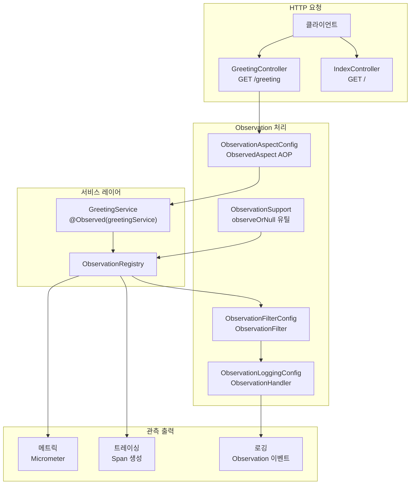

# Micrometer Observation with Spring MVC

Micrometer Observation API를 Spring MVC와 연동하는 예제입니다.
`@Observed` 어노테이션과 `ObservationRegistry`를 통해 메서드 실행에 자동으로 메트릭·트레이싱을 부착합니다.

## 아키텍처 다이어그램



## 주요 구성

| 클래스 | 역할 |
|---|---|
| `ObservationAspectConfig` | `@Observed` AOP 처리를 위한 `ObservedAspect` 빈 등록 |
| `ObservationLoggingConfig` | Observation 이벤트를 로그로 출력하는 Handler 설정 |
| `ObservationFilterConfig` | 특정 Observation 필터링 설정 |
| `GreetingService` | `@Observed`가 적용된 서비스 — 자동으로 span 생성 |
| `GreetingController` | REST 엔드포인트 (`/greeting`) |
| `ObservationSupport` | `ObservationRegistry` 유틸리티 |

## `@Observed` 사용 예시

```kotlin
@Service
@Observed(name = "greeting.service")
class GreetingService(private val registry: ObservationRegistry) {

    fun greet(name: String): String {
        return Observation.createNotStarted("greet", registry)
            .observe { "Hello, $name!" }
    }
}
```

## 테스트

- `ObservationRegistryTest` — `ObservationRegistry` 직접 테스트
- `GreetingServiceTracingIntegrationTest` — 통합 트레이싱 검증

## 참고

- [Micrometer Observation 공식 문서](https://micrometer.io/docs/observation)
- [Spring Boot Actuator + Micrometer](https://docs.spring.io/spring-boot/reference/actuator/metrics.html)
- [`micrometer-tracing-coroutines`](../micrometer-tracing-coroutines) — Coroutine 환경 트레이싱 예제
