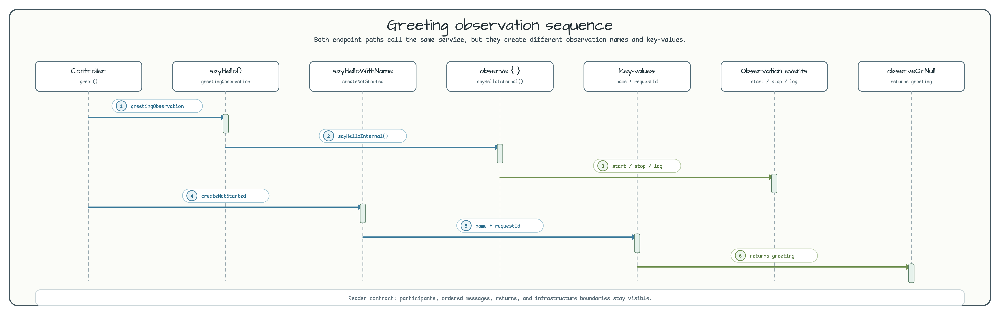

# Micrometer Observation with Spring MVC

[한국어](README.ko.md) | English

`observability/micrometer-observation` shows how a Spring MVC service can use Micrometer Observation directly and through
`@Observed`. The module wires `ObservedAspect`, `ServerHttpObservationFilter`, and an `ObservationTextPublisher` handler
around the application `ObservationRegistry`.

## Architecture


The HTTP controller is intentionally excluded from `ObservedAspect` so the Spring HTTP observation remains the outer
request span. `GreetingService` is the method-level observation target, and it also demonstrates manual observations with
`Observation.createNotStarted(...)`.

## Observation Flow



`sayHello()` uses a reusable `Observation` and `observe { ... }`. `sayHelloWithName(name)` creates a named observation,
adds low/high cardinality key-values, and runs the block through the bluetape4k `observeOrNull` extension.

## Key Components

| Component | Role |
|---|---|
| `GreetingController` | Exposes `GET /greeting` and `GET /greeting/for?name=...`. |
| `GreetingService` | `@Observed(name = "greetingService")`; creates manual nested observations for greeting methods. |
| `ObservationAspectConfig` | Registers `ObservedAspect` and skips `@Controller` / `@RestController` classes. |
| `ObservationFilterConfig` | Registers `ServerHttpObservationFilter` when an `ObservationRegistry` exists. |
| `ObservationLoggingConfig` | Registers `ObservationTextPublisher` to log observation events. |
| `ObservationSupport` | Adds Kotlin-friendly `observe`, `observeOrNull`, and `scopedOrNull` helpers. |

## What to Inspect

| Path | What it proves |
|---|---|
| `/greeting` | Calls `GreetingService.sayHello()` and emits a service observation around the internal greeting. |
| `/greeting/for?name=Debop` | Emits `greetingService.sayHelloWithName` with `name` as a low-cardinality key and `requestId` as a high-cardinality key. |
| `/actuator/prometheus` | Shows metrics exported through Spring Boot Actuator and Micrometer configuration. |

## bluetape4k Usage

| Feature | Where | Why it matters |
|---|---|---|
| `KLogging` / `KotlinLogging.logger` | Service and observation logger config | Lazy Kotlin log lambdas keep observation logging concise. |
| `debug {}` / `info {}` | Source files | Removes explicit `isDebugEnabled` checks. |
| `observeOrNull` extension | `GreetingService.sayHelloWithName` | Wraps the observed block with a Kotlin-friendly nullable result contract. |
| bluetape4k assertions | Tests | Keeps `ObservationRegistry` and tracing integration assertions compact. |

## Example

```kotlin
fun sayHelloWithName(name: String): String {
    val greetingName = name.requireNotBlank("name")
    val greeting = Observation.createNotStarted("$GREETING_SERVICE_NAME.sayHelloWithName", observationRegistry)
        .contextualName("sayHello-with-name")
        .lowCardinalityKeyValue("name", greetingName)
        .highCardinalityKeyValue("requestId", "1234")
        .observeOrNull { "Hello, $greetingName" }

    return greeting.requireNotNull("greeting")
}
```

## Tests

```bash
./gradlew :observability-micrometer-observation:test
```

The test suite covers direct `ObservationRegistry` usage and service tracing with `TestObservationRegistry`.

## Running

```bash
./gradlew :observability-micrometer-observation:bootRun
curl "http://localhost:8080/greeting/for?name=Debop"
curl "http://localhost:8080/actuator/prometheus"
```

## References

- [Micrometer Observation](https://micrometer.io/docs/observation)
- [Spring Boot Actuator metrics](https://docs.spring.io/spring-boot/reference/actuator/metrics.html)
- [`micrometer-tracing-coroutines`](../micrometer-tracing-coroutines) - coroutine observation propagation.
