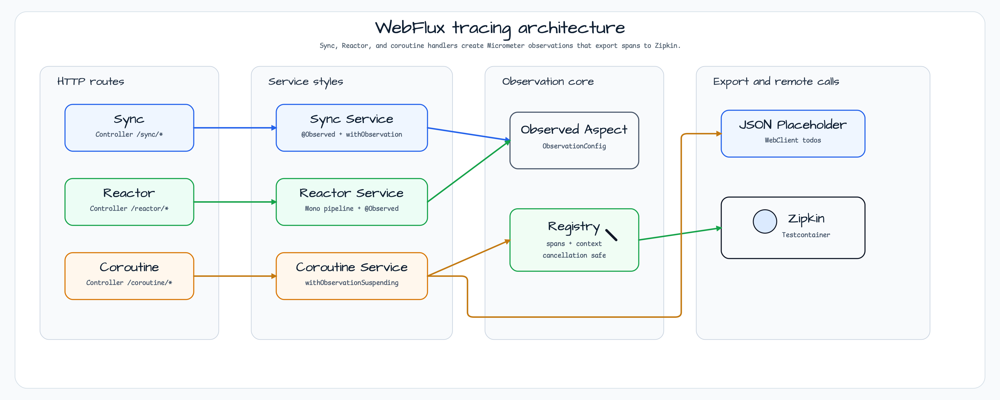
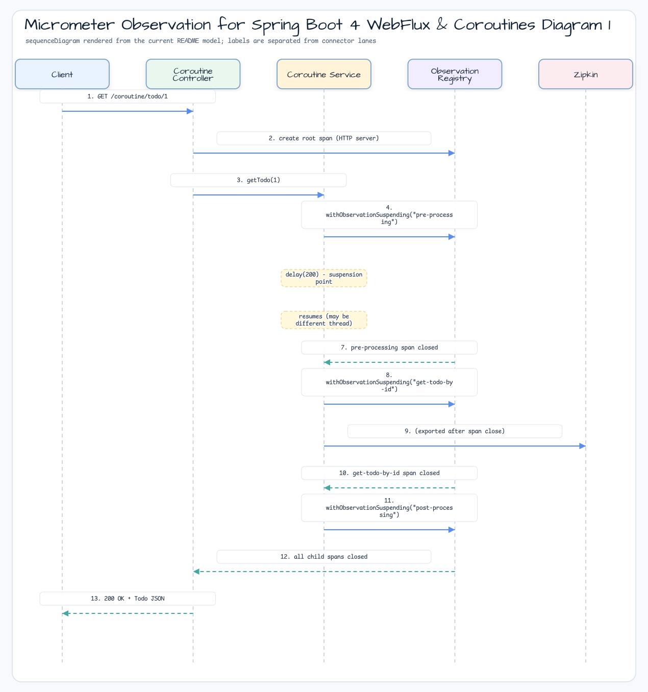

# Spring Boot 4 WebFlux & Coroutines용 Micrometer Observation

[English](README.md) | 한국어

## 예제 시나리오

이 예제는 **Spring Boot 4 WebFlux & Coroutines용 Micrometer Observation**을 실행 가능한 메트릭, 트레이싱, 관측 워크숍 조각으로 다룹니다. 개발자가 가장 먼저 확인할 경로인 모듈 설정, 샘플 또는 테스트 실행, 반복적인 인프라 코드를 줄여 주는 라이브러리와 프레임워크 API를 중심으로 설명합니다.

## 흐름 다이어그램

1. `observability-micrometer-tracing-coroutines`에 필요한 로컬 런타임을 준비합니다.
2. 예제 시나리오를 담당하는 애플리케이션, 컨트롤러, 서비스 또는 테스트 픽스처를 실행합니다.
3. 반복적인 인프라 작업을 bluetape4k 유틸리티 또는 Spring/Kotlin 통합에 위임합니다.
4. 샘플 출력, HTTP 응답, 저장소 상태, 메트릭, trace 또는 테스트 기대값으로 보이는 결과를 검증합니다.

## 시퀀스 다이어그램

핵심 시퀀스는 호출자 또는 테스트 픽스처 -> 워크숍 어댑터 -> bluetape4k 헬퍼/API -> 외부 런타임 또는 인메모리 백엔드 -> 검증/응답 순서입니다. 이 모듈에 전용 시퀀스 이미지가 있으면 아래 이미지가 상호작용 순서를 보여주며, 그렇지 않으면 소스 테스트가 실행 가능한 시퀀스의 기준입니다.


이 예제는 Spring Boot 4 WebFlux 환경에서 동기 방식, Reactor 방식, coroutine 방식으로 Micrometer Tracing을 적용합니다.
bluetape4k의 `withObservation` / `withObservationSuspending` DSL을 사용해 coroutine context를 통해 tracing span을 안전하게 전파합니다.

## 아키텍처




## 핵심 구성 요소

| 클래스 | 역할 |
|---|---|
| `ObservationConfig` | `ObservedAspect` 빈을 등록합니다. `@Observed` AOP를 활성화하고 Controller 레이어는 제외합니다 |
| `NettyConfig` | Reactor Netty 서버 튜닝(keepalive, backlog, event-loop size)을 설정합니다 |
| `SyncService` | 동기 서비스입니다. `@Observed`와 `withObservation {}` 중첩 span을 사용합니다 |
| `CoroutineService` | Coroutine 서비스입니다. suspend 함수 안에서 span을 만들기 위해 `withObservationSuspending {}`를 사용합니다 |
| `ReactorService` | Reactor 서비스입니다. 클래스 레벨에 `@Observed`가 적용됩니다 |
| `SyncController` | 동기 REST 엔드포인트(`/sync`)입니다 |
| `CoroutineController` | Coroutine REST 엔드포인트(`/coroutine`)입니다 |
| `ReactorController` | Reactor REST 엔드포인트(`/reactor`)입니다 |
| `TracingApplication` | `ZipkinServer.Launcher.zipkin`으로 Zipkin 컨테이너를 시작합니다 |

## Tracing Pipeline

```
Micrometer Tracing → OTel Bridge → OTel Exporter → Zipkin Server  (active)
Micrometer Tracing → Brave Bridge → Zipkin Reporter → Zipkin Server (commented out)
```

## Coroutine 경계에서의 Span 전파

Coroutine 환경의 핵심 과제는 suspension point를 지나도 span context를 유지하는 것입니다.
`withObservationSuspending`은 다음 방식으로 이를 올바르게 처리합니다.

1. suspension point 전에 observation을 시작합니다.
2. span을 thread-local이 아니라 coroutine context에 저장합니다.
3. coroutine이 다른 스레드에서 재개되어도 span을 복원합니다.
4. `CancellationException`을 span error로 표시하지 않고 자동으로 다시 던집니다.

```
suspend fun getTodo(id: Int): Todo? {
    preProcessing()          // span: pre-processing (suspends, resumes on different thread)
        └── getTodoById(id)  // span: get-todo-by-id (WebClient call, async I/O)
    postProcessing()         // span: post-processing (correct parent span restored)
}
```

위 호출 체인은 각 coroutine이 어떤 스레드에서 재개되든 Zipkin에서 올바르게 중첩된 trace를 만듭니다.

### Trace 전파 시퀀스



## 사용한 bluetape4k 기능

| 기능 | 아티팩트 | 코드 위치 | 이점 |
|---|---|---|---|
| `withObservation {}` DSL | `bluetape4k-micrometer` | `SyncService` | `Observation.createNotStarted().start().stop()` 보일러플레이트를 제거합니다 |
| `withObservationSuspending {}` DSL | `bluetape4k-micrometer` | `CoroutineService` | suspend 함수 안에서 span을 만들고 전파하며, `CancellationException`을 안전하게 처리합니다 |
| `KLoggingChannel`(coroutine logger) | `bluetape4k-logging` | `CoroutineService`, `CoroutineController` | Coroutine context-aware logging과 MDC 자동 전파를 제공합니다 |
| `KLogging` | `bluetape4k-logging` | `SyncService`, `SyncController` | SLF4J companion object logger를 제공합니다 |
| `ZipkinServer.Launcher.zipkin` | `bluetape4k-testcontainers` | `TracingApplication` | Zipkin 컨테이너 singleton입니다. 한 번만 시작되어 테스트와 앱 시작에서 공유됩니다 |
| `bluetape4k-junit5` assertions(`shouldNotBeNull` 등) | `bluetape4k-junit5` | 테스트 파일 | `assertNotNull(x)` 대신 Kotlin 스타일 assertion chain을 제공합니다 |
| suspend 테스트용 `runTest` | `bluetape4k-coroutines`(transitive) | `CoroutineServiceTest` | virtual time으로 suspend 테스트를 실행합니다 |

## Before / After

### 동기 중첩 Span 생성

```kotlin
// Before — standard Micrometer (manual start/stop)
fun preProcessing() {
    val obs = Observation.createNotStarted("pre-processing", observationRegistry)
    obs.start()
    try {
        Thread.sleep(100)
    } finally {
        obs.stop()
    }
}

// After — bluetape4k withObservation DSL
import io.bluetape4k.micrometer.observation.withObservation

private fun preProcessing() {
    withObservation("pre-processing", observationRegistry) {
        log.debug { "Pre processing ..." }
        Thread.sleep(100)
    }
}
```

### Suspend 함수 Span 생성

```kotlin
// Before — manual Observation in coroutine (CancellationException can be missed)
private suspend fun preProcessing() {
    val obs = Observation.createNotStarted("pre-processing", observationRegistry)
    obs.start()
    try {
        delay(200)
    } catch (e: Exception) {   // catches CancellationException — WRONG
        obs.error(e)
        throw e
    } finally {
        obs.stop()
    }
}

// After — bluetape4k withObservationSuspending DSL
import io.bluetape4k.micrometer.observation.coroutines.withObservationSuspending

private suspend fun preProcessing() {
    withObservationSuspending("pre-processing", observationRegistry) {
        log.debug { "Pre processing ..." }
        delay(200)  // CancellationException is automatically rethrown (not treated as error)
    }
}
```

### Zipkin Server 자동 시작(Testcontainers Singleton)

```kotlin
// Before — Zipkin URL hardcoded in application.yml or manual GenericContainer management
@SpringBootApplication
class TracingApplication

// After — bluetape4k ZipkinServer.Launcher singleton
import io.bluetape4k.testcontainers.infra.ZipkinServer

@SpringBootApplication(proxyBeanMethods = false)
class TracingApplication {
    companion object: KLogging() {
        @JvmStatic
        val zipkinServer = ZipkinServer.Launcher.zipkin   // shared singleton, started once

        @JvmStatic
        val zipkinUrl: String get() = zipkinServer.url
    }
}
```

## CancellationException 안전성

Coroutine과 Micrometer를 함께 사용할 때 `CancellationException`은 tracing error로 기록되면 안 됩니다.
`withObservationSuspending`은 이를 자동으로 처리합니다.

```kotlin
// withObservationSuspending internal behavior (simplified)
suspend fun <T> withObservationSuspending(name: String, registry: ObservationRegistry, block: suspend () -> T): T {
    val obs = Observation.createNotStarted(name, registry).start()
    return try {
        block()
    } catch (e: CancellationException) {
        throw e                   // rethrow — not an error, just coroutine cancellation
    } catch (e: Exception) {
        obs.error(e)              // record as span error only for real exceptions
        throw e
    } finally {
        obs.stop()
    }
}
```

## 테스트

- `CoroutineServiceTest` — `runTest`로 `withObservationSuspending` coroutine 서비스를 검증합니다
- `SyncServiceTest` — `withObservation` 동기 서비스를 검증합니다
- `CoroutineControllerTest` — WebFlux `WebTestClient` 기반 통합 테스트입니다
- `SyncControllerTest` — 동기 컨트롤러 통합 테스트입니다
- `ZipkinServerLaunchTest` — Zipkin 컨테이너가 올바르게 시작되는지 확인합니다

## 실행

```bash
# Start the application (Zipkin starts automatically via Testcontainers)
./gradlew :observability-micrometer-tracing-coroutines:bootRun

# Run all tests
./gradlew :observability-micrometer-tracing-coroutines:test

# View traces: open http://localhost:9411 in a browser
```

## 사전 요구 사항

- Docker(Zipkin Testcontainers에 필요)
- JDK 25(`.java-version`으로 설정)
- 외부 Zipkin 서버는 필요하지 않습니다. `ZipkinServer.Launcher`가 자동으로 시작합니다

## 참고 자료

- [Micrometer Observation official docs](https://micrometer.io/docs/observation)
- [Micrometer Tracing official docs](https://micrometer.io/docs/tracing)
- [Spring Boot Actuator + Micrometer](https://docs.spring.io/spring-boot/reference/actuator/metrics.html)
- [`micrometer-observation`](../micrometer-observation) — Spring MVC + `@Observed` basic example
