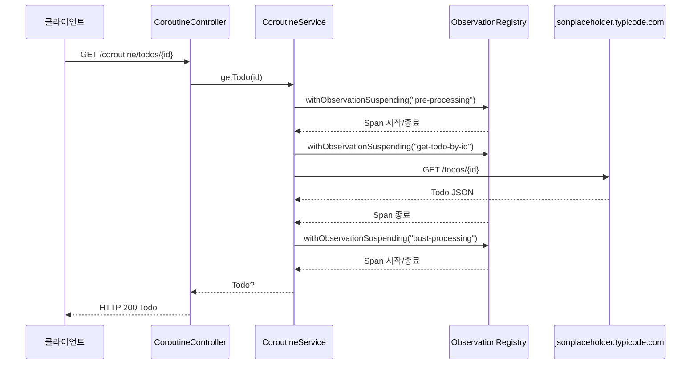
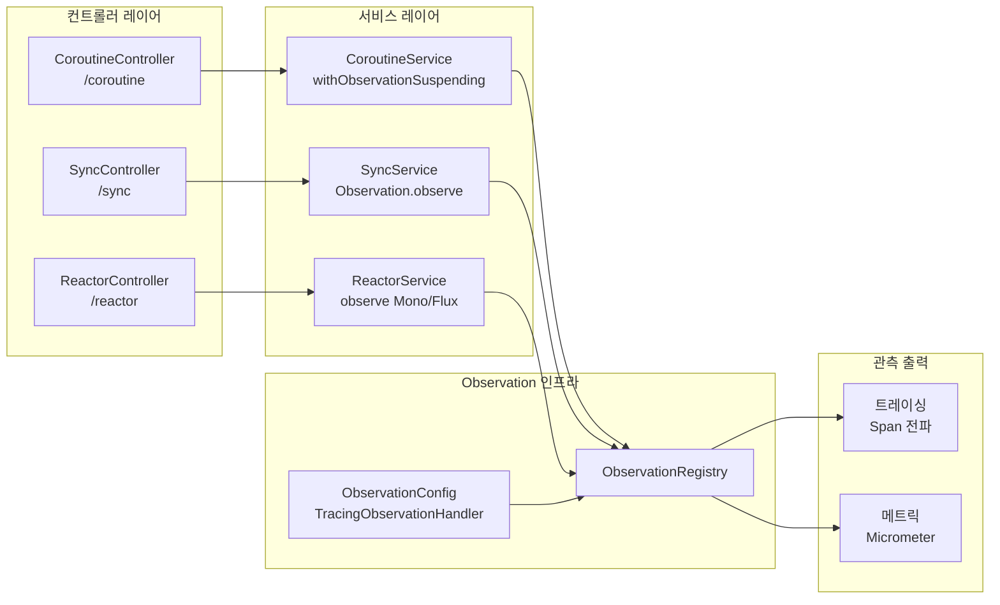

# Micrometer Observation for Spring Boot 3 Webflux & Coroutines

## 아키텍처 다이어그램

```mermaid
sequenceDiagram
    participant 클라이언트
    participant CoroutineController
    participant CoroutineService
    participant ObservationRegistry
    participant 외부API as jsonplaceholder.typicode.com

    클라이언트->>CoroutineController: GET /coroutine/todos/{id}
    CoroutineController->>CoroutineService: getTodo(id)
    CoroutineService->>ObservationRegistry: withObservationSuspending("pre-processing")
    ObservationRegistry-->>CoroutineService: Span 시작/종료
    CoroutineService->>ObservationRegistry: withObservationSuspending("get-todo-by-id")
    CoroutineService->>외부API: GET /todos/{id}
    외부API-->>CoroutineService: Todo JSON
    ObservationRegistry-->>CoroutineService: Span 종료
    CoroutineService->>ObservationRegistry: withObservationSuspending("post-processing")
    ObservationRegistry-->>CoroutineService: Span 시작/종료
    CoroutineService-->>CoroutineController: Todo?
    CoroutineController-->>클라이언트: HTTP 200 Todo
```

```mermaid
flowchart LR
    subgraph 컨트롤러 레이어
        CC[CoroutineController\n/coroutine]
        SC[SyncController\n/sync]
        RC[ReactorController\n/reactor]
    end

    subgraph 서비스 레이어
        CS[CoroutineService\nwithObservationSuspending]
        SS[SyncService\nObservation.observe]
        RS[ReactorService\nobserve Mono/Flux]
    end

    subgraph Observation 인프라
        OR[ObservationRegistry]
        OC[ObservationConfig\nTracingObservationHandler]
    end

    subgraph 관측 출력
        TR[트레이싱\nSpan 전파]
        MT[메트릭\nMicrometer]
    end

    CC --> CS
    SC --> SS
    RC --> RS
    CS --> OR
    SS --> OR
    RS --> OR
    OC --> OR
    OR --> TR
    OR --> MT
```
