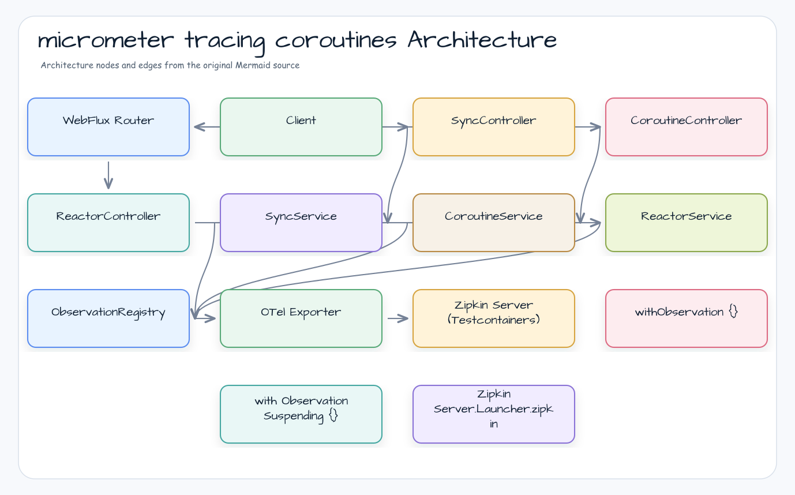
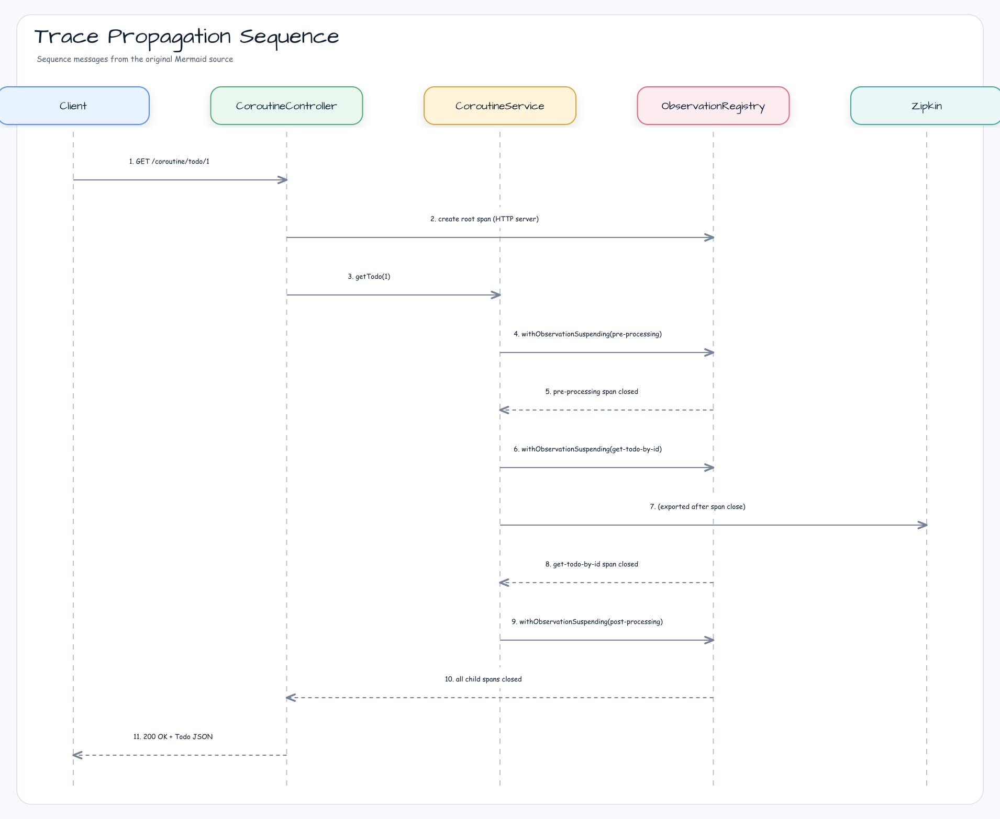

# Micrometer Observation for Spring Boot 4 WebFlux & Coroutines

Spring Boot 4 WebFlux 환경에서 Micrometer Tracing을 동기(Sync), 리액터(Reactor), 코루틴(Coroutine) 방식으로 적용하는 예제입니다.
bluetape4k의 `withObservation` / `withObservationSuspending` DSL로 코루틴 context에서 tracing span을 안전하게 전파합니다.

## 아키텍처 다이어그램





## 주요 구성

| 클래스 | 역할 |
|---|---|
| `ObservationConfig` | `ObservedAspect` 빈 등록 — `@Observed` AOP 활성화, Controller 제외 필터 |
| `NettyConfig` | Reactor Netty 서버 튜닝 (keepalive, backlog, event-loop 크기) |
| `SyncService` | 동기 방식 서비스 — `@Observed` + `withObservation {}` 중첩 span |
| `CoroutineService` | 코루틴 서비스 — `withObservationSuspending {}` 으로 suspend 함수 내 span 생성 |
| `ReactorService` | Reactor 서비스 — `@Observed` 클래스 레벨 적용 |
| `SyncController` | 동기 REST 엔드포인트 (`/sync`) |
| `CoroutineController` | 코루틴 REST 엔드포인트 (`/coroutine`) |
| `ReactorController` | Reactor REST 엔드포인트 (`/reactor`) |
| `TracingApplication` | `ZipkinServer.Launcher.zipkin` 으로 Zipkin 컨테이너 자동 시작 |

## Tracing 전달 방식

이 예제는 두 가지 tracing 파이프라인을 모두 지원합니다.

```
Micrometer Tracing → OTel Bridge → OTel Exporter → Zipkin Server (활성)
Micrometer Tracing → Brave Bridge → Zipkin Reporter → Zipkin Server (비활성/주석)
```

## bluetape4k 활용 기능

| 기능 | 아티팩트 | 코드 위치 | 이점 |
|---|---|---|---|
| `withObservation {}` DSL | `bluetape4k-micrometer` | `SyncService` | `Observation.createNotStarted().start().stop()` 보일러플레이트 제거 |
| `withObservationSuspending {}` DSL | `bluetape4k-micrometer` | `CoroutineService` | suspend 함수 안에서 span 생성·전파; `CancellationException` 안전 처리 |
| `KLoggingChannel` (코루틴 로거) | `bluetape4k-logging` | `CoroutineService`, `CoroutineController` | 코루틴 context-aware 로깅, MDC 자동 전파 |
| `KLogging` | `bluetape4k-logging` | `SyncService`, `SyncController` | SLF4J companion object 로거 |
| `ZipkinServer.Launcher.zipkin` | `bluetape4k-testcontainers` | `TracingApplication` | Zipkin 컨테이너 싱글턴 자동 시작·URL 제공 |
| `bluetape4k-junit5` assertion (`shouldNotBeNull` 등) | `bluetape4k-junit5` | 테스트 파일 전반 | `assertNotNull(x)` 대신 Kotlin 스타일 체인 |
| `kotlinx.coroutines.test.runTest` | `bluetape4k-coroutines` (전이 의존성) | `CoroutineServiceTest` | suspend 테스트를 가상 시간으로 실행 |

## bluetape4k Before / After

### 동기 함수에서 중첩 span 생성

```kotlin
// Before — 표준 Micrometer (수동 start/stop)
fun preProcessing() {
    val obs = Observation.createNotStarted("pre-processing", observationRegistry)
    obs.start()
    try {
        Thread.sleep(100)
    } finally {
        obs.stop()
    }
}

// After — bluetape4k withObservation DSL
import io.bluetape4k.micrometer.observation.withObservation

private fun preProcessing() {
    withObservation("pre-processing", observationRegistry) {
        log.debug { "Pre processing ..." }
        Thread.sleep(100)
    }
}
```

### 코루틴 suspend 함수 안에서 span 생성

```kotlin
// Before — 코루틴에서 Observation 수동 처리 (CancellationException 누락 위험)
private suspend fun preProcessing() {
    val obs = Observation.createNotStarted("pre-processing", observationRegistry)
    obs.start()
    try {
        delay(200)
    } catch (e: Exception) {
        obs.error(e)
        throw e
    } finally {
        obs.stop()
    }
}

// After — bluetape4k withObservationSuspending DSL
import io.bluetape4k.micrometer.observation.coroutines.withObservationSuspending

private suspend fun preProcessing() {
    withObservationSuspending("pre-processing", observationRegistry) {
        log.debug { "Pre processing ..." }
        delay(200)  // CancellationException 자동 처리·전파
    }
}
```

### Zipkin 서버 자동 시작 (Testcontainers 싱글턴)

```kotlin
// Before — Zipkin URL을 application.yml에 하드코딩 또는 직접 GenericContainer 관리
@SpringBootApplication
class TracingApplication

// After — bluetape4k ZipkinServer.Launcher 싱글턴
import io.bluetape4k.testcontainers.infra.ZipkinServer

@SpringBootApplication(proxyBeanMethods = false)
class TracingApplication {
    companion object: KLogging() {
        @JvmStatic
        val zipkinServer = ZipkinServer.Launcher.zipkin   // 공유 싱글턴, 한 번만 시작

        @JvmStatic
        val zipkinUrl: String get() = zipkinServer.url
    }
}
```

## 테스트

- `CoroutineServiceTest` — `withObservationSuspending` 적용 코루틴 서비스 검증 (`runTest`)
- `SyncServiceTest` — `withObservation` 적용 동기 서비스 검증
- `CoroutineControllerTest` — WebFlux `WebTestClient` 기반 통합 테스트
- `SyncControllerTest` — 동기 Controller 통합 테스트
- `ZipkinServerLaunchTest` — Zipkin 컨테이너 시작 확인

## 참고

- [Micrometer Observation 공식 문서](https://micrometer.io/docs/observation)
- [Micrometer Tracing 공식 문서](https://micrometer.io/docs/tracing)
- [Spring Boot Actuator + Micrometer](https://docs.spring.io/spring-boot/reference/actuator/metrics.html)
- [`micrometer-observation`](../micrometer-observation) — Spring MVC + `@Observed` 기본 예제
