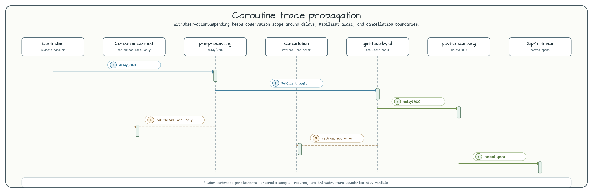

# Micrometer Tracing for WebFlux and Coroutines

[한국어](README.ko.md) | English

`observability/micrometer-tracing-coroutines` compares synchronous, Reactor, and Kotlin coroutine request handlers in a
Spring Boot 4 WebFlux application. It starts Zipkin with `ZipkinServer.Launcher.zipkin` and exports Micrometer tracing
spans through the configured Zipkin endpoint.

## Architecture


The module registers `ObservedAspect(observationRegistry)`, uses `@Observed` on sync/reactor services or methods, and
uses bluetape4k `withObservation` / `withObservationSuspending` for explicit nested spans.

## Coroutine Trace Flow



`withObservationSuspending` wraps suspend blocks such as `pre-processing`, `get-todo-by-id`, and `post-processing`. The
observation scope survives `delay(...)` and `WebClient.awaitBodyOrNull()` suspension points and rethrows
`CancellationException` without recording it as a span error.

## Endpoints

| Style | Endpoint | Service path |
|---|---|---|
| Sync | `/sync/name`, `/sync/todos/{id}` | `@Observed` controller/service methods plus explicit `withObservation` or manual `Observation`. |
| Reactor | `/reactor/name`, `/reactor/todos/{id}` | `Mono` pipeline with class-level `@Observed` on `ReactorService`. |
| Coroutine | `/coroutine/name`, `/coroutine/todos/{id}` | Suspend handlers and `withObservationSuspending` spans inside `CoroutineService`. |

## Key Components

| Component | Role |
|---|---|
| `TracingApplication` | Starts the Spring app and a singleton Zipkin Testcontainer. |
| `ObservationConfig` | Registers `ObservedAspect` when `ObservationRegistry` exists. |
| `SyncService` | Demonstrates `@Observed`, manual `Observation`, and `withObservation`. |
| `ReactorService` | Demonstrates Reactor `Mono` operations with class-level `@Observed`. |
| `CoroutineService` | Demonstrates suspend functions with `withObservationSuspending`. |
| `ZipkinServer.Launcher.zipkin` | Provides `${testcontainers.zipkin.url}/api/v2/spans` for local trace export. |

## bluetape4k Usage

| Feature | Where | Why it matters |
|---|---|---|
| `withObservation {}` | `SyncService.preProcessing`, `postProcessing` | Creates nested spans without manual start/stop boilerplate. |
| `withObservationSuspending {}` | `CoroutineService` | Keeps span context correct across coroutine suspension and cancellation. |
| `KLoggingChannel` | Coroutine/Reactor components | Keeps coroutine-aware logging consistent with trace context. |
| `ZipkinServer.Launcher.zipkin` | `TracingApplication` | Starts Zipkin once without custom `GenericContainer` wiring. |

## Coroutine Example

```kotlin
private suspend fun getTodoById(id: Int): Todo? {
    return withObservationSuspending("get-todo-by-id", observationRegistry) {
        client.get()
            .uri("/todos/${id}")
            .retrieve()
            .awaitBodyOrNull<Todo>()
    }
}
```

## Tests

```bash
./gradlew :observability-micrometer-tracing-coroutines:test
```

The test suite covers sync service spans, coroutine service spans, WebFlux controller integration, and Zipkin container
startup.

## Running

```bash
./gradlew :observability-micrometer-tracing-coroutines:bootRun
curl http://localhost:8080/coroutine/todos/1
open http://localhost:9411
```

Docker is required because Zipkin is started through Testcontainers.

## References

- [Micrometer Observation](https://micrometer.io/docs/observation)
- [Micrometer Tracing](https://micrometer.io/docs/tracing)
- [`micrometer-observation`](../micrometer-observation) - Spring MVC observation basics.
