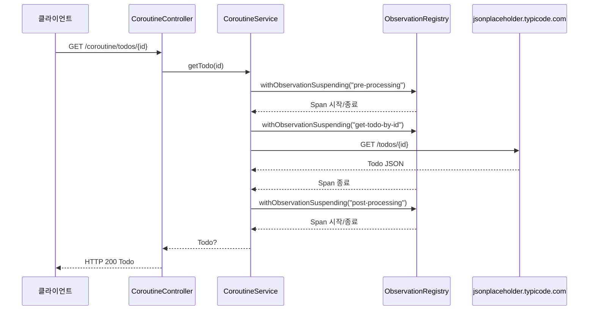

# Micrometer Observation for Spring Boot 4 WebFlux & Coroutines

## 아키텍처 다이어그램

```mermaid
sequenceDiagram
    participant 클라이언트
    participant CoroutineController
    participant CoroutineService
    participant ObservationRegistry
    participant 외부API as jsonplaceholder.typicode.com

    클라이언트->>CoroutineController: GET /coroutine/todos/{id}
    CoroutineController->>CoroutineService: getTodo(id)
    CoroutineService->>ObservationRegistry: withObservationSuspending("pre-processing")
    ObservationRegistry-->>CoroutineService: Span 시작/종료
    CoroutineService->>ObservationRegistry: withObservationSuspending("get-todo-by-id")
    CoroutineService->>외부API: GET /todos/{id}
    외부API-->>CoroutineService: Todo JSON
    ObservationRegistry-->>CoroutineService: Span 종료
    CoroutineService->>ObservationRegistry: withObservationSuspending("post-processing")
    ObservationRegistry-->>CoroutineService: Span 시작/종료
    CoroutineService-->>CoroutineController: Todo?
    CoroutineController-->>클라이언트: HTTP 200 Todo
```

