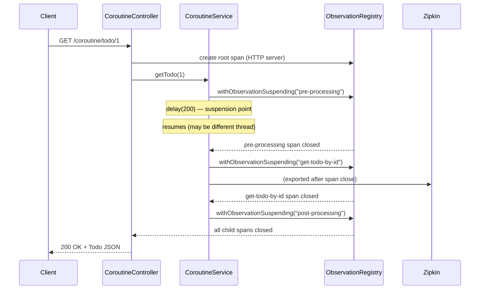

# Micrometer Observation for Spring Boot 4 WebFlux & Coroutines

Spring Boot 4 WebFlux 환경에서 Micrometer Tracing을 동기(Sync), 리액터(Reactor), 코루틴(Coroutine) 방식으로 적용하는 예제입니다.
bluetape4k의 `withObservation` / `withObservationSuspending` DSL로 코루틴 context에서 tracing span을 안전하게 전파합니다.

## Architecture

```mermaid
flowchart TD
    Client -->|HTTP| Router["WebFlux Router"]
    Router -->|/sync| SyncController
    Router -->|/coroutine| CoroutineController
    Router -->|/reactor| ReactorController

    SyncController -->|withObservation| SyncService
    CoroutineController -->|withObservationSuspending| CoroutineService
    ReactorController -->|@Observed| ReactorService

    SyncService -->|nested spans| ObservationRegistry
    CoroutineService -->|nested suspend spans| ObservationRegistry
    ReactorService -->|class-level span| ObservationRegistry

    ObservationRegistry -->|OTel Bridge| OTelExporter["OTel Exporter"]
    OTelExporter -->|HTTP POST| Zipkin["Zipkin Server\n(Testcontainers)"]

    subgraph "bluetape4k-micrometer"
        withObservation["withObservation {}"]
        withObservationSuspending["withObservationSuspending {}"]
    end

    subgraph "bluetape4k-testcontainers"
        ZipkinLauncher["ZipkinServer.Launcher.zipkin"]
    end
```


## Key Components

| Class | Role |
|---|---|
| `ObservationConfig` | Registers `ObservedAspect` bean — enables `@Observed` AOP, excludes Controller layer |
| `NettyConfig` | Reactor Netty server tuning (keepalive, backlog, event-loop size) |
| `SyncService` | Synchronous service — `@Observed` + `withObservation {}` nested spans |
| `CoroutineService` | Coroutine service — `withObservationSuspending {}` for spans in suspend functions |
| `ReactorService` | Reactor service — `@Observed` applied at class level |
| `SyncController` | Synchronous REST endpoint (`/sync`) |
| `CoroutineController` | Coroutine REST endpoint (`/coroutine`) |
| `ReactorController` | Reactor REST endpoint (`/reactor`) |
| `TracingApplication` | Starts Zipkin container via `ZipkinServer.Launcher.zipkin` |

## Tracing Pipeline

```
Micrometer Tracing → OTel Bridge → OTel Exporter → Zipkin Server  (active)
Micrometer Tracing → Brave Bridge → Zipkin Reporter → Zipkin Server (commented out)
```

## Span Propagation Across Coroutine Boundaries

A key challenge in coroutine environments is maintaining span context across suspension points.
`withObservationSuspending` handles this correctly by:

1. Starting the observation before the suspension point
2. Storing the span in the coroutine context (not a thread-local)
3. Restoring the span on coroutine resumption — even on a different thread
4. Automatically rethrowing `CancellationException` without marking the span as error

```
suspend fun getTodo(id: Int): Todo? {
    preProcessing()          // span: pre-processing (suspends, resumes on different thread)
        └── getTodoById(id)  // span: get-todo-by-id (WebClient call, async I/O)
    postProcessing()         // span: post-processing (correct parent span restored)
}
```

The above call chain produces a properly nested trace in Zipkin, regardless of which thread each coroutine resumes on.

### Trace Propagation Sequence



## Used bluetape4k Features

| Feature | Artifact | Code Location | Benefit |
|---|---|---|---|
| `withObservation {}` DSL | `bluetape4k-micrometer` | `SyncService` | Eliminates `Observation.createNotStarted().start().stop()` boilerplate |
| `withObservationSuspending {}` DSL | `bluetape4k-micrometer` | `CoroutineService` | Creates and propagates spans inside suspend functions; handles `CancellationException` safely |
| `KLoggingChannel` (coroutine logger) | `bluetape4k-logging` | `CoroutineService`, `CoroutineController` | Coroutine context-aware logging; MDC auto-propagation |
| `KLogging` | `bluetape4k-logging` | `SyncService`, `SyncController` | SLF4J companion object logger |
| `ZipkinServer.Launcher.zipkin` | `bluetape4k-testcontainers` | `TracingApplication` | Zipkin container singleton — starts once, shared across tests and app startup |
| `bluetape4k-junit5` assertions (`shouldNotBeNull`, etc.) | `bluetape4k-junit5` | Test files | Kotlin-style assertion chains instead of `assertNotNull(x)` |
| `runTest` for suspend tests | `bluetape4k-coroutines` (transitive) | `CoroutineServiceTest` | Execute suspend tests with virtual time |

## Before / After

### Synchronous Nested Span Creation

```kotlin
// Before — standard Micrometer (manual start/stop)
fun preProcessing() {
    val obs = Observation.createNotStarted("pre-processing", observationRegistry)
    obs.start()
    try {
        Thread.sleep(100)
    } finally {
        obs.stop()
    }
}

// After — bluetape4k withObservation DSL
import io.bluetape4k.micrometer.observation.withObservation

private fun preProcessing() {
    withObservation("pre-processing", observationRegistry) {
        log.debug { "Pre processing ..." }
        Thread.sleep(100)
    }
}
```

### Suspend Function Span Creation

```kotlin
// Before — manual Observation in coroutine (CancellationException can be missed)
private suspend fun preProcessing() {
    val obs = Observation.createNotStarted("pre-processing", observationRegistry)
    obs.start()
    try {
        delay(200)
    } catch (e: Exception) {   // catches CancellationException — WRONG
        obs.error(e)
        throw e
    } finally {
        obs.stop()
    }
}

// After — bluetape4k withObservationSuspending DSL
import io.bluetape4k.micrometer.observation.coroutines.withObservationSuspending

private suspend fun preProcessing() {
    withObservationSuspending("pre-processing", observationRegistry) {
        log.debug { "Pre processing ..." }
        delay(200)  // CancellationException is automatically rethrown (not treated as error)
    }
}
```

### Zipkin Server Auto-Start (Testcontainers Singleton)

```kotlin
// Before — Zipkin URL hardcoded in application.yml or manual GenericContainer management
@SpringBootApplication
class TracingApplication

// After — bluetape4k ZipkinServer.Launcher singleton
import io.bluetape4k.testcontainers.infra.ZipkinServer

@SpringBootApplication(proxyBeanMethods = false)
class TracingApplication {
    companion object: KLogging() {
        @JvmStatic
        val zipkinServer = ZipkinServer.Launcher.zipkin   // shared singleton, started once

        @JvmStatic
        val zipkinUrl: String get() = zipkinServer.url
    }
}
```

## CancellationException Safety

When using coroutines with Micrometer, `CancellationException` must never be recorded as a tracing error.
`withObservationSuspending` handles this automatically:

```kotlin
// withObservationSuspending internal behavior (simplified)
suspend fun <T> withObservationSuspending(name: String, registry: ObservationRegistry, block: suspend () -> T): T {
    val obs = Observation.createNotStarted(name, registry).start()
    return try {
        block()
    } catch (e: CancellationException) {
        throw e                   // rethrow — not an error, just coroutine cancellation
    } catch (e: Exception) {
        obs.error(e)              // record as span error only for real exceptions
        throw e
    } finally {
        obs.stop()
    }
}
```

## Tests

- `CoroutineServiceTest` — validates `withObservationSuspending` coroutine service with `runTest`
- `SyncServiceTest` — validates `withObservation` synchronous service
- `CoroutineControllerTest` — WebFlux `WebTestClient`-based integration test
- `SyncControllerTest` — synchronous controller integration test
- `ZipkinServerLaunchTest` — confirms Zipkin container starts correctly

## Running

```bash
# Start the application (Zipkin starts automatically via Testcontainers)
./gradlew :observability-micrometer-tracing-coroutines:bootRun

# Run all tests
./gradlew :observability-micrometer-tracing-coroutines:test

# View traces: open http://localhost:9411 in a browser
```

## Prerequisites

- Docker (required for Zipkin Testcontainers)
- JDK 25 (configured via `.java-version`)
- No external Zipkin server needed — `ZipkinServer.Launcher` starts one automatically

## References

- [Micrometer Observation official docs](https://micrometer.io/docs/observation)
- [Micrometer Tracing official docs](https://micrometer.io/docs/tracing)
- [Spring Boot Actuator + Micrometer](https://docs.spring.io/spring-boot/reference/actuator/metrics.html)
- [`micrometer-observation`](../micrometer-observation) — Spring MVC + `@Observed` basic example
