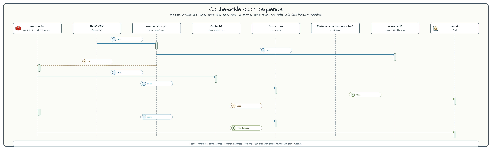

# observability-advanced

[English](README.md) | 한국어

`observability-advanced`는 WebFlux 컨트롤러, 코루틴 서비스, Redis 캐시, Exposed JDBC
영속화 사이에서 Micrometer Observation을 어떻게 유지하는지 보여줍니다. 예제는 작지만 실제
서비스에서 먼저 깨지기 쉬운 지점을 다룹니다. cache hit/miss별 span 모양, dispatcher 이동,
Redis soft-fail, 성공/실패 양쪽에서의 span 종료가 핵심입니다.

## 아키텍처


HTTP 계층은 suspend endpoint를 노출합니다. `UserService`는 cache-aside 결정을 소유하고
상위 `user.service.*` span을 만듭니다. Redis 작업은 `UserCacheRepository`가 감싸고,
DB 호출은 `UserRepository`에 남겨 `withContext(Dispatchers.IO) { transaction { ... } }`
안에서 실행합니다. released `withObservationContextSuspending` helper는 코루틴 resume 뒤에도
Micrometer scope가 이어지게 만들고, `finally`에서 항상 observation을 stop합니다.

## Span Flow



Cache hit은 `user.cache.get`에서 끝나고 DB span을 만들지 않습니다. Cache miss는
`user.db.find`로 이어지고 값이 있으면 `user.cache.put`까지 진행합니다. Redis read/write
실패는 warn 로그 후 cache miss 또는 cache write skip으로 처리하지만, `CancellationException`은
다시 던져 structured concurrency를 보존합니다.

## Span Trees

Cache miss:

```text
http.server.requests
  └─ user.service.get
       ├─ user.cache.get
       ├─ user.db.find
       └─ user.cache.put
```

Cache hit:

```text
http.server.requests
  └─ user.service.get
       └─ user.cache.get
```

## 핵심 개념

| 개념 | 구현 |
|---|---|
| 다계층 span | `withObservationContextSuspending()`이 service, cache, 선택된 DB 작업을 감싼다. |
| Dispatcher 경계 | Coroutine `ThreadContextElement`로 Observation scope를 연다. |
| Redis soft-fail | Cancellation이 아닌 Redis 예외는 로그 후 cache miss/skip으로 변환한다. |
| Cache-aside 패턴 | `get -> miss -> DB -> put`; hit이면 DB span을 건너뛴다. |
| 테스트 어설션 | `TestObservationRegistryAssert`로 필요한 span과 생기지 않아야 할 span을 함께 검증한다. |

## 사용한 Bluetape4k 기능

| 기능 | 모듈 / Artifact | 코드 위치 | 이점 |
|---|---|---|---|
| Micrometer Observation starter | `bluetape4k-micrometer` | `withObservationContextSuspending()`이 observation을 만들고 scope를 연다 | released bluetape4k coroutine Observation lifecycle과 context 전파를 재사용한다. |
| 코루틴 친화 로깅 | `bluetape4k-logging` | `UserService`, `UserRepository`, `UserCacheRepository` | Lazy Kotlin logging과 trace/span MDC 출력을 일관되게 유지한다. |
| Redis/Redisson DSL | `bluetape4k-redisson`, `bluetape4k-redis` | `RedissonConfig` | 간결한 Kotlin 설정으로 Redisson client를 만든다. |
| Redis Testcontainer singleton | `bluetape4k-testcontainers` | `AbstractAdvancedTest` | 임의 container 대신 `RedisServer.Launcher.redis`를 재사용한다. |
| 코루틴 테스트 runner | `bluetape4k-junit5` | `UserServiceTest`, `UserControllerTest` | 테스트 본문에서 `runBlocking` 없이 suspend 통합 테스트를 실행한다. |
| Assertion DSL | `bluetape4k-assertions` | `UserServiceTest`, `UserControllerTest` | Kotlin 스타일 값/null assertion을 사용한다. |

## Before / After

Micrometer를 직접 쓰면 lifecycle 처리를 모두 손으로 맞춰야 합니다.

```kotlin
val observation = Observation.createNotStarted("user.service.get", registry)
observation.start()
try {
    observation.openScope().use {
        withContext(Dispatchers.IO) {
            transaction { /* DB query */ }
        }
    }
} catch (e: CancellationException) {
    throw e
} catch (e: Throwable) {
    observation.error(e)
    throw e
} finally {
    observation.stop()
}
```

이 예제는 같은 Micrometer 의미를 released suspend 친화 helper로 구현합니다.

```kotlin
suspend fun getById(id: Long): User? =
    withObservationContextSuspending("user.service.get", observationRegistry) {
        val cached = cache.get(id)
        cached ?: withObservationContextSuspending("user.db.find", observationRegistry) {
            repo.findById(id)
        }
    }
```

## 테스트 커버리지

- `UserServiceTest`: cache miss/hit span, null 결과, create span, 명시적 cache delete 후 DB 조회.
- `UserControllerTest`: HTTP POST create, GET cache miss, GET cache hit.

## Smoke 확인

```bash
./gradlew :observability-advanced:test
./gradlew :observability-advanced:bootRun
```

사전 조건:

- 통합 테스트의 Redis Testcontainer를 위해 Docker가 필요합니다.
- Gradle이 사용할 수 있는 JDK 21+가 필요합니다.

## 설정

```yaml
workshop:
  observability:
    redis:
      url: redis://localhost:6379

spring:
  datasource:
    url: jdbc:h2:mem:observability;MODE=PostgreSQL;DB_CLOSE_DELAY=-1

management:
  tracing:
    sampling:
      probability: 1.0
```

## 의존성

- `bluetape4k-micrometer` - released `withObservationContextSuspending` 코루틴 helper.
- `bluetape4k-redisson` - `redissonClient {}` DSL.
- `micrometer-context-propagation` - dispatcher 경계 span 연속성.
- `jetbrains-exposed-spring-boot4-starter` - Exposed 자동 구성.
