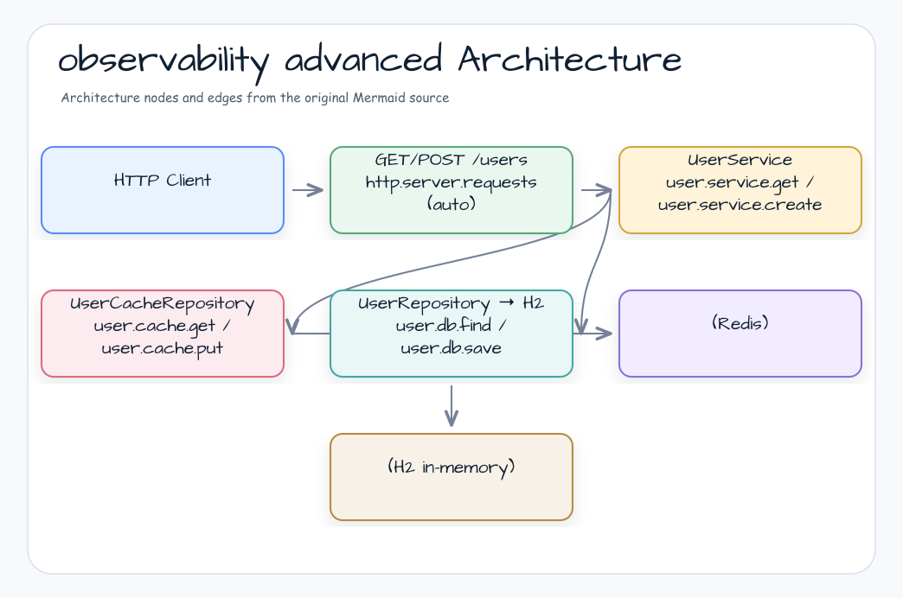

# observability-advanced

[한국어](README.ko.md) | English

## Example Scenario

This example exercises **observability-advanced** as a runnable metrics, tracing, and observation workshop slice. It focuses on the path a developer would inspect first: configure the module, run the sample or tests, and observe the library or framework APIs that remove repetitive infrastructure code.

## Flow Diagram

1. Prepare the local runtime required by `observability-observability-advanced`.
2. Execute the application, controller, service, or test fixture that owns the example scenario.
3. Delegate repetitive infrastructure work to bluetape4k utilities or Spring/Kotlin integrations.
4. Assert the visible result through the sample output, HTTP response, repository state, metric, trace, or test expectation.

## Sequence Diagram

The core sequence is: caller or test fixture -> workshop adapter -> bluetape4k helper/API -> external runtime or in-memory backend -> assertion/response. When this module has a dedicated sequence asset, the image below shows that interaction order; otherwise the source tests are the authoritative executable sequence.

Full-stack observability workshop demonstrating multi-layer span instrumentation
across HTTP (WebFlux), coroutine service, H2 database (Exposed JDBC), and Redis cache.

## Architecture



## Span Trees

**Cache miss path:**
```
http.server.requests              (auto)
  └─ user.service.get             (manual)
       ├─ user.cache.get          (manual — returns null)
       ├─ user.db.find            (manual)
       └─ user.cache.put          (manual)
```

**Cache hit path:**
```
http.server.requests              (auto)
  └─ user.service.get             (manual)
       └─ user.cache.get          (manual — returns User)
```

## Key Concepts

| Concept | Implementation |
|---------|---------------|
| Multi-layer spans | `observed()` helper at service + cache layers |
| Dispatcher boundary | `withObservation { withContext(IO) { transaction { } } }` (Observation OUTER) |
| Redis soft-fail | catch + log.warn, fallback to DB |
| Cache-aside pattern | get → miss → DB → put |
| Positive test assertions | `TestObservationRegistryAssert.assertThat(testRegistry).hasObservationWithNameEqualTo(...)` |
| Negative test assertions | `TestObservationRegistryAssert.assertThat(testRegistry).hasNumberOfObservationsWithNameEqualTo(name, 0)` |

## Used Bluetape4k Features

| Feature | Module / Artifact | Code Reference | Benefit |
|---|---|---|---|
| Micrometer observation starter | `bluetape4k-micrometer` | `ObservationSupport.observed()` uses `ObservationRegistry.start(name)` | Reuses the bluetape4k Observation factory instead of hand-building `Observation.Context` objects |
| Coroutine-aware logging | `bluetape4k-logging` | `UserService`, `UserRepository`, `UserCacheRepository`, test base | Lazy Kotlin logging and consistent trace/span MDC output |
| Redis/Redisson DSL | `bluetape4k-redisson`, `bluetape4k-redis` | `RedissonConfig` | Creates a Redisson client from a concise `redissonClient {}` configuration path |
| Redis Testcontainer singleton | `bluetape4k-testcontainers` | `AbstractAdvancedTest` | Reuses `RedisServer.Launcher.redis` instead of ad-hoc `GenericContainer` setup |
| Coroutine test runner | `bluetape4k-junit5` | `UserServiceTest`, `UserControllerTest` | Runs suspend integration tests with `runSuspendIO {}` without `runBlocking` in test bodies |
| Assertion DSL | `bluetape4k-assertions` | `UserServiceTest`, `UserControllerTest` | Kotlin-style null/value assertions without JUnit assertion APIs |

## Before / After

### Raw Micrometer approach

```kotlin
val observation = Observation.createNotStarted("user.service.get", registry)
observation.start()
try {
    observation.openScope().use {
        withContext(Dispatchers.IO) {
            transaction { /* DB query */ }
        }
    }
} catch (e: CancellationException) {
    throw e
} catch (e: Throwable) {
    observation.error(e)
    throw e
} finally {
    observation.stop()
}
```

### Bluetape4k-supported workshop approach

```kotlin
suspend fun getById(id: Long): User? =
    observed("user.service.get", observationRegistry) {
        val cached = cache.get(id)
        cached ?: observed("user.db.find", observationRegistry) {
            repo.findById(id)
        }
    }
```

`observed()` keeps the `bluetape4k-micrometer` `ObservationRegistry.start(name)` path,
opens the Micrometer scope through a coroutine context element, rethrows
`CancellationException`, records only real errors, and always stops the span. This removes
manual `start/openScope/error/stop` boilerplate while keeping the parent-child span tree stable
across `withContext(Dispatchers.IO)` boundaries.

## Test Coverage

- `UserServiceTest`: cache miss/hit spans, null result, create spans, explicit cache delete forces DB lookup
- `UserControllerTest`: HTTP POST create, GET cache miss, GET cache hit

The cache-miss service test also verifies parent-child propagation:

```
user.service.get
  ├─ user.cache.get
  ├─ user.db.find
  └─ user.cache.put
```

## Smoke and Load Checks

### Targeted smoke

```bash
./gradlew :observability-advanced:test
./gradlew :observability-advanced:bootRun
```

Prerequisites:

- Docker must be available for the Redis Testcontainer used by integration tests.
- JDK 21+ toolchain must be available through Gradle.

### Retained load/performance examples

This module is the tracing/correlation proof. Load behavior remains in the retained
performance-oriented modules because they demonstrate supported bluetape4k runtime helpers:

| Module | Command | Stop condition |
|---|---|---|
| `gatling/virtualthread-simulation` | `./gradlew :gatling-virtualthread-simulation:gatlingRun` | Gatling assertions should keep p95 latency and success rate inside the README thresholds |
| `virtualthreads/spring-mvc-tomcat` | `./gradlew :virtualthreads-spring-mvc-tomcat:gatlingRun` | Virtual-thread request handling should not degrade under the documented ramp profile |
| `virtualthreads/spring-webflux` | `./gradlew :virtualthreads-spring-webflux:gatlingRun` | Dispatcher scenarios should complete without error-rate regression |

Stop a local load run when error rate exceeds 1%, p95 latency exceeds the README threshold for
the scenario, container CPU/memory saturates, or the application logs repeated connection failures.

## Configuration

```yaml
workshop:
  observability:
    redis:
      url: redis://localhost:6379  # override in tests via Testcontainers

spring:
  datasource:
    url: jdbc:h2:mem:observability;MODE=PostgreSQL;DB_CLOSE_DELAY=-1

management:
  tracing:
    sampling:
      probability: 1.0
```

## Dependencies

- `bluetape4k-micrometer` — local `observed()` coroutine wrapper (finally-safe)
- `bluetape4k-redisson` — `redissonClient {}` DSL (`io.bluetape4k.redis.redisson`)
- `micrometer-context-propagation` — span continuity across dispatcher boundaries
- `jetbrains-exposed-spring-boot4-starter` — Exposed auto-configuration
