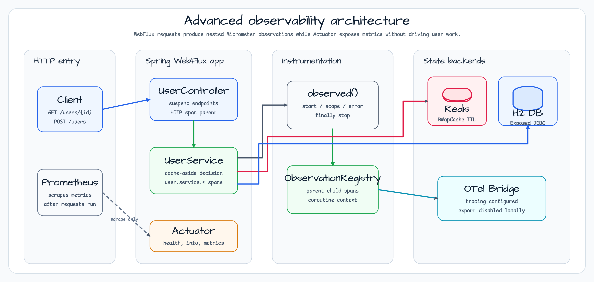
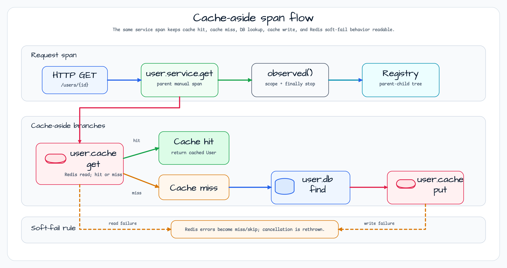

# observability-advanced

[한국어](README.ko.md) | English

`observability-advanced` shows how to keep Micrometer observations coherent across a WebFlux
controller, coroutine services, Redis cache access, and Exposed JDBC persistence. The sample is
small enough to run locally, but it covers the contracts that usually break first in real services:
cache hit/miss span shape, dispatcher hops, Redis soft-fail behavior, and span shutdown on both
success and failure.

## Architecture



The HTTP layer exposes suspend endpoints. `UserService` owns the cache-aside decision and creates
the high-level `user.service.*` spans. Redis operations are wrapped by `UserCacheRepository`, while
database calls stay in `UserRepository` and run inside `withContext(Dispatchers.IO) { transaction { ... } }`.
The local `observed()` helper keeps the Micrometer scope attached to coroutine resumes and always
stops the observation in `finally`.

## Span Flow



Cache hits stop after `user.cache.get`. Cache misses continue to `user.db.find` and then
`user.cache.put`. Redis read/write failures are logged and treated as cache misses or skipped cache
writes; `CancellationException` is rethrown so structured concurrency is preserved.

## Span Trees

Cache miss:

```text
http.server.requests
  └─ user.service.get
       ├─ user.cache.get
       ├─ user.db.find
       └─ user.cache.put
```

Cache hit:

```text
http.server.requests
  └─ user.service.get
       └─ user.cache.get
```

## Key Concepts

| Concept | Implementation |
|---|---|
| Multi-layer spans | `observed()` wraps service, cache, and selected DB operations. |
| Dispatcher boundary | Observation scope is opened through a coroutine `ThreadContextElement`. |
| Redis soft-fail | Non-cancellation Redis exceptions are logged and converted to cache miss/skip behavior. |
| Cache-aside pattern | `get -> miss -> DB -> put`; hit skips the database span. |
| Test assertions | `TestObservationRegistryAssert` verifies required spans and absence of skipped spans. |

## Used Bluetape4k Features

| Feature | Module / Artifact | Code Reference | Benefit |
|---|---|---|---|
| Micrometer observation starter | `bluetape4k-micrometer` | `ObservationSupport.observed()` calls `ObservationRegistry.start(name)` | Reuses the bluetape4k Observation factory instead of hand-building contexts. |
| Coroutine-aware logging | `bluetape4k-logging` | `UserService`, `UserRepository`, `UserCacheRepository` | Keeps lazy Kotlin logging and trace/span MDC output consistent. |
| Redis/Redisson DSL | `bluetape4k-redisson`, `bluetape4k-redis` | `RedissonConfig` | Builds a Redisson client from concise Kotlin configuration. |
| Redis Testcontainer singleton | `bluetape4k-testcontainers` | `AbstractAdvancedTest` | Reuses `RedisServer.Launcher.redis` instead of ad-hoc containers. |
| Coroutine test runner | `bluetape4k-junit5` | `UserServiceTest`, `UserControllerTest` | Runs suspend integration tests without `runBlocking` in test bodies. |
| Assertion DSL | `bluetape4k-assertions` | `UserServiceTest`, `UserControllerTest` | Uses Kotlin-style value and null assertions. |

## Before / After

Raw Micrometer code requires explicit lifecycle handling:

```kotlin
val observation = Observation.createNotStarted("user.service.get", registry)
observation.start()
try {
    observation.openScope().use {
        withContext(Dispatchers.IO) {
            transaction { /* DB query */ }
        }
    }
} catch (e: CancellationException) {
    throw e
} catch (e: Throwable) {
    observation.error(e)
    throw e
} finally {
    observation.stop()
}
```

The workshop keeps the same Micrometer semantics behind a suspend-friendly wrapper:

```kotlin
suspend fun getById(id: Long): User? =
    observed("user.service.get", observationRegistry) {
        val cached = cache.get(id)
        cached ?: observed("user.db.find", observationRegistry) {
            repo.findById(id)
        }
    }
```

## Test Coverage

- `UserServiceTest`: cache miss/hit spans, null result, create spans, explicit cache delete before DB lookup.
- `UserControllerTest`: HTTP POST create, GET cache miss, GET cache hit.

## Smoke Checks

```bash
./gradlew :observability-advanced:test
./gradlew :observability-advanced:bootRun
```

Prerequisites:

- Docker must be available for the Redis Testcontainer used by integration tests.
- JDK 21+ must be available through Gradle.

## Configuration

```yaml
workshop:
  observability:
    redis:
      url: redis://localhost:6379

spring:
  datasource:
    url: jdbc:h2:mem:observability;MODE=PostgreSQL;DB_CLOSE_DELAY=-1

management:
  tracing:
    sampling:
      probability: 1.0
```

## Dependencies

- `bluetape4k-micrometer` - local `observed()` coroutine wrapper.
- `bluetape4k-redisson` - `redissonClient {}` DSL.
- `micrometer-context-propagation` - span continuity across dispatcher boundaries.
- `jetbrains-exposed-spring-boot4-starter` - Exposed auto-configuration.
