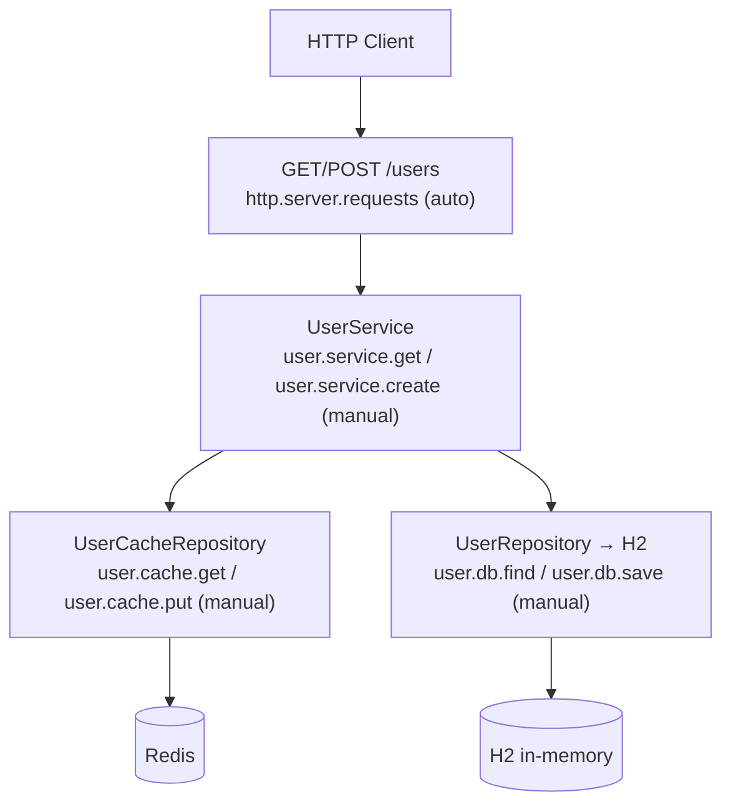

# observability-advanced

Full-stack observability workshop demonstrating multi-layer span instrumentation
across HTTP (WebFlux), coroutine service, H2 database (Exposed JDBC), and Redis cache.

## Architecture



## Span Trees

**Cache miss path:**
```
http.server.requests              (auto)
  └─ user.service.get             (manual)
       ├─ user.cache.get          (manual — returns null)
       ├─ user.db.find            (manual)
       └─ user.cache.put          (manual)
```

**Cache hit path:**
```
http.server.requests              (auto)
  └─ user.service.get             (manual)
       └─ user.cache.get          (manual — returns User)
```

## Key Concepts

| Concept | Implementation |
|---------|---------------|
| Multi-layer spans | `observed()` helper at service + cache layers |
| Dispatcher boundary | `withObservation { withContext(IO) { transaction { } } }` (Observation OUTER) |
| Redis soft-fail | catch + log.warn, fallback to DB |
| Cache-aside pattern | get → miss → DB → put |
| Positive test assertions | `TestObservationRegistryAssert.assertThat(testRegistry).hasObservationWithNameEqualTo(...)` |
| Negative test assertions | `TestObservationRegistryAssert.assertThat(testRegistry).hasNumberOfObservationsWithNameEqualTo(name, 0)` |

## Test Coverage

- `UserServiceTest`: cache miss/hit spans, null result, create spans, explicit cache delete forces DB lookup
- `UserControllerTest`: HTTP POST create, GET cache miss, GET cache hit

## Configuration

```yaml
workshop:
  observability:
    redis:
      url: redis://localhost:6379  # override in tests via Testcontainers

spring:
  datasource:
    url: jdbc:h2:mem:observability;MODE=PostgreSQL;DB_CLOSE_DELAY=-1

management:
  tracing:
    sampling:
      probability: 1.0
```

## Dependencies

- `bluetape4k-micrometer` — local `observed()` coroutine wrapper (finally-safe)
- `bluetape4k-redisson` — `redissonClient {}` DSL (`io.bluetape4k.redis.redisson`)
- `micrometer-context-propagation` — span continuity across dispatcher boundaries
- `jetbrains-exposed-spring-boot4-starter` — Exposed auto-configuration
