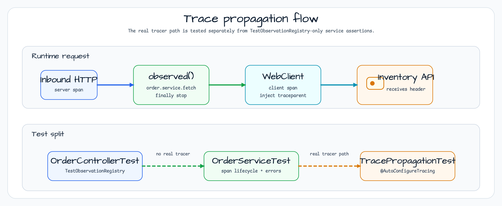

# observability-basic

[English](README.md) | 한국어

`observability-basic`은 워크샵에서 가장 작은 tracing 예제입니다. WebFlux suspend endpoint가
자동 HTTP server span을 만들고, `OrderService`가 수동 `order.service.fetch` span을 하나
추가하며, Spring Boot가 관리하는 `WebClient.Builder`가 downstream inventory 호출에 W3C
`traceparent`를 전파합니다. Smoke 경로에는 DB, Redis, Kafka, 외부 collector가 필요 없습니다.

## 아키텍처


이 예제는 수동 계측을 `OrderService.getOrder()` 한 곳에 둡니다. `InventoryClient`는 직접 span을
만들지 않습니다. Micrometer WebClient 계측이 `http.client.requests`를 만들고, 자동 구성된
`WebClient.Builder`를 통해 trace header를 주입합니다.

## Trace Propagation Flow



`TracePropagationTest`는 실제 Micrometer + OpenTelemetry tracing을 사용해 MockWebServer로 나가는
요청에 `traceparent` header가 들어가는지 확인합니다. `TestObservationRegistry`로 registry를
교체하는 controller 테스트와 분리한 이유는, test registry에는 실제 tracer가 붙어 있지 않기 때문입니다.

## Span Tree

```text
http.server.requests
  └─ order.service.fetch
       └─ http.client.requests
            └─ downstream inventory service
```

## 핵심 개념

| 개념 | 구현 |
|---|---|
| 수동 span | `observed("order.service.fetch", registry) { }`가 order 조립을 감싼다. |
| W3C 전파 | Spring Boot `WebClient.Builder`가 `traceparent`를 자동 주입한다. |
| Test registry | `TestObservationRegistry`로 Zipkin 없이 service span lifecycle을 검증한다. |
| 4xx 처리 | `awaitExchangeOrNull { 4xx -> null }`로 order 없음 처리. |
| 5xx 처리 | `createExceptionAndAwait()`로 upstream 실패를 전파한다. |

## 테스트 커버리지

- `OrderServiceTest`: span lifecycle, error recording, cancellation safety.
- `OrderControllerTest`: HTTP 200과 not-found 통합 동작.
- `TracePropagationTest`: outbound `traceparent` header가 MockWebServer에 도달하는지 검증.

## 설정

```yaml
workshop:
  observability:
    inventory:
      base-url: http://localhost:8080

management:
  tracing:
    sampling:
      probability: 1.0
  otlp:
    tracing:
      export:
        enabled: false
```

## Smoke 확인

```bash
./gradlew :observability-basic:test
./gradlew :observability-basic:bootRun
```

## 의존성

- `bluetape4k-micrometer` - 로컬 `observed()` 코루틴 helper.
- `micrometer-tracing-bridge-otel` - W3C 전파를 위한 OpenTelemetry bridge.
- `micrometer-context-propagation` - Reactor와 coroutine context bridging.
- `spring-boot-starter-opentelemetry` - WebClient 계측 자동 구성.
